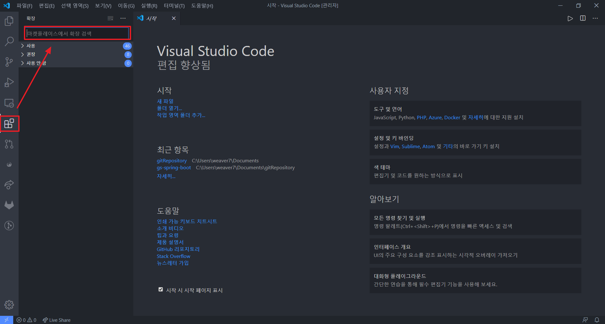
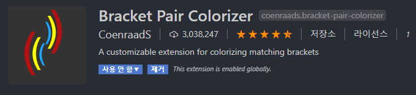
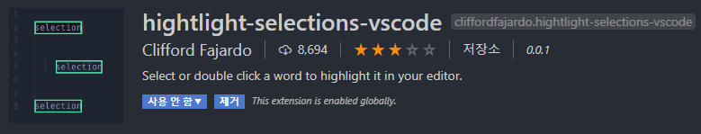

# **Visual Studio Code 설치 가이드**

## Change Log

### - 2020-05-27
  - INIT

### - 2020-06-09
  - 이미지 대체 및 경로 수정
  - Extension 이미지 추가

---
## **Introduction**
이 내용에서는 Visual Studio Code를 설치하는 방법을 설명합니다.

## **1. Visual Studio Code 다운로드**

다운로드 링크 : https://code.visualstudio.com

## **2. Visual Studio Code Extension 설치**

아래 그림을 참고하여 Extension 검색 후 설치
   
**[Fig.001 - Visual Studio Code Extension]**

---
### **1) Korean Language Pack for Visual Studio Code**
   
**[Fig.002 - Visual Studio Code Extension - Korean Language Pack for Visual Studio Code]**

---
### **2) Atom One Dark Theme**
   
**[Fig.003 - Visual Studio Code Extension - Atom One Dark Theme]**

---
### **3) Bracket Pair Colorizer**
   
**[Fig.004 - Visual Studio Code Extension - Bracket Pair Colorizer]**

---
### **4) hightlight-selections-vscode**
   
**[Fig.005 - Visual Studio Code Extension - hightlight-selections-vscode]**

---
### **5) Material Icon Theme**
   
**[Fig.006 - Visual Studio Code Extension - Material Icon Theme]**

---
### **6) npm**
   
**[Fig.007 - Visual Studio Code Extension - npm]**

---
### **7) npm Intellisense**
   
**[Fig.008 - Visual Studio Code Extension - npm Intellisense]**

---
### **8) Output Colorizer**
   
**[Fig.009 - Visual Studio Code Extension - Output Colorizer]**

---
### **9) Path Intellisense**
   
**[Fig.010 - Visual Studio Code Extension - Path Intellisense]**

---
### **10) Prettier - Code formatter**
   
**[Fig.011 - Visual Studio Code Extension - Prettier - Code formatter]**

---
### **11) XML Tools**
   
**[Fig.012 - Visual Studio Code Extension - XML Tools]**
