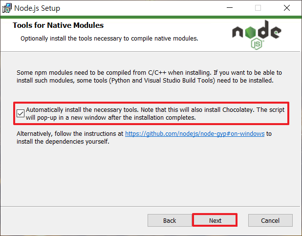
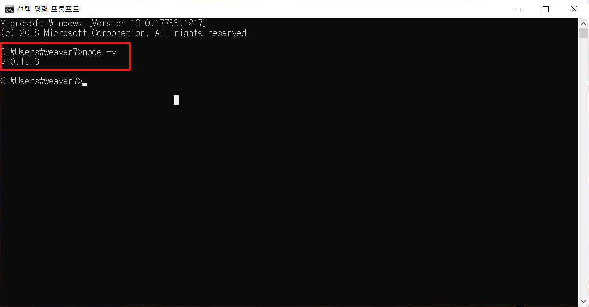

# **NodeJS 설치 가이드**

## Change Log

### - 2020-05-27
  - INIT

### - 2020-06-09
  - 내용 추가
  - 오타 수정

---
## **Introduction**
이 내용에서는 NodeJS를 설치하는 방법을 설명합니다.

## **1. NodeJS 다운로드**

다운로드 링크 : https://nodejs.org/ko/

## **2. NodeJS 설치**

  
**[Fig.001 - NodeJS Installiation]**

---
  
**[Fig.002 - NodeJS Installiation]**

---
  
**[Fig.003 - NodeJS Installiation]**

---
  
**[Fig.004 - NodeJS Installiation]**

---
  
**[Fig.005 - NodeJS Installiation]**

---
  
**[Fig.006 - NodeJS Installiation]**


 ## **3. 설치 확인**

- 명령어
```linux
$ node -v
```

  
**[Fig.007 - NodeJS Installiation]**

