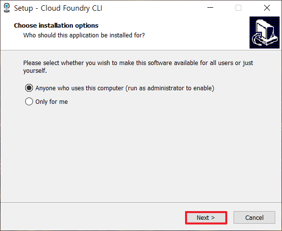
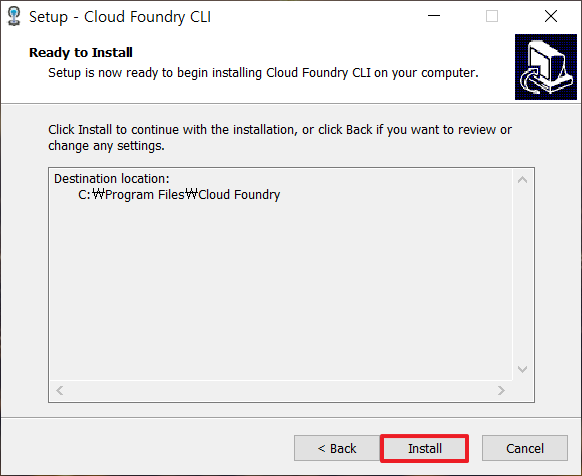
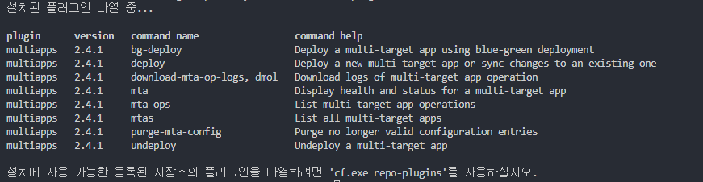

# **Cloud Foundry CLI 설치 가이드**

## Change Log

### - 2020-05-27
  - INIT

### - 2020-06-09
  - 내용 추가
  - 오타 수정

### - 2020-06-25
  - 내용 추가 (MTA, deploy)

---

## **Introduction**
이 내용에서는 NodeJS를 설치하는 방법을 설명합니다.

## **1. Cloud Foundry CLI 다운로드**

다운로드 링크 : https://packages.cloudfoundry.org/stable?release=windows64&source=github

## **2. Cloud Foundry CLI 설치**


  
**[Fig.001 - CF CLI Installiation]**


  
**[Fig.002 - CF CLI Installiation]**


## **3. Cloud Foundry CLI 확인**

 - 설치 확인

```linux
cf -v
```

```
cf.exe 버전 6.51.0+2acd15650.2020-04-07
```


## **4. Plugin 설치**

### **1) multiapps**

`MTA (Multi-target Application)` Plugin을 설치합니다.

- `multiapps` plugin 설치

```
cf install-plugin multiapps
```


- 설치된 plugin 확인
```
cf plugins
```

  
**[Fig.003 - CF CLI multiapps plugin]**


- deploy 명령어 옵션
```
cf deploy --help
```

```bash
이름:
   deploy - Deploy a new multi-target app or sync changes to an existing one

사용법:
   Deploy a multi-target app archive
   cf deploy MTA [-e EXT_DESCRIPTOR[,...]] [-t TIMEOUT] [--version-rule VERSION_RULE] [-u URL] [-f] [--retries RETRIES] [--no-start] [--use-namespaces] [--no-namespaces-for-services] [--delete-services] [--delete-service-keys] [--delete-service-brokers] [--keep-files] [--no-restart-subscribed-apps] [--do-not-fail-on-missing-permissions] [--abort-on-error] [--verify-archive-signature] [--strategy STRATEGY] [--skip-testing-phase]

   Perform action on an active deploy operation
   cf deploy -i OPERATION_ID -a ACTION [-u URL]

옵션:
   --abort-on-error                          Auto-abort the process on any errors
   --all-modules                             Deploy all modules which are contained in the deployment descriptor, in the current location
   --all-resources                           Deploy all resources which are contained in the deployment descriptor, in the current location
   --delete-service-brokers                  Delete discontinued service brokers
   --delete-service-keys                     Delete existing service keys and apply the new ones
   --delete-services                         Recreate changed services / delete discontinued services
   --do-not-fail-on-missing-permissions      Do not fail on missing permissions for admin operations
   --keep-files                              Keep files used for deployment
   --no-namespaces-for-services              Do not use namespaces in service names
   --no-restart-subscribed-apps              Do not restart subscribed apps, updated during the deployment
   --no-start                                Do not start apps
   --retries                                 Retry the operation N times in case a non-content error occurs (default 3)
   --skip-testing-phase                      (EXPERIMENTAL) (STRATEGY: BLUE-GREEN) Do not require confirmation for deleting the previously deployed MTA apps
   --strategy                                (EXPERIMENTAL) Specify the deployment strategy when updating an mta (default, blue-green)
   --use-namespaces                          Use namespaces in app and service names
   --verify-archive-signature                Verify the archive is correctly signed
   -a                                        Action to perform on active deploy operation (abort, retry, monitor)
   -e                                        Extension descriptors
   -f                                        Force deploy without confirmation for aborting conflicting processes
   -i                                        Active deploy operation ID
   -m                                        Deploy list of modules which are contained in the deployment descriptor, in the current location
   -r                                        Deploy list of resources which are contained in the deployment descriptor, in the current location
   -t                                        Start timeout in seconds
   -u                                        Deploy service URL, by default 'deploy-service.<system-domain>'
   --version-rule                            Version rule (HIGHER, SAME_HIGHER, ALL)
```


