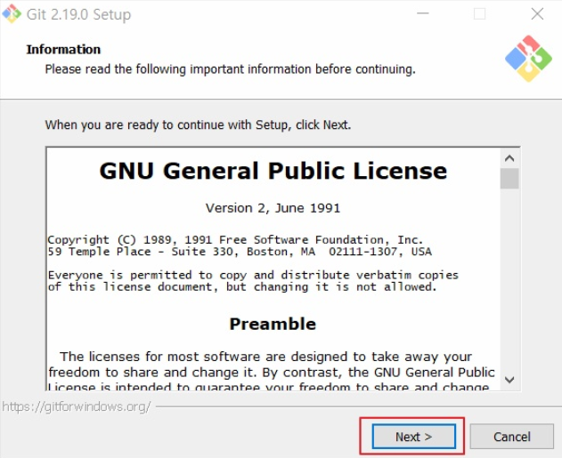
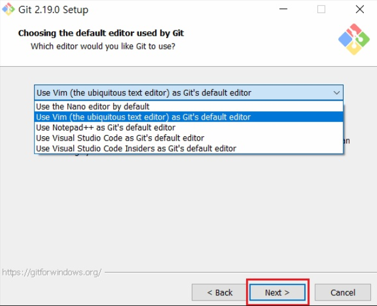
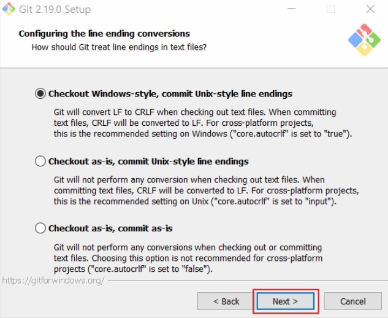

# **Git 설치 가이드**

## Change Log

### - 2020-05-27
  - INIT

### - 2020-06-09
  - 내용 추가
  - 오타 수정

---
## **Introduction**
이 내용에서는 Git를 설치하는 방법을 설명합니다.

## **1. Git 다운로드**

다운로드 링크 : https://github.com/git-for-windows/git/releases/download/v2.27.0.windows.1/Git-2.27.0-64-bit.exe

## **2. Git 설치**

  
**[Fig.001 - Git Installiation]**

---
  
**[Fig.002 - Git Installiation]**

---
  
**[Fig.003 - Git Installiation]**

---
  
**[Fig.004 - Git Installiation]**

---
  
**[Fig.005 - Git Installiation]**

---
  
**[Fig.006 - Git Installiation]**

---
  
**[Fig.007 - Git Installiation]**

---
  
**[Fig.008 - Git Installiation]**

---
  
**[Fig.009 - Git Installiation]**

---
  
**[Fig.010 - Git Installiation]**

---
| Options                       | Description                                                                              |
| :---------------------------- | :--------------------------------------------------------------------------------------- |
| Enable file system caching    | 성능향상을 위해 파일 시스템 데이터를 메모리에 캐시합니다.                                |
| Enable Git Credential Manager | Windows 용 보안 Git 자격증명 저장소를 사용하기 위해 Git Credential Manager 활성화합니다. |
| Enable symbolic links         | symbolic links 활성화합니다.(기존 저장소는 영향을 받지 않습니다)                         |  

  
**[Fig.011 - Git Installiation]**

---
  
**[Fig.012 - Git Installiation]**


## **3. Git 설치 확인**

- 명령어
```
$ git
```

- 초기설정
```
$ git config --global user.name "Name명"
$ git config --global user.email "메일주소"
```
Git을 처음 설치하면 Name과 Email이 Null입니다. 설치한 GitBash를 열어서 위의 명령어를 입력해 설정을 해줍니다.

- 설정 확인 
```
$ git config --list 
```
위의 명령어를 입력하여 Name과 Email이 제대로 들어갔는지 확인할 수 있습니다.