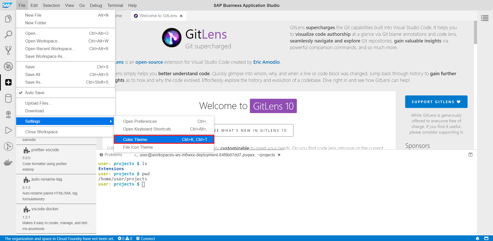

# **SAP Business Application Studio Extension 설치 가이드**

## Change Log

### - 2020-06-10
  - INIT

---

## **Prerequisite**

- SAP Business Application Studio 활성화 (Subscription & Role Assign)
- Terminal 사용법

## **Introduction**
이 내용에서는 SAP Business Application Studio에서 수동으로 Extension을 설치하는 방법을 설명합니다.

편의상 `Business Application Studio` -> `BAS`로 줄여서 사용합니다.

## **1. VSCODE Extension 모음 다운로드**

다운로드 링크(OneDrive) : https://istnci-my.sharepoint.com/:f:/g/personal/weaver7_istnci_onmicrosoft_com/EveZBeEMoS1Jv9VaUWV45DEBS99gCEvP2aahayr2sjgxmw?e=LEPrfP

## **2. Extension 업로드**

BAS 초기화면
  
**[Fig.001 - Extension Installiation]**

---
`Workspace`를 엽니다.
  
**[Fig.002 - Extension Installiation]**

---
`Workspace`를 선택하고 `Open`
  
**[Fig.003 - Extension Installiation]**

---
다운로드한 링크를 폴더에 넣은 후 폴더를 `BAS`로 `Drag & Drop`
  
**[Fig.004 - Extension Installiation]**

---
업로드 완료된 Extension 목록을 확인
  
**[Fig.005 - Extension Installiation]**


## **3. .vsix 파일의 절대 경로 확인**

---
새로운 Terminal을 열고 명령어를 입력합니다.
  
**[Fig.006 - Extension Installiation]**

- `ls` 명령어는 현재 디렉토리에 어떤 파일들과 하위 디렉토리가 존재하는지 알아보기 위해 사용합니다.
```
$ ls
```
- `pwd` 명령어는 "print working directory"로, 현재 작업 중인 디렉터리의 이름을 출력하는 데 쓰입니다.
```
$ pwd
```
---
  
**[Fig.007 - Extension Installiation]**


```
local-dir:<path>
```

`Fig.007` 에 나타난 pwd 명령어의 결과를 아래와 같이 구성 후 복사(Ctrl+C)해 둡니다.
```
local-dir:/home/user/projects/Extensions
```

 
---
Command (Ctrl + Shift + P)를 열고 deploy를 입력 후 아래 그림처럼 선택  
  
**[Fig.008 - Extension Installiation]**

---
위에서 복사해둔 경로를 입력 후 `Enter`
  
**[Fig.009 - Extension Installiation]**

---
Extension이 설치되면 아래 그림과 같이 여러가지 추가되거나 변경된 모습을 확인할 수 있습니다.
  
**[Fig.010 - Extension Installiation]**

---
설치된 Extension을 확인하기 위해 `View` -> `Plugins`(Ctrl+Shift+ L)을 선택합니다.  
  
**[Fig.011 - Extension Installiation]**

---
설치된 Extension을 목록을 확인할 수 있습니다.  
  
**[Fig.012 - Extension Installiation]**

---
설치된 Extension을 이용해 Theme를 변경해 보겠습니다.
  
**[Fig.013 - Extension Installiation]**

---
Atom One Dark를 선택합니다.
  
**[Fig.014 - Extension Installiation]**

---
정상적으로 Atom Theme가 적용된것을 확인할 수 있습니다.
  
**[Fig.015 - Extension Installiation]**

