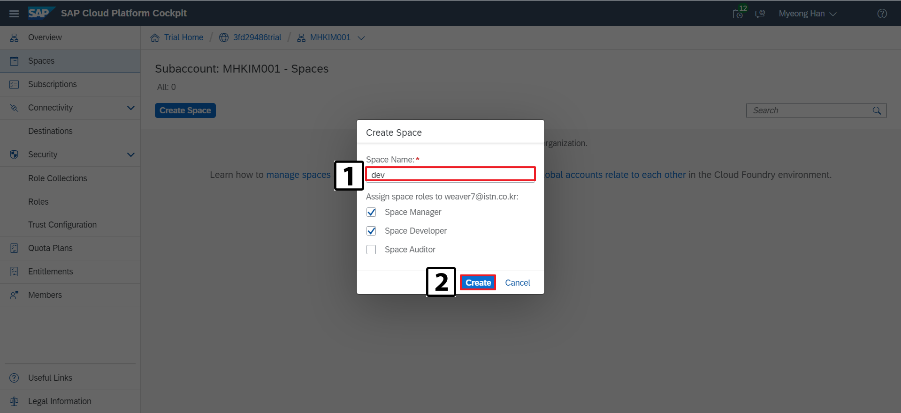
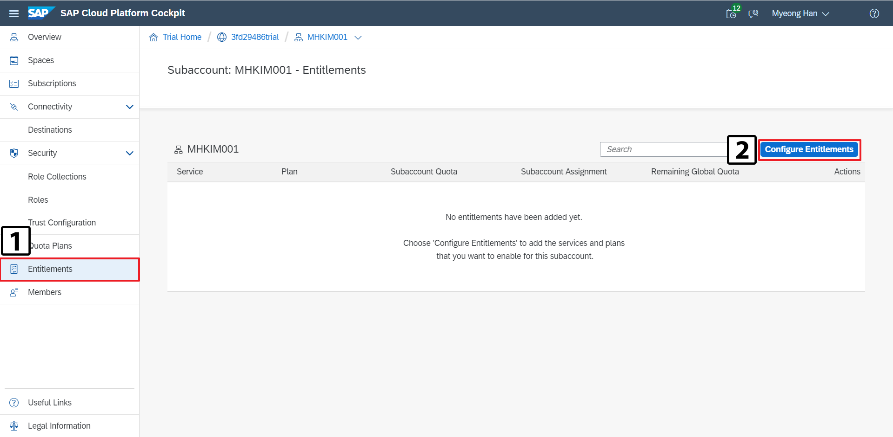
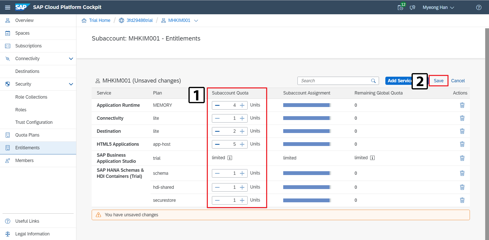

# **SAP Cloud Platform**

## Change Log

### - 2020-05-27
  - INIT

### - 2020-06-08
  - 이미지 경로 수정

### - 2020-06-09
  - 템플릿 변경으로 인한 재작성

---
## **Introduction**
이 내용에서는 SAP Cloud Platform에서 Cloud Foundry를 활성화하는 방법을 안내합니다.

## **1. SAP Cloud Platform Trial 가입 (https://account.hana.ondemand.com/)**

해당 링크로 이동해 SAP Cloud Platform Trial 가입을 진행합니다.

## **2. Login**

가입한 본인의 SAP Cloud Platform 계정으로 로그인합니다.
   
## **3. Cloud Foundry Subaccount 생성**

  
**[Fig.3-1 - SAP Cloud Platform Home]**

---
`New Subaccount` 클릭해 `Subaccount` 생성

**[Fig.3-2 - SAP Cloud Platform SubAccounts]**

---
생성할 `Subaccount`의 정보를 입력

**[Fig.3-3 - SAP Cloud Platform Subaccounts]**

---
생성된 `Subaccount`를 선택해 이동

**[Fig.3-4 - SAP Cloud Platform Create Subaccounts]**

---
`Enable Cloud Foundry` 클릭해 활성화

**[Fig.3-5 - SAP Cloud Platform Create Subaccounts]**

---
`Create` 클릭

**[Fig.3-6 - SAP Cloud Platform Create Subaccounts]**

---
`API Endpoint` 자주 사용하는 정보이므로 메모

**[Fig.3-7 - SAP Cloud Platform Create Subaccounts]**

## **4. Cloud Foundry Space 생성**

Navaigator에서 Spaces선택 후 `Create Space` 클릭

**[Fig.4-1 - SAP Cloud Platform Create Space]**

---
Space 이름을 입력 후 `Create` 클릭

**[Fig.4-2 - SAP Cloud Platform Create Space]**

---
Space가 정상적으로 생성된것을 확인

**[Fig.4-3 - SAP Cloud Platform Create Space]**

## **5. Entitlement 설정**

---
`Etitilements` -> `Configure Entitlements` 클릭

**[Fig.5-1 - SAP Cloud Platform Entitlement Setting]**

---
`Add Service Plans` 클릭

**[Fig.5-2 - SAP Cloud Platform Entitlement Setting]**

---
`Application Runtime` 추가

**[Fig.5-3 - SAP Cloud Platform Entitlement Setting]**

---
`Connectivity` 추가

**[Fig.5-4 - SAP Cloud Platform Entitlement Setting]**

---
~~Destination 추가~~ (2020.06 업데이트로 Connectivity로 병합됐으므로 해당 절차 생략)

**[Fig.5-5 - SAP Cloud Platform Entitlement Setting]**

---
`HTML5 Application` 추가

**[Fig.5-6 - SAP Cloud Platform Entitlement Setting]**

---
`SAP Business Application Studio` 추가

**[Fig.5-7 - SAP Cloud Platform Entitlement Setting]**

---
`SAP HANA Schema & HDI Container` 추가

**[Fig.5-8 - SAP Cloud Platform Entitlement Setting]**

---
최대치로 변경 후 `Save` 클릭

**[Fig.5-9 - SAP Cloud Platform Entitlement Setting]**

## **6. Role Assign**

Subscription한 SAP Business Application Studio를 사용하기 위해서는 Role Collection을 사용자에게 지정해야 합니다.

---
`Subscriptions` -> `SAP Business Application Stutio` 선택

**[Fig.6-1 - SAP Cloud Platform Role Assign]**

---
`Subscribe` 클릭

**[Fig.6-2 - SAP Cloud Platform Role Assign]**

---
활성화를 확인후 상위 Node로 이동

**[Fig.6-3 - SAP Cloud Platform Role Assign]**

---
`Trust Configuration` -> `IAS` 선택

**[Fig.6-4 - SAP Cloud Platform Role Assign]**

---
Role를 Assign하고자 하는 사용자의 `E-mail`입력 후 `Show Assignment`클릭

**[Fig.6-5 - SAP Cloud Platform Role Assign]**

---
`Assign Role Collection` 선택

**[Fig.6-6 - SAP Cloud Platform Role Assign]**

---
Assign할 `Role Collectio`n 선택 후 `Assign Role Collection` 클릭해서 `Role Collection` 추가

**[Fig.6-7 - SAP Cloud Platform Role Assign]**

---
아래와 같이 `Role Collection`을 Assign 후 로그아웃 후 재로그인

**[Fig.6-8 - SAP Cloud Platform Role Assign]**

> ### **⚠ 주의**
>
>Assign된 Role을 적용받기 위해서는 해당 사용자가 로그아웃 후 다시 로그인을 해야합니다.
