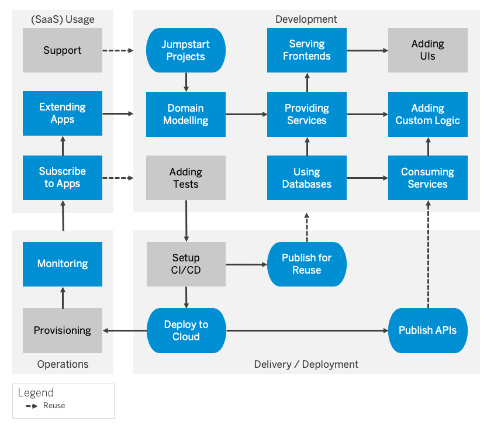

# **SAP CAP - VSCODE - iFLOW**

# **Change Log**

## - 2020-06-11

-   INIT

## - 2020-06-17

-   Templeate 변경

## - 2020-06-18

-   최종 작성

## - 2020-06-23

-  Sqlite 내용 삭제
-  Custom Logic 내용 일부 수정
-  SAPUI5 APP 작성 설명 추가

**TODO :**

-   [x] Visual Studio Code 설정
-   [x] CAP Project 생성
-   [x] CAP Data Model 작성
-   [x] CAP Service Model 작성
-   [x] CAP 실행
-   [x] CRUD
-   [x] CAP Custom Logic 작성
-   [x] CAP Build & Deploy
-   [x] NodeJS Middleware 작성
-   [x] NodeJS SAP CF 배포
-   [x] MTA(Multi-Target Application) 작성
-   [x] SAPUI5 Front-End 작성
-   [x] SAPUI5 Ajax Request 작성
-   [x] SAPUI5 CF Destination 설정
-   [x] SAPUI5 CF 배포 및 CF Destination 작성
-   [ ] SAP CF API Management 설정

## **Introduction**

이 내용은 SAP CAP(Cloud Application Programming) 예제를 다룹니다.

## **Prerequisite**

### 1) Visual Studio Code : [설치 가이드 링크](../Installation-Guide/01_Install-VSCODE.md)

### 2) NodeJS (Stable 버전 설치 - 12.x) [설치 가이드 링크](../Installation-Guide/02_Install-NodeJS.md)

### 3) Cloud Foundry CLI [설치 가이드 링크](../Installation-Guide/03_Install-CF-CLI.md)

### 4) Git [설치 가이드 링크](../Installation-Guide/04_Install-Git.md)

---

## **1. Visual Studio Code 설정**

SAP CAP를 개발하기 위해서는 먼저 `@sap/cds-dk` 패키지가 필요합니다.

### 1) **`@sap`** 패키지에 대한 NPM registry 설정

SAP는 개발자가 사용할 Node.js 모듈을 제공하는 Public NPM registry를 관리합니다.

```
npm set @sap:registry=https://npm.sap.com
```

### 2) `cds` Development Kit 설치

이제 npm이 올바른 레지스트리에서 패키지를 요청한다는 것을 알고 다음 명령을 실행하여 `@sap/cds-dk`를 전역(Global)으로 설치할 수 있습니다.  
`cmd` 또는 `` Vscode Terminal(Ctrl + `) `` 에서 다음 명령을 입력하세요.

```
$ npm i -g @sap/cds-dk
```

> ✔ `@sap/cds` 와 `@sap/cds-dk`의 차이
>
> CAP의 NodeJS 패키지는 최상위 모듈 `@sap/cds`에 통합되어 있었습니다. 현재는 `@sap/cds-dk`가 별도로 분리되어 존재합니다. 여기서 `dk` 는 `'Development Kit'`를 의미합니다. 이 패키지는 포함된 모든 도구를 활용하여 CAP로 개발하기 위해 설치하려는 패키지입니다. `@sap/cds` 단순히 `Runtime` 패키지로 생각하시면 됩니다.

### 3) CDS Language Support for Visual Studio Code 설치

-   `vscode-cds-2.2.0.vsix` [다운로드 링크](https://tools.hana.ondemand.com/additional/vscode-cds-updateSite/vscode-cds-2.2.0.vsix)

-   **`Ctrl + Shitp + P`** 를 입력 후 `VSIX` 입력  
    

-   다운로드 받은 `vscode-cds-2.2.0.vsix` 파일을 찾아 설치

### 4) 설치 확인

-   **명령어**

```
cds -v
```

-   **결과**

## **Architecture**



## **2. CAP Project 생성**

### **1) CAP Project 생성**

설치한 `cds` 명령어를 사용하면 다양한 구성 요소가 미리 구성된 새 디렉토리 형태로 새로운 CAP Project를 만들 수 있습니다. 홈 디렉토리 또는 쓰기 액세스 권한이 있는 다른 디렉토리에서 다음 명령어를 입력하세요.

-   터미널 (`Ctrl` + `Shiht` + ` ) 명령어

```
cds init <사용자 프로젝트명>
```

-   예제

```
cds init cap-sample
```

프로젝트 생성시 아래와 같이 다수의 폴더/파일들이 생성됩니다.

```
📦cap-sample
 ┣ 📂.vscode
 ┣ 📂app
 ┣ 📂db
 ┣ 📂srv
 ┣ 📜.cdsrc.json
 ┣ 📜.eslintrc
 ┣ 📜.gitignore
 ┣ 📜package.json
 ┗ 📜README.md
```

### - `📂app` : Fiori UI를 그리기 위한 Artifacts를 정의하는 위치

### - `📂db` : 데이터베이스 스키마 모델을 정의하는 위치

### - `📂srv` : 서비스를 정의하는 위치

### **2) NodeJS Dependency Module 설치**

명령어를 입력하면 `package.json` 등록된 모든 `dependencies`를 설치합니다.

-   터미널 (`Ctrl` + `Shiht` + ` ) 명령어

```
npm i
```

> ### ⚠ 주의
>
> 프로젝트의 ROOT경로에서 명령어를 입력해야 합니다.

  
**[Fig 1. package.json]**

설치가 완료되면 CAP Project ROOT 디렉토리에 `node_modules/`라는 새로운 디렉토리가 생성된것을 확인할 수 있습니다.

## **3. CAP Data Model 작성**

### **1) 가장 먼저 `Database` 정의를 작성합니다.**

`📂db` 디렉토리에 `schema.cds` 파일을 작성하고 다음 내용을 파일에 저장합니다.

```
📦cap-sample
 ┣ 📂db
   ┣ 📜schema.cds
```

### **Predefined Types**

SAP CAP에서 Database 정의를 하기 위한 기본적인 Data Type은 다음과 같습니다.

ANSI SQL Type 및 Edm에 맵핑 비교를 위해 주어진 Type.

| CDS Type     | Arguments / Remarks      | SQL          | OData (V4)         |
| :----------- | :----------------------- | :----------- | :----------------- |
| UUID         | a 36-characters string   | NVARCHAR(36) | Edm.Guid (1)       |
| Boolean      |                          | BOOLEAN      | Edm.Boolean        |
| Integer      |                          | INTEGER      | Edm.Int32          |
| Integer64    |                          | BIGINT       | Edm.Int64          |
| Decimal      | ( precision, scale ) (2) | DECIMAL      | Edm.Decimal        |
| DecimalFloat | deprecated               | DECIMAL      | Edm.Decimal        |
| Double       |                          | DOUBLE       | Edm.Double         |
| Date         |                          | DATE         | Edm.Date (3)       |
| Time         |                          | TIME         | Edm.TimeOfDay (4)  |
| DateTime     | sec precision            | TIMESTAMP    | Edm.DateTimeOffset |
| Timestamp    | µs precision             | TIMESTAMP    | Edm.DateTimeOffset |
| String       | ( length )               | NVARCHAR     | Edm.String         |
| Binary       | ( length )               | VARBINARY    | Edm.Binary         |
| LargeBinary  |                          | BLOB         | Edm.Binary         |
| LargeString  |                          | NCLOB        | Edm.String         |

```
(1) Mapping can be changed with, for example, @odata.Type='Edm.String'
(2) Optional
(3) OData V2: Edm.DateTime with sap:display-format="Date"
(4) OData V2: Edm.Time
```

### **SAP HANA-Specific Data Types**

> SAP HANA-Specific Data Types은 기존 SAP HANA Type을 전통적인 HANA Database Table에 `마이그레이션(Migration)` 하는 경우 SAP HANA CDS Model을 CAP Domain으로 포팅하기 위해 주로 사용됩니다.  
> `마이그레이션(Migration)`을 고려하지 않는다면 이러한 유형을 사용하지 말고 `Predefined Types`을 사용해야 합니다.

| CDS Type          | Arguments / Remarks | SQL          | OData (V4)        |
| :---------------- | :------------------ | :----------- | :---------------- |
| hana.SMALLINT     |                     | SMALLINT     | Edm.Int16         |
| hana.TINYINT      |                     | TINYINT      | Edm.Byte          |
| hana.SMALLDECIMAL |                     | SMALLDECIMAL | Edm.Decimal       |
| hana.REAL         |                     | REAL         | Edm.Single        |
| hana.CHAR         | ( length )          | CHAR         | Edm.String        |
| hana.NCHAR        | ( length )          | NCHAR        | Edm.String        |
| hana.VARCHAR      | ( length )          | VARCHAR      | Edm.String        |
| hana.CLOB         |                     | CLOB         | Edm.String        |
| hana.BINARY       | ( length )          | BINARY       | Edm.Binary        |
| hana.ST_POINT     | ( srid ) (1)        | ST_POINT     | Edm.GeometryPoint |
| hana.ST_GEOMETRY  | ( srid ) (1)        | ST_GEOMETRY  | Edm.Geometry      |

### **📜schema.cds**

```javascript
using {
    Currency,
    managed
} from '@sap/cds/common';

namespace ifl.db;

entity IFLT0001 : managed {
    key FLOWNO           : UUID @odata.Type : 'Edm.String'; /*Mapping UUIDs to OData 참고*/
    key FLOWCODE         : String(5);
    key FLOWCNT          : String(3);
        BUKRS            : String(4);
        CREATOR_LOGIN_ID : String(20);
        CREATOR_NAME     : String(35);
        CREATOR_PERNR    : String(10);
        CREATOR_ORGEH    : String(10);
        CREATOR_ORGTX    : String(40);
        TITLE            : String(100);
        CREATE_DATE      : Date;
        CREATE_TIME      : Time;
        START_DATE       : Date;
        START_TIME       : Time;
        END_DATE         : Date;
        END_TIME         : Time;
        DETAIL           : Composition of many IFLT0002
                               on DETAIL.FLOWNO = FLOWNO;
        /* "Composition of"는 Deep CRUD가 가능하게 해줍니다. */
}

entity IFLT0002 {
    key FLOWNO           : UUID @odata.Type : 'Edm.String'; /*Mapping UUIDs to OData 참고*/
    key FLOWCODE         : String(5);
    key FLOWCNT          : String(3);
    key FLOWIT           : String(2);
        WFIT_TYPE        : String(2);
        CREATE_DATE      : Date;
        CREATE_TIME      : Time;
        START_DATE       : Date;
        START_TIME       : Time;
        END_DATE         : Date;
        END_TIME         : Time;
        IT_WFSTAT        : String(1);
        APPROVE_LOGIN_ID : String(20);
        APPROVER_SAP_ID  : String(12);
        APPROVER_NAME    : String(35);
        APPROVER_PERNR   : String(10);
        APPROVER_ORGEH   : String(14);
        APPROVER_ORGTX   : String(40);
}

```

### **Mapping UUIDs to OData**

기본적으로 cds는 UUID를 OData 모델의 `Edm.Guid`에 매핑합니다.  
그러나 OData 표준은 `Edm.Guid` 값에 대해 제한적인 규칙을 설정합니다 (예 : 하이픈('-')으로 묶인 문자열만 허용).  
그래서 기존 데이터와 충돌할 수 있습니다. 따라서 다음과 같이 `기본 매핑을 재정의(overridden)` 할 수 있습니다.

```javascript
entity IFLT0001 {
  key FLOWNO : UUID @odata.Type:'Edm.String';
  ...
}
```

필요한 경우 주석 `@odata.MaxLength` 를 추가하여 해당 속성(property)를 재정의(override)할 수도 있습니다.

> ⚠ 주의  
> 필드의 길이를 지정하지 않아도 로컬 디버깅 모드에서는 정상적으로 동작하지만, Deploy시에는 오류가 발생합니다.  
> 반드시 길이를 지정하시기 바랍니다.

## **4. CAP Service Model 작성**

### **1) 해당 Entity를 노출시킬 `Service` 를 작성합니다.**

`📂srv` 디렉토리에 `service.cds` 파일을 작성하고 다음 내용을 파일에 저장합니다.

```
📦cap-sample
 ┣ 📂srv
   ┣ 📜service.cds
```

### **📜service.cds**

```javascript
using {ifl.db as db} from '../db/schema';

service iflowService @(path : 'IFL') {

    entity IFLT0001 as projection on db.IFLT0001;
    entity IFLT0002 as projection on db.IFLT0002;
}
```

## **5. CAP 실행**

여기까지 진행하면 기본적인 `Database` 및 `Service` 작성이 완료됐습니다.  
이제 작성한 CAP 프로젝트를 실행해 보도록 하겠습니다.

-   터미널 (`Ctrl` + `Shiht` + ` ) 명령어

```
cds watch
```

> ### ⚠ 주의
>
> 프로젝트의 ROOT경로에서 명령어를 입력해야 합니다.

정상적인 실행된다면 아래와 같이 터미널에 출력되는것을 확인할 수 있습니다.

  
**[Fig 2. cds watch]**

  
**[Fig 3. OData Service]**

## **6. CRUD 사용법**

### **1) 해당 CRUD 테스트를 위한 📂test 폴더 생성**

ROOT 경로에 📂test 폴더를 생성합니다

```
📦cap-sample
 ┣ 📂.vscode
 ┣ 📂app
 ┣ 📂db
 ┣ 📂srv
 ┣ 📂test
 ┣ 📜.cdsrc.json
 ┣ 📜.eslintrc
 ┣ 📜.gitignore
 ┣ 📜package.json
 ┗ 📜README.md
```

-   `📂test` : HTTP CRUD를 테스트 하기위한 디렉토리

### **2) Rest Client Extension 설치**

`Rest Client` Extension을 설치합니다.

  
**[Fig 6. Rest Client Extension]**

`📂test` 디렉토리에 파일을 작성하고 다음 내용을 파일에 저장합니다.

```
📦cap-sample
 ┣ 📂test
   ┣ 📜CRUD.http
   ┣ 📜BatchMultipartCRUD.http
   ┣ 📜BatchJsonCRUD.http
```

### **📜CRUD.http**

```bash

### Basic Read
GET http://localhost:4004/IFL/IFLT0001


### Deep Create
POST http://localhost:4004/IFL/IFLT0001
Content-Type: application/json

{
    "FLOWCODE" : "BS001",
    "FLOWCNT" : "001",
    "DETAIL" : [
        {
            "FLOWCODE" : "BS001",
            "FLOWCNT" : "001",
            "FLOWIT" : "01"
        }
    ]
}

### Deep Read
GET http://localhost:4004/IFL/IFLT0001(FLOWNO='FLOWNO',FLOWCODE='BS001',FLOWCNT='001')?$expand=DETAIL


### Deep Update
PUT http://localhost:4004/IFL/IFLT0001(FLOWNO='FLOWNO',FLOWCODE='BS001',FLOWCNT='001')
Content-Type: application/json

{
    "FLOWCODE" : "BS001",
    "FLOWCNT" : "001",
    "DETAIL" : [
        {
            "FLOWCODE" : "BS001",
            "FLOWCNT" : "001",
            "FLOWIT" : "01"
        }
    ]
}

### Deep Delete
DELETE http://localhost:4004/IFL/IFLT0001(FLOWNO='FLOWNO',FLOWCODE='BS001',FLOWCNT='001')


```

### **📜BatchMultipartCRUD.http**

```bash

### Basic Read
GET http://localhost:4004/IFL/IFLT0001


### Batch(Multipart) - Deep Create
POST http://localhost:4004/IFL/$batch
Content-Type: multipart/mixed; boundary=batch

--batch
Content-Type: multipart/mixed; boundary=changeset

--changeset
Content-Type: application/http
Content-Transfer-Encoding: binary

POST IFLT0001 HTTP/1.1
Content-Type: application/json;IEEE754Compatible=true
Accept: application/json

{
    "FLOWCODE" : "BS001",
    "FLOWCNT" : "001",
    "DETAIL" : [
        {
            "FLOWCODE" : "BS001",
            "FLOWCNT" : "001",
            "FLOWIT" : "01"
        }
    ]
}

--changeset
Content-Type: application/http
Content-Transfer-Encoding: binary

POST IFLT0001 HTTP/1.1
Content-Type: application/json;IEEE754Compatible=true
Accept: application/json

{
    "FLOWCODE" : "BS001",
    "FLOWCNT" : "001",
    "DETAIL" : [
        {
            "FLOWCODE" : "BS001",
            "FLOWCNT" : "001",
            "FLOWIT" : "01"
        }
    ]
}


### Batch(Multipart) - Deep Update
POST http://localhost:4004/IFL/$batch
Content-Type: multipart/mixed; boundary=batch

--batch
Content-Type: multipart/mixed; boundary=changeset

--changeset
Content-Type: application/http
Content-Transfer-Encoding: binary

PATCH IFLT0001(FLOWNO='FLOWNO',FLOWCODE='BS001',FLOWCNT='001') HTTP/1.1
Content-Type: application/json;IEEE754Compatible=true
Accept: application/json

{
    "FLOWCODE" : "BS001",
    "FLOWCNT" : "001",
    "DETAIL" : [
        {
            "FLOWCODE" : "BS001",
            "FLOWCNT" : "001",
            "FLOWIT" : "01"
        }
    ]
}

--changeset
Content-Type: application/http
Content-Transfer-Encoding: binary

PATCH IFLT0001(FLOWNO='FLOWNO',FLOWCODE='BS001',FLOWCNT='001') HTTP/1.1
Content-Type: application/json;IEEE754Compatible=true
Accept: application/json

{
    "FLOWCODE" : "BS001",
    "FLOWCNT" : "001",
    "DETAIL" : [
        {
            "FLOWCODE" : "BS001",
            "FLOWCNT" : "001",
            "FLOWIT" : "01"
        }
    ]
}

--changeset--
--batch--

```

### **📜BatchJsonCRUD.http**

```bash

### Basic Read
GET http://localhost:4004/IFL/IFLT0001


### Batch(JSON) - Deep Create
POST http://localhost:4004/IFL/$batch
Content-Type: application/json

{
	"requests": [
        {
            "atomicityGroup": "group1",
            "id": "id-001",
            "method": "POST",
            "url": "IFLT0001",
            "headers": {
                "content-type": "application/json; odata.metadata=minimal; odata.streaming=true"
		    },
            "body": {
                "FLOWCODE" : "BS001",
                "FLOWCNT" : "001",
                "DETAIL" : [
                    {
                        "FLOWCODE" : "BS001",
                        "FLOWCNT" : "001",
                        "FLOWIT" : "01"
                    }
                ]
            }

        },
        {
            "atomicityGroup": "group1",
            "id": "id-002",
            "method": "POST",
            "url": "IFLT0001",
            "headers": {
                "content-type": "application/json; odata.metadata=minimal; odata.streaming=true"
		    },
            "body": {
                "FLOWCODE" : "BS001",
                "FLOWCNT" : "001",
                "DETAIL" : [
                    {
                        "FLOWCODE" : "BS001",
                        "FLOWCNT" : "001",
                        "FLOWIT" : "01"
                    }
                ]
            }

        },
        {
            "atomicityGroup": "group1",
            "id": "id-003",
            "method": "POST",
            "url": "IFLT0001",
            "headers": {
                "content-type": "application/json; odata.metadata=minimal; odata.streaming=true"
		    },
            "body": {
                "FLOWCODE" : "BS001",
                "FLOWCNT" : "001",
                "DETAIL" : [
                    {
                        "FLOWCODE" : "BS001",
                        "FLOWCNT" : "001",
                        "FLOWIT" : "01"
                    }
                ]
            }

        }
    ]
}


### Batch(JSON) - Deep Update
POST http://localhost:4004/IFL/$batch
Content-Type: application/json

{
	"requests": [
        {
            "atomicityGroup": "group1",
            "id": "id-001",
            "method": "PATCH",
            "url": "IFLT0001(FLOWNO='FLOWNO',FLOWCODE='BS001',FLOWCNT='001')",
            "headers": {
                "content-type": "application/json; odata.metadata=minimal; odata.streaming=true"
		    },
            "body": {
                "FLOWCODE" : "BS001",
                "FLOWCNT" : "001",
                "DETAIL" : [
                    {
                        "FLOWCODE" : "BS001",
                        "FLOWCNT" : "001",
                        "FLOWIT" : "01"
                    }
                ]
            }

        },
        {
            "atomicityGroup": "group1",
            "id": "id-002",
            "method": "PATCH",
            "url": "IFLT0001(FLOWNO='FLOWNO',FLOWCODE='BS001',FLOWCNT='001')",
            "headers": {
                "content-type": "application/json; odata.metadata=minimal; odata.streaming=true"
		    },
            "body": {
                "FLOWCODE" : "BS001",
                "FLOWCNT" : "001",
                "DETAIL" : [
                    {
                        "FLOWCODE" : "BS001",
                        "FLOWCNT" : "001",
                        "FLOWIT" : "01"
                    }
                ]
            }

        },
        {
            "atomicityGroup": "group1",
            "id": "id-003",
            "method": "PATCH",
            "url": "IFLT0001(FLOWNO='FLOWNO',FLOWCODE='BS001',FLOWCNT='001')",
            "headers": {
                "content-type": "application/json; odata.metadata=minimal; odata.streaming=true"
		    },
            "body": {
                "FLOWCODE" : "BS001",
                "FLOWCNT" : "001",
                "DETAIL" : [
                    {
                        "FLOWCODE" : "BS001",
                        "FLOWCNT" : "001",
                        "FLOWIT" : "01"
                    }
                ]
            }

        }
    ]
}


### Batch(JSON) - Deep Delete
POST http://localhost:4004/IFL/$batch
Content-Type: application/json

{
	"requests": [
        {
            "atomicityGroup": "group1",
            "id": "id-001",
            "method": "DELETE",
            "url": "IFLT0001(FLOWNO='FLOWNO',FLOWCODE='MH001',FLOWCNT='001')"
        },
        {
            "atomicityGroup": "group1",
            "id": "id-002",
            "method": "DELETE",
            "url": "IFLT0001(FLOWNO='FLOWNO',FLOWCODE='MH001',FLOWCNT='001')"
        },
        {
            "atomicityGroup": "group1",
            "id": "id-003",
            "method": "DELETE",
            "url": "IFLT0001(FLOWNO='FLOWNO',FLOWCODE='MH001',FLOWCNT='001')"
        }
    ]
}

```

  
**[Fig 7. Rest Client Example]**

## **7. CAP Custom Logic 작성**

기본적인 OData Service가 아닌 Custom Logic을 추가할 수 있습니다.

`📂srv` 디렉토리에 `📜service.js` 파일을 작성하고 다음 내용을 파일에 저장합니다.

```
📦cap-sample
 ┣ 📂srv
   ┣ 📜service.cds
   ┣ 📜service.js
```

> ### **📖 Tip - Custom Logic 파일이 지정되는 원리**
>
> 기본적으로 Custom Logic은 `cds로 작성된 service파일명과 동인한 이름의 js파일을 생성하면 자동으로 맵핑`됩니다.  
> 하지만 이름이 다르더라도 수동으로 맵핑하는 방법이 있습니다.
>
> ```
> 📦cap-sample
> ┣ 📂srv
>   ┣ 📜service.cds
>   ┣ 📜myLogic.js
> ```
>
> 이렇게 `cds`와 `js` 의 이름이 서로 다른경우 `@impl` Annotation을 이용해 맵핑할 수 있습니다.
>
> ```javascript
> using {ifl.db as db} from '../db/schema';
>
> service iflowService @(path : 'IFL', impl : './myLogic.js') {
>
>    entity IFLT0001 as projection on db.IFLT0001;
>    entity IFLT0002 as projection on db.IFLT0002;
> }
> ```

### **📜service.js**

```javascript
const cds = require('@sap/cds');
const moment = require('moment');

module.exports = async function () {
    const db = cds.connect.to('db');
    const { IFLT0001 } = db.entities('ifl.db');

    this.on('READ', (req) => {
        console.log('READ Call');

        //Status에 대한 처리
        req.on('succeeded', () => {
            console.log('READ Succeed');
        });
        req.on('failed', () => {
            console.log('READ Failed');
        });
        req.on('done', () => {
            console.log('READ Done');
        });
    });

    this.on('CREATE', `IFLT0001`, (req) => {
        /* UTC+9 처리를 위한 Custom Logic*/
        var tDate = moment.utc().utcOffset('+09:00');
        var tUCT9 = tDate.format('YYYY-MM-DD[T]HH:mm:ss.SSS[Z]');

        if (req.target.elements.createdAt) req.data.createdAt = tUCT9;
        if (req.target.elements.modifiedAt) req.data.modifiedAt = tUCT9;

        req.data.CREATE_DATE = tDate.format('YYYY-MM-DD');
        req.data.CREATE_TIME = tDate.format('HH:mm:ss');
        req.data.START_DATE = tDate.format('YYYY-MM-DD');
        req.data.START_TIME = tDate.format('HH:mm:ss');
        req.data.END_DATE = tDate.format('YYYY-MM-DD');
        req.data.END_TIME = tDate.format('HH:mm:ss');

        //Status에 대한 처리
        req.on('succeeded', () => {
            console.log('CREATE Succeed');
        });
        req.on('failed', () => {
            console.log('CREATE Failed');
        });
        req.on('done', () => {
            console.log('CREATE Done');
        });
    });

    this.on('UPDATE', (req) => {
        /* UTC+9 처리를 위한 Custom Logic*/
        var tDate = moment.utc().utcOffset('+09:00');
        var tUCT9 = tDate.format('YYYY-MM-DD[T]HH:mm:ss.SSS[Z]');

        if (req.target.elements.modifiedAt) req.data.modifiedAt = tUCT9;

        //Status에 대한 처리
        req.on('succeeded', () => {
            console.log('UPDATE Succeed');
        });
        req.on('failed', () => {
            console.log('UPDATE Failed');
        });
        req.on('done', () => {
            console.log('UPDATE Done');
        });
    });
};
```

## **8. CAP Build & Deploy**

제작한 CAP Project를 Cloud Foundry에 배포하는 방법을 안내합니다.

### **1) CAP Project Build**

CAP Project를 배포하기 위해서는 우선 Build를 해야합니다.

HANA에 배포(Deploy)하기 위해서는 우선 `@sap/hana-client` 모듈이 필요합니다. 아래와 같이 설치합니다.

```
npm i @sap/hana-client --save
```

`package.json`에 cds 항목을 추가합니다.

  
**[Fig 8. package.json]**

```
$ $env:CDS_ENV = "production" ; cds build
```

Build후엔 아래와 같이 ROOT 디렉토리에 `📂gen` 디렉토리 생성된것을 확인할 수 있습니다.

```
📦gen
 ┣ 📂db
 ┗ 📂srv
```

> ### **⚠ 실행 환경에 따른 package.json 작성방법**  
> 운영환경 `cds build`시에는 CDS_ENV = production로 설정하고 우측과 같이 `kind : "hana"` 설정해야 hana와 연결  
> 개발환경에서는 좌측과 같이 `kind : "sql"`로 설정하고 `cds watch`를 실행해야 정상적으로 실행됩니다.
> 
>   
> **[Fig 10. Cloud Foundry Login]**


### **2) Cloud Foundry 로그인**

```
$ cf l -a https://api.cf.eu10.hana.ondemand.com
```

명령어를 입력후 Email 과 Password를 입력해 로그인 합니다.

  
**[Fig 10. Cloud Foundry Login]**

### **3) Cloud Foundry HANA HDI-Container 생성**

Database 역할을 담당할 HDI-Container를 생성합니다.

-   명령어

```
cf create-service hana hdi-shared  {appname}-db-hdi-container
```

-   Trial인 경우

```
$ cf create-service hanatrial hdi-shared  cap-sample-db-hdi-container
```

-   GlobalAccount에 CF HANA DB가 존재할 경우

```
$ cf create-service hana hdi-shared cap-sample-db-hdi-container
```

  
**[Fig 11. Create HANA HDI-Container Service]**

### **4) Cloud Foundry HANA DB 생성**

```
$ cf push -f gen\db
```

DB 생성이 완료된 상태
  
**[Fig 12. Deploy HANA DB]**

### **5) Cloud Foundry OData Service 생성**

```
$ cf push -f gen\srv --random-route
```

Service 생성이 완료된 상태
  
**[Fig 13. Deploy Service]**

생성된 서비스 URL로 이동
  
**[Fig 14. Enter CAP Service]**

  
**[Fig 15. Complete ]**

로컬 CAP와 같은 화면이 나타난다면 정상적으로 CAP Project Deploy가 완료됐습니다.

## **9. NodeJS Middleware 작성**

### **1) NodeJS Init**

NodeJS 프로그램을 만들 📂cap-node 디렉토리를 생성합니다.

```
📦cap-node
```

`📂cap-node`경로에서 `` 터미널(Ctrl + Shift + `) ``에 아래 명령어를 입력해 NodeJS 프로젝트 초기화(생성) 시킵니다.

```
npm init -y
```

`package.json`이 생성된 모습을 확인할 수 있습니다.

```
📦cap-node
 ┗ 📜package.json
```

### **2) Module 추가**

프로젝트 진행에 도움을 줄 Module들을 설치합니다.

```bash
npm i express joi nodemon request randombytes crypto-js --save
```

명령어를 입력하면 아래와 같이 `📂node_modules` 디렉토리와 `📜package-lock.json`이 생성된것을 확인할 수 있습니다

```
📦cap-node
 ┣ 📂node_modules
 ┣ 📜package-lock.json
 ┗ 📜package.json
```

아래와 같이 📂routes, 📂services, 📂utils를 생성합니다.

```
📦cap-node
 ┣ 📂node_modules
 ┣ 📂routes
 ┣ 📂services
 ┣ 📂utils
 ┣ 📜package-lock.json
 ┗ 📜package.json
```

| 디렉토리  | 설명                             |
| :-------- | :------------------------------- |
| 📂routes   | Route를 관리하기 위한 디렉토리   |
| 📂services | Service를 관리하기 위한 디렉토리 |
| 📂utils    | Config를 관리하기 위한 디렉토리  |

### **3) Node Server 작성**

Node.js는 node(윈도우에서는 node.exe) 실행파일이 Javascript를 읽어서 실행하는 방식입니다. 즉 스크립트 언어인 Python이나 Perl, Ruby와 동일한 실행 방식입니다.

`📜app.js` 파일 생성

```javascript
const express = require('express');

const app = express();

const port = process.env.PORT || '5000';
app.listen(port, () => {
    console.log(`App listening Port ${port}`);
});
```

-   서버 실행 명령어

```
nodemon app.js
```

명령어 입력시 5000번 포트를 사용하는 서버가 실행된것을 확인할 수 있습니다.  
  
**[Fig 16. Run Nodejs Server]**

### **3) 기본 API 작성**

이제 기본적인 API를 만들어 보겠습니다. 아래 구조과 깉이 `📜api.router.js` 파일을 생성해줍니다.

```
📦cap-node
 ┣ 📂node_modules
 ┣ 📂routes
   ┗ 📜api.router.js
 ┣ 📂services
 ┣ 📂utils
 ┣ 📜package-lock.json
 ┗ 📜package.json
```

**📜api.router.js**

```javascript
const router = require('express').Router();

const bodyParser = require('body-parser').json();

router.get('/', bodyParser, (req, res) => {
    res.send('Hello Node');
});

module.exports = router;
```

**📜app.js**

```javascript
const express = require('express');

const app = express();

const apiRouter = require('./routes/api.router');

const API_RELEASE_VERSION = 'v1';

app.use(`/api/${API_RELEASE_VERSION}`, apiRouter);

const port = process.env.port || '5000';
app.listen(port, () => {
    console.log(`App listening Port ${port}`);
});
```

테스트를 위해 Rest Client 파일을 하나 작성합니다.

**📜test.http**

```http
GET http://localhost:5000/api/v1
```

  
**[Fig 17. TEST API]**

### **4) CREATE API 작성**

CAP의 OData URL의 구조입니다.
  
**[Fig 18. OData Structure]**

아래와 같이 `POST` Router하나를 추가합니다.

**📜api.router.js**

```javascript
/* ODATA 공용 상수*/
const ODATA_DOMAIN = 'http://localhost:4004';
const ODATA_PATH = '/IFL';
const ODATA_ENTITY = '/IFLT0001';
const ODATA_BATCH = '/$batch';
```

**📜api.router.js**

```javascript
router.post('/iflow', bodyParser, (req, res) => {
    var options = {
        uri: ODATA_DOMAIN + ODATA_PATH + ODATA_ENTITY,
        method: 'POST',
        json: req.body,
    };

    request(options, (err, response, body) => {
        if (err) {
            res.json(err);
        } else {
            res.json(body);
        }
    });
});
```

### **📜test.http**

```http
POST http://localhost:5000/api/v1/iflow
Content-Type: application/json

{
    "FLOWCODE" : "BS001",
    "FLOWCNT" : "001",
    "DETAIL" : [
        {
            "FLOWCODE" : "BS001",
            "FLOWCNT" : "001",
            "FLOWIT" : "01"
        }
    ]
}
```

  
**[Fig 18. Response ]**

### **5) READ API 작성**

아래와 같이 `GET` Router하나를 추가합니다.

**📜api.router.js**

```javascript
router.get('/iflow', bodyParser, (req, res) => {
    var options = {
        uri: ODATA_DOMAIN + ODATA_PATH + ODATA_ENTITY + (req.query.query ? req.query.query : ''),
        method: 'GET',
        json: req.body,
    };

    request(options, (err, response, body) => {
        if (err) {
            res.json(err);
        } else {
            res.json(body);
        }
    });
});
```

**📜test.http**

```http
GET http://localhost:5000/api/v1/iflow?query=(FLOWNO='FLOWNO',FLOWCODE='BS001',FLOWCNT='001')?$expand=DETAIL
```

> `FLOWNO='FLOWNO'` 부분은 실제 FLOWNO로 변경해서 Reqeust 테스트를 진행해야 합니다.  
> 예제) `FLOWNO='1ca8179a-0122-45c6-8db4-6714ca219d8c'`

**- Response**

  
**[Fig 19. Response ]**

### **6) UPDATE API 작성**

아래와 같이 `PATCH` Router하나를 추가합니다.

### **📜api.router.js**

```javascript
router.patch('/iflow', bodyParser, (req, res) => {
    var options = {
        uri: ODATA_DOMAIN + ODATA_PATH + ODATA_ENTITY + (req.query.query ? req.query.query : ''),
        method: 'PATCH',
        json: req.body,
    };

    request(options, (err, response, body) => {
        if (err) {
            res.json(body);
        } else {
            res.json(body);
        }
    });
});
```

### **📜test.http**

```http
PATCH http://localhost:5000/api/v1/iflow?query=(FLOWNO='FLOWNO',FLOWCODE='BS001',FLOWCNT='001')
Content-Type: application/json

{
    "FLOWCODE" : "BS001",
    "FLOWCNT" : "001",
    "DETAIL" : [
        {
            "FLOWCODE" : "BS001",
            "FLOWCNT" : "001",
            "FLOWIT" : "01"
        }
    ]
}
```

**- Response**

  
**[Fig 20. Response ]**

### **7) DELETE API 작성**

아래와 같이 `DELETE` Router하나를 추가합니다.

### **📜api.router.js**

```javascript
router.delete('/iflow', bodyParser, (req, res) => {
    var options = {
        uri: ODATA_DOMAIN + ODATA_PATH + ODATA_ENTITY + (req.query.query ? req.query.query : ''),
        method: 'DELETE',
    };

    request(options, (err, response, body) => {
        if (err) {
            res.json(err);
        } else {
            res.status(response.statusCode).send(response.statusMessage);
            /*DELETE는 정상처리시 body가 빈값이므로 정상처리 됐음을 확인하는  statusCode, statusMessage를 전송해야 합니다. */
        }
    });
});
```

### **📜test.http**

```http
DELETE http://localhost:5000/api/v1/iflow?query=(FLOWNO='FLOWNO',FLOWCODE='BS001',FLOWCNT='001')
```

**- Response**

  
**[Fig 21. Response ]**

### **7) BATCH API 작성**

BATCH 처리를 위한 API를 작성합니다.  
모든 BATCH처리는 `POST`만 허용됩니다. 따라서 위에서 작성한 POST API에 코드를 변경하겠습니다.

### **📜api.router.js**

```javascript
router.post('/iflow', bodyParser, (req, res) => {
    if (!req.body.requests) {
        var options = {
            uri: ODATA_DOMAIN + ODATA_PATH + ODATA_ENTITY,
            method: 'POST',
            json: req.body,
        };
    } else {
        var options = {
            uri: ODATA_DOMAIN + ODATA_PATH + ODATA_PATH_BATCH,
            method: 'POST',
            json: req.body,
        };
    }

    request(options, (err, response, body) => {
        if (err) {
            res.json(err);
        } else {
            res.json(body);
        }
    });
});
```

### **📜test.http**

```http
POST http://localhost:5000/api/v1/iflow
Content-Type: application/json

{
	"requests": [
        {
            "atomicityGroup": "group1",
            "id": "id-001",
            "method": "POST",
            "url": "IFLT0001",
            "headers": {
                "content-type": "application/json; odata.metadata=minimal; odata.streaming=true"
		    },
            "body": {
                "FLOWCODE" : "BS001",
                "FLOWCNT" : "001",
                "DETAIL" : [
                    {
                        "FLOWCODE" : "BS001",
                        "FLOWCNT" : "001",
                        "FLOWIT" : "01"
                    }
                ]
            }

        },
        {
            "atomicityGroup": "group1",
            "id": "id-002",
            "method": "POST",
            "url": "IFLT0001",
            "headers": {
                "content-type": "application/json; odata.metadata=minimal; odata.streaming=true"
		    },
            "body": {
                "FLOWCODE" : "BS001",
                "FLOWCNT" : "001",
                "DETAIL" : [
                    {
                        "FLOWCODE" : "BS001",
                        "FLOWCNT" : "001",
                        "FLOWIT" : "01"
                    }
                ]
            }

        },
        {
            "atomicityGroup": "group1",
            "id": "id-003",
            "method": "POST",
            "url": "IFLT0001",
            "headers": {
                "content-type": "application/json; odata.metadata=minimal; odata.streaming=true"
		    },
            "body": {
                "FLOWCODE" : "BS001",
                "FLOWCNT" : "001",
                "DETAIL" : [
                    {
                        "FLOWCODE" : "BS001",
                        "FLOWCNT" : "001",
                        "FLOWIT" : "01"
                    }
                ]
            }

        }
    ]
}
```

**- Response**

  
**[Fig 22. Response ]**

## **10. NodeJS SAP CF 배포**

이제 작성한 NodeJS 프로그램을 Cloud Foundry에 배포하겠습니다.

### **1) CAP Service URL 변경**

우선 `📜api.router.js`의 `ODATA_HOST`를 Cloud Foundry에 배포한 CAP Service URL로 변경합니다.

### **📜api.router.js**

```javascript
const ODATA_HOST = '<<SAP Cloud Platform에 배포한 CAP-Service URL>>';
// const ODATA_HOST = "http://localhost:4004";
```

### **2) package.json 변경**

우선 `📜package.json`에 Deploy(배포)시 Node 서버를 실행하는 스크립트를 추가합니다.

### **📜package.json**

```json
"start": "node app.js"
```
>
>- 프로젝트 실행
>```
>$ npm start
>```
>- 테스트 코드 실행
>```
>$ npm test
>```
>이처럼 다양한 명령어를 사용하여 프로젝트를 동작시킬 수 있는 이유는 어딘가에 해당 스크립트가 등록되어 있기 때문입니다.  
>`package.json` 파일을 열어보면 `"scripts"` 부분에 `start, build, test, lint` 등 다양한 스크립트가 등록되어 있는 것을 확인할 수 있습니다.
>그렇다면 custom한 스크립트를 npm 명령어를 사용하여 실행하고 싶을땐 어떻게 해야할까요?  
>바로 `run-script`라는 npm의 명령어를 사용하여 실행할 수 있습니다.

  
**[Fig 23. package.json ]**

### **3) manifest.yml 작성**

NodeJS 소스코드를 배포하기 전에 Application에 대한 사전 정의하는 파일로 각종 설정 정보를 포함합니다.

| Property Name  | Value                                                                                        |
| :------------- | :------------------------------------------------------------------------------------------- |
| `name`         | Cloud Foundry에 애플리케이션을 배포 할 애플리케이션 이름입니다.                              |
| `host`         | Application (SAP Cloud Platform region의 subdomain)에 도달 할 수있는 위치                    |
| `path`         | content/artifact를 배치해야하는 로컬 파일 시스템의 경로입니다.                               |
| `memory`       | Application에 할당해야 할 메모리                                                             |
| `random-route` | 이 속성이 **true**로 설정되면 Cloud Foundry는 애플리케이션에 임의의 경로 (URL)를 할당합니다. |

```
📦cap-node
 ┣ 📂node_modules
 ┣ 📂routes
 ┣ 📂services
 ┣ 📂utils
 ┣ 📜manifest.yml
 ┣ 📜package-lock.json
 ┗ 📜package.json
```

📜manifest.yml

```yml
---
applications:
    - name: CAP_NODE
      memory: 256MB
      disk_quota: 256MB
      buildpack: nodejs_buildpack
```

### **4) Cloud Foundry 배포**

```
cf push
```

## **11. MTA(Multi-Target Application) 작성**

**Git Sample 1 (연습용) : https://github.com/MHKIM0829/CAP-SAPUI5-SAMPLE.git**  
**Git Sample 2 (완성본) : https://github.com/MHKIM0829/CAP-SAPUI5.git**


일반적으로 한 환경에서 다른 환경으로 이동할 때 발생하는 문제 중 하나는 여러 개의 상호 연결된 구성 요소를 수동으로 배포하는 것입니다. 클라우드와 관련하여 SAP Cloud Platform에는 `MTA(Multi-Target Application)`라는 "자료"가 있습니다. 응용 프로그램을 별도로 배포한 다음 함께 작동시키는 대신, 하나의 구체적으로 구조화된 번들로 패키지하고 한 번의 실행으로 배포합니다. 이것이 우리가 플랫폼의 맥락에서 솔루션 이라고 부르는 것이지만 나중에 더 자세히 설명합니다.

솔루션은 특정 사용 사례에 맞게 설계된 응용 프로그램 및 구성을 쉽게 배포할 수 있는 퍼즐입니다. SAP Cloud Platform은 기반 기술에 따라 퍼즐 조각을 필요한 곳에 동시에 배치합니다. 해야 할 일은 이러한 구성 요소를 `MTA(Multi-Target Application)`아카이브 및 선택적 MTA 확장 설명 자라고하는 아카이브에 묶어서 배포하는 것입니다. SAP Cloud Platform은 아카이브에 사용 된 각 기술을 알고 있으므로 각 구성 요소를 배포하는 방법을 알고 있습니다. 콘솔 클라이언트를 사용하거나 `CTS+`를 사용하여 MTA 배포를 트리거 할 수도 있습니다.

그건 그렇고, 공급자가 배포한 MTA 제공 솔루션은 제 3 자에게 직접 사용할 수 있습니다.

어쨌든 다음 그림은 MTA를 압축 형식으로 배포 한 것을 보여줍니다.

이제 일반 비즈니스에 필요한 요소를 사용하여 생산적으로 SAP Cloud Platform 솔루션을 구축하고 실행한다고 가정 해 봅시다. 먼저 필요한 아카이브 구조와 설명자를 만드는 방법을 살펴본 다음 앱을 배치하고 번들로 제공합니다. 그런 다음 생산적으로 사용할 수있는 옵션을 배포하고 확인합니다. 기본적으로 SAP Cloud Platform 조종실의 새로운 솔루션보기를 통해 솔루션의 개념과 사용 방법을 살펴보고 배포 수명주기를 통해 일관성을 단순화하고 보장합니다.


  
**[Fig 45. An MTA with its components, and a Cloud with its runtimes]**


### **1) WebIDE Git Clone Repository**

  
**[Fig 42. WebIDE Clone Repository ]**

위의 Git Sample 1 (연습용)의 URL을 복사하여 붙여넣습니다.
  
**[Fig 43. WebIDE Clone Repository ]**

  
**[Fig 44. WebIDE Clone Repository ]**

  
**[Fig 43. WebIDE Clone Repository ]**

### **2) NEO Destination 설정**

CORS는 `Cross Origin Resource Sharing`의 약자로 도메인 또는 포트가 다른 서버의 자원을 요청하는 매커니즘을 말합니다.

이때 요청을 할때는 `cross-origin HTTP`에 의해 요청됩니다.

하지만 동일 출처 정책(same-origin policy) 때문에 CORS 같은 상황이 발생 하면 외부서버에 요청한 데이터를 브라우저에서 보안목적으로 차단합니다. 그로 인해 정상적으로 데이터를 받을 수 없습니다.

> ### **동일 출처 정책(same-origin policy)**
>
> 불러온문서나 스크립트가 다른 출처에서 가져온 리소스와 상호작용하는 것을 제한하는 중요한 보안 방식입니다. 이것은 잠재적 악성 문서를 격리하여, 공격 경로를 줄이는데 도움이 됩니다.

SAP Cloud Platform에서는 `Destination`을 설정해 이 문제를 해결할 수 있습니다.

  
**[Fig 24. NEO Destination ]**

  
**[Fig 25. NEO Destination ]**

  
**[Fig 26. NEO Destination ]**

  
**[Fig 27. NEO Destination ]**

-   기본 Properties

| Properties     | Description                        |
| :------------- | :--------------------------------- |
| Name           | Destination 이름                   |
| Type           | Destination 타입                   |
| URL            | 사용할 외부 URL                    |
| Proxy Type     | Proxy Type                         |
| Authentication | 인증방식 (없다면 NoAuthentication) |

-   추가 Properties

| Additional Properties | Value |
| :-------------------- | :---- |
| WebIDEEnabled         | true  |

설정한 Destination을 `WebIDE`에서 사용하기 위해서는 SAPUI5의 `neo-app.json`에 생성한 Destination을 등록해야 합니다.

```json
{
    "path": "/CAP_NODE",
    "target": {
        "type": "destination",
        "name": "CAP_NODE"
    },
    "description": "CAP_NODE"
}
```

앞에서 설정한 외부 URL이 `/CAP_NODE` 로 대체된 겁니다.  
이제 `/CAP_NODE`로 외부 URL을 호출할 수 있습니다.

## **12. SAPUI5 Ajax Request**

Ajax(Asynchronous Javascript And Xml)

```
$.ajax({property})
```

| property     | description                                |
| :----------- | :----------------------------------------- |
| url          | 접근할 url 주소                            |
| type         | 전송 방식으로 get 또는 post 등등           |
| dataType     | 파싱할 파일 형태를 설정 (json, xml, html)  |
| success      | 성공시 호출할 함수                         |
| error        | 실패시 호출할 함수                         |
| complete     | 성공하거나 실패하는 경우의 호출할 함수     |
| jsonCallback | json 방식의 콜백함수 호출                  |
| async        | 동기 또는 비동기 방식                      |
| contentType  | 콘텐츠 타입 설정                           |
| cache        | 캐쉬에 저장할 것인지를 설정                |
| timeout      | 지연시간의 기준 시간을 설정(밀리세컨 단위) |


브라우저가 가지고있는 `XMLHttpRequest` 객체를 이용해서 전체 페이지를 새로 고치지 않고도 페이지의 일부만을 위한 데이터를 로드하는 기법이며 Ajax를 한마디로 정의하자면 JavaScript를 사용한 비동기 통신, 클라이언트와 서버간에 XML 데이터를 주고받는 기술이라고 할 수 있겠습니다.

Ajax call은 기본적으로 `비동기식(async)적으로 실행`됩니다.
Server내 내용을 전송하고 Server에서 처리한 결과를 보내줍니다.
Server에서 보낸 결과에 대한 응답에 따라 Client에서는 처리할 준비를 해야 합니다.

그게 3가지의 statement를 통해 결과를 처리할 수 있습니다.


```javascript
$.ajax({
    url: uri,
    method: method,
    data: data,
    contentType: 'application/json; charset=utf-8',
    async: false,
    /*성공한 경우*/
    success: function (data, textStatus, jqXHR) {
        console.log('Success');
    },
    /*실패한 경우*/
    error: function (xhr, status, thrownError) {
        console.log('Error');
    },
    /*성공/실패와 관계없이 실행*/
    complete: function (xhr, status) {
        console.log('Complete');
    },
});
```

> ### **⚠ jqXHR**
>$.ajax()에 의해 반환된 jQuery XMLHttpRequest(jqXHR) 객체는 브라우저의 기본 XMLHttpRequest 객체의 상위 집합입니다.  
>예를 들어, getResponseHeader () 메소드뿐만 아니라 responseText 및 responseXML 특성도 포함합니다.  
>전송 메커니즘이 XMLHttpRequest 이외의 것 (예 : JSONP 요청의 스크립트 태그) 인 경우 jqXHR 객체는 가능한 경우 기본 XHR 기능을 시뮬레이션합니다.


### **1) Create**

```javascript
onCreateFlow: function(oEvent) {


    /*UI5*/
    var that =  this; 

    var oPageData = this.oPage.getModel().getData();
    var oHeaderData = this.oCreateFlowHeader.getModel().getData();
    delete oHeaderData.propInput;

    for(var idx=0, length = oHeaderData.DETAIL.length; idx<length; idx++) {
        oHeaderData.DETAIL[idx].WFIT_TYPE = "S";
        if(idx === 0) {
            oHeaderData.DETAIL[idx].IT_WFSTAT = "P";
        }
    }

    /*NodeJS API 호출*/
    $.ajax({
        url: "/CAP_NODE/api/v1/iFlow",
        method: "POST",
        data: JSON.stringify(oHeaderData),
        contentType: "application/json; charset=utf-8",
        async: false,
        success: function (data, textStatus, jqXHR) {
            if(data.error) {
                oPageData.footer.iconSrc = "sap-icon://error";
                oPageData.footer.iconColor = "#B00";
                oPageData.footer.message = "결재 생성 실패";
            } else {
                oPageData.footer.iconSrc = "sap-icon://message-success";
                oPageData.footer.iconColor = "#2B7C2B";
                oPageData.footer.message = "결재 생성 " + data.FLOWNO;	
            }
        },
        error: function (xhr, status, thrownError) {
            oPageData.footer.iconSrc = "sap-icon://error";
            oPageData.footer.iconColor = "#B00";
            oPageData.footer.message = "결재 생성 실패";	
        },
        complete: function (xhr, status) {
            that.oPage.setModel(new JSONModel(oPageData));
            that.getReadFlowHeader();
        }
    });

}
```

### **2) Read**

```javascript
/*결재 헤더 호출*/
getReadFlowHeader: function() {
			
    var that =  this; 
    
    /*NodeJS API 호출*/
    $.ajax({
        url: "/CAP_NODE/api/v1/iFlow",
        method: "GET",
        async: true,
        success: function (data, textStatus, jqXHR) {
            
            /*IE 사용불가*/
            data.value.sort(function(a, b) {
                return a.CREATE_DATE < b.CREATE_DATE ? -1 : a.CREATE_DATE > b.CREATE_DATE ? 1 : 0 
                    || a.CREATE_TIME < b.CREATE_TIME ? -1 : a.CREATE_TIME > b.CREATE_TIME ? 1 : 0 ;
            });
                    
            that.oReadFlowHeader.setModel(new JSONModel(data.value));
            that.oReadFlowHeader.bindRows("/");
        },
        error: function (xhr, status, thrownError) {
            console.log("ERROR");
        },
        complete: function (xhr, status) {
            console.log("COMPLETE");
        }
    });
},

/*결재 아이템 호출*/
onClickHeader: function (oEvent) {
			
    var that = this;

    var oTable = this.getView().byId('table-id-read-flow-header');
    var oTableData = oTable.getModel().getData();

    if(!Utils.isEmpty(oTableData[oEvent.mParameters.rowIndex])) {

    var sQuery = "(" + "FLOWNO='"+ oTableData[oEvent.mParameters.rowIndex].FLOWNO + "'," 
                        + "FLOWCODE='"+ oTableData[oEvent.mParameters.rowIndex].FLOWCODE  + "'," 
                        + "FLOWCNT='"+ oTableData[oEvent.mParameters.rowIndex].FLOWCNT + "'" + ")?$expand=DETAIL";
                        
    /*NodeJS API 호출*/
    $.ajax({
        url: "/CAP_NODE/api/v1/iflow" + "?query=" + sQuery,
        method: "GET",
        async: true,
        success: function (data, textStatus, jqXHR) {
                that.oReadFlowItem.setModel(new JSONModel(data.DETAIL));
                that.oReadFlowItem.bindRows("/");
        },
        error: function (xhr, status, thrownError) {
            console.log("ERROR");
        },
        complete: function (xhr, status) {
            // console.log("COMPLETE");
        }
    });
}
```

### **3) Delete (BatchJSON)**

```javascript
/*결재 삭제 요청 */
onDeleteFlow : function(oEvent) {
			
    var that = this;
    
    var oPageData = this.oPage.getModel().getData();
    var tableData = this.oReadFlowHeader.getModel().getData();
    
    var selIdx = this.oReadFlowHeader.getSelectedIndices();
    
    var oRequest = {
        requests : []
    };
    
    var requestItem = {
        atomicityGroup : "",
        id : "",
        method : "",
        url : ""
    };
    
    for (var idx = 0; idx < selIdx.length; idx++) {
        
        var item = JSON.parse(JSON.stringify(requestItem));
        item.atomicityGroup = "group1";
        item.id = Utils.setLeadingZero(idx+1, 3);
        item.method = "DELETE";
        item.url = "IFLT0001(" + "FLOWNO='"+ tableData[selIdx[idx]].FLOWNO + "'," 
                                + "FLOWCODE='"+ tableData[selIdx[idx]].FLOWCODE  + "'," 
                                + "FLOWCNT='"+ tableData[selIdx[idx]].FLOWCNT + "'" + ")";
        
        oRequest.requests.push(item);
    }
    
    /*NodeJS API 호출*/
    $.ajax({
        url: "/CAP_NODE/api/v1/iflow",
        method: "POST",
        data : JSON.stringify(oRequest),
        contentType: "application/json; charset=utf-8",
        async: true,
        success: function (data, textStatus, jqXHR) {
                if(data.responses[0].status === 204) {
                oPageData.footer.iconSrc = "sap-icon://message-success";
                oPageData.footer.iconColor = "#2B7C2B";
                oPageData.footer.message = "결재 삭제 완료" ;	
                } else {
                oPageData.footer.iconSrc = "sap-icon://error";
                oPageData.footer.iconColor = "#B00";
                oPageData.footer.message = "결재 삭제 실패";
                }
                
                that.oPage.setModel(new JSONModel(oPageData));
                that.oReadFlowItem.setModel(new JSONModel(data.DETAIL));
                that.getReadFlowHeader();
        },
        error: function (xhr, status, thrownError) {
            console.log("ERROR");
        },
        complete: function (xhr, status) {
            
        }
    });
}
```

## **13. SAPUI5 CF Destination 설정**

여기까지작성됐다면 Cloud Founrdry에서 SAPUI5 Application 사용하기 위한 Destination을 별도로 설정해야 합니다.  
지금까지 작성한 Destination은 NEO에서 배포할때는 문제가 없지만, Cloud Founrdry로 배포시에는 문제가 발생합니다.

아래 내용을 `📜xs-app.json`에 추가합니다.

### **📜xs-app.json**

```json
{
    "source": "^/CAP_NODE/(.*)",
    "target": "$1",
    "destination": "CAP_NODE",
    "csrfProtection": false
}
```

  
**[Fig 28. xs-app.json ]**

> ⚠ 주의
> 현재 `csrfProtection` 옵션을 활성화하면 `GET`을 제외한 모든 HTTP 요청이 허용되지 않습니다.  
> 반드시 `false`로 설정해주시기 바랍니다.
>
> > (Cloud Foundary 배포한 SAPUI5 Application에서 403/404 오류가 발생)  
> > [CF환경에 배포하기 위한 csrfProtection 옵션 설정](https://launchpad.support.sap.com/#/notes/0002931253)

## **SAPUI5 CF 배포 및 CF Destination 작성**

### **1) MTA Build**

  
**[Fig 29. MTA Build]**

### **2) MTA Deploy**

  
**[Fig 30. MTA Deploy ]**

  
**[Fig 31. MTA Deploy ]**

  
**[Fig 32. MTA Deploy ]**

  
**[Fig 33. MTA Deploy ]**

  
**[Fig 34. MTA Deploy ]**

### **3) CF Destination 작성**

  
**[Fig 35. CF Destination ]**

  
**[Fig 36. CF Destination ]**

  
**[Fig 37. CF Destination ]**

### **4) 배포한 Application 정상동작 확인**

  
**[Fig 38. SAPUI5 Application ]**

  
**[Fig 39. SAPUI5 Application ]**

  
**[Fig 40. SAPUI5 Application ]**

## **15. SAP CF API Management 설정** --작성중--
