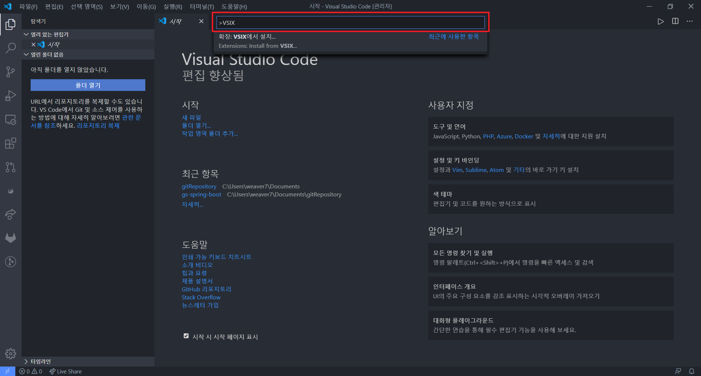
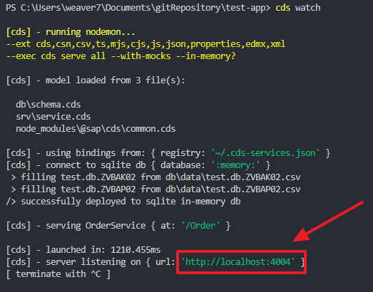
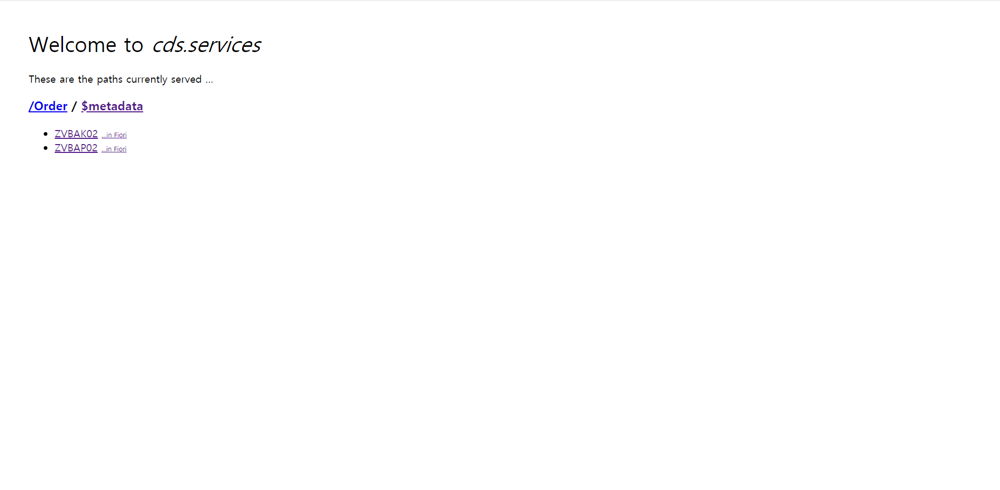
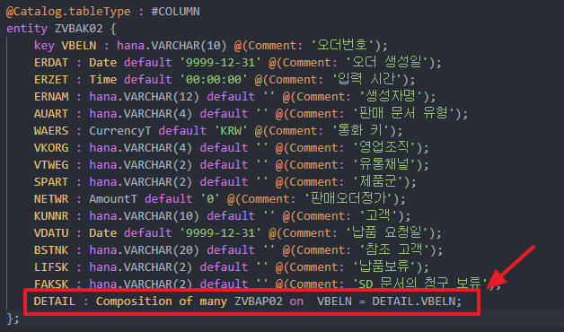
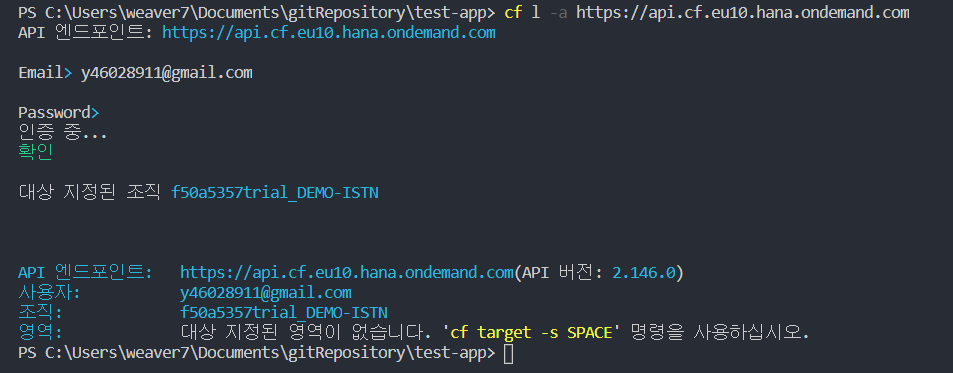
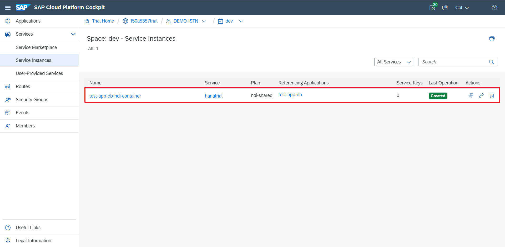
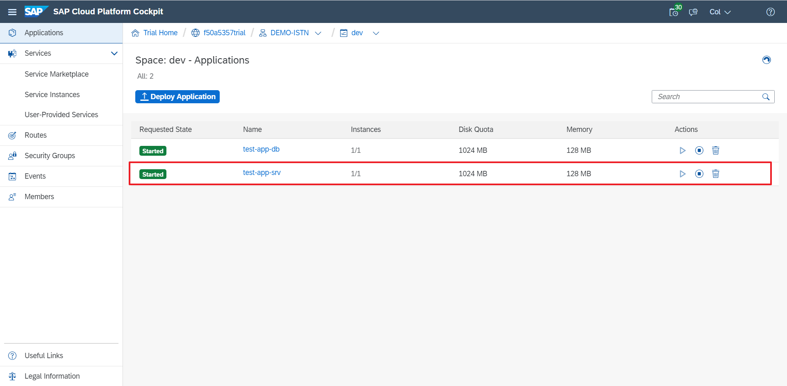
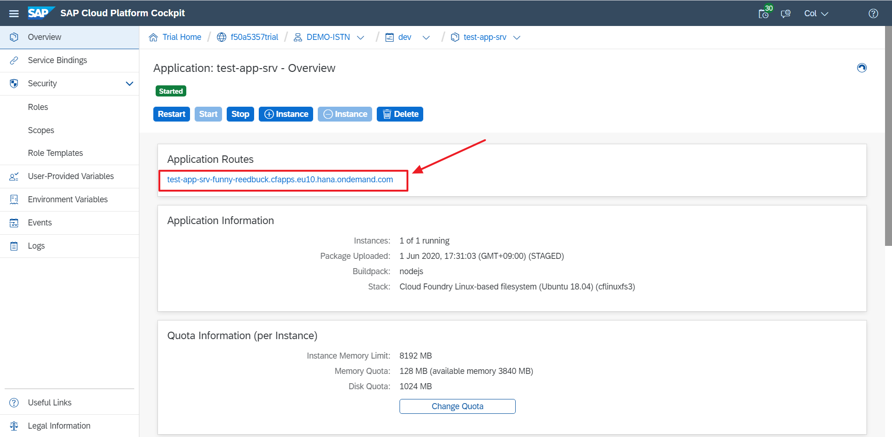
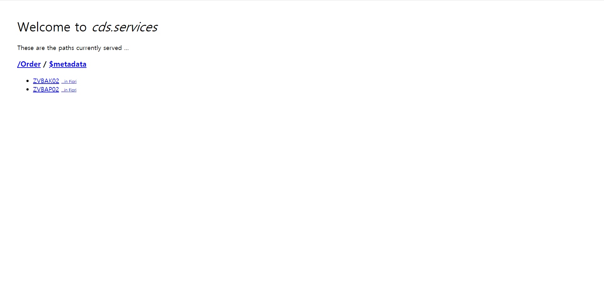

# **Tutorial SAP CAP - VSCODE**

# Change Log

## - 2020-05-27
  - INIT

## - 2020-06-08
  - 오타 수정
  - 내용 추가

---

## **Introduction**
이 내용에서는 SAP CAP 예제에 관한 내용을 안내합니다.

---
## **Prerequisite**
### 1) Visual Studio Code : [설치 가이드 링크](../Installation-Guide/01_Install-VSCODE.md)
### 2) NodeJS (Stable 버전 설치 - 12.x) [설치 가이드 링크](../Installation-Guide/02_Install-NodeJS.md) 
### 3) Cloud Foundry CLI [설치 가이드 링크](../Installation-Guide/03_Install-CF-CLI.md)
### 4) Git [설치 가이드 링크](../Installation-Guide/04_Install-Git.md)
---

## **1. Visual Studio Setting**


### 1) **`@sap`** 패키지에 대한 NPM registry 설정

    $ npm set @sap:registry=https://npm.sap.com
    

### 2) `cds` Development Kit 설치

이제 npm이 올바른 레지스트리에서 패키지를 요청한다는 것을 알고 다음 명령을 실행하여 `@sap/cds-dk`를 전역으로 설치할 수 있습니다. `cmd` 또는 `Vscode Terminal` 에서 다음 명령을 입력하세요.
   
   ```
   $ npm i -g @sap/cds-dk
   ```

> ✔ `@sap/cds` 와 `@sap/cds-dk`의 차이
>
> 원래 CAP의 NodeJS 패키지는 최상위 모듈 `@sap/cds`에 통합되어 있었습니다. 현재는 `@sap/cds-dk`가 별도로 분리되어 존재합니다. 여기서 `dk` 는 `'Development Kit'`를 의미합니다. 이 패키지는 포함된 모든 도구를 활용하여 CAP로 개발하기 위해 설치하려는 패키지입니다. `@sap/cds` 단순히 `Runtime` 패키지로 생각하시면 됩니다.

### 3) CDS Language Support for Visual Studio Code 설치

- `vscode-cds-2.2.0.vsix`  [다운로드 링크](https://tools.hana.ondemand.com/additional/vscode-cds-updateSite/vscode-cds-2.2.0.vsix)

- **`Ctrl + Shitp + P`** 를 입력 후 `VSIX` 입력


- 다운로드 받은 `vscode-cds-2.2.0.vsix` 파일을 찾아 설치

### 4) 설치 확인
- **명령어**

```
$ cds -v
```
- **결과**
```
PS C:\Users\weaver7\Documents\gitRepository> cds -v
@sap/cds: 3.34.1
@sap/cds-compiler: 1.26.2
@sap/cds-dk: 1.8.2
@sap/cds-foss: 1.2.0
@sap/cds-reflect: 2.11.0
@sap/cds-runtime: 1.1.0
Node.js: v10.15.3
home: C:\Users\weaver7\AppData\Roaming\npm\node_modules\@sap\cds-dk\node_modules\@sap\cds
```

## **2. Initialize new CAP porject**

설치한 `cds` 명령어를 사용하면 다양한 구성 요소가 미리 구성된 새 디렉토리 형태로 새 CAP Project를 만들 수 있습니다. 홈 디렉토리 또는 쓰기 액세스 권한이있는 다른 디렉토리에서 다음 명령어를 입력하세요.

- 명령어
```
cds init <사용자 프로젝트명>
```

- 예제
```
cds init test-app
```


## **3. Add a schema and service definition**

프로젝트 생성시 아래와 같이 다수의 폴더/파일들이 생성됩니다.

```
📦test-app
 ┣ 📂.vscode
 ┣ 📂app
 ┣ 📂db
 ┣ 📂srv
 ┣ 📜.cdsrc.json
 ┣ 📜.eslintrc
 ┣ 📜.gitignore
 ┣ 📜package.json
 ┗ 📜README.md  
```

 ### - 📂app : Fiori UI를 그리기 위한 Artifacts
 ### - 📂db : 데이터베이스 스키마 모델을 정의하는 위치
 ### - 📂srv : 서비스를 정의하는 위치


### **1) 가장 먼저 데이터베이스 정의를 작성합니다.**

`📂db` 디렉토리에 `schema.cds` 파일을 작성하고 다음 내용을 파일에 저장합니다.

## Predefined Types

ANSI SQL 유형 및 Edm에 맵핑 비교를 위해 주어진 유형. 

다음과 같은 내장 유형이 제공됩니다.

| CDS Type     | Arguments / Remarks      | SQL          | OData (V4)         |
| :----------- | :----------------------- | :----------- | :----------------- |
| UUID         | a 36-characters string   | NVARCHAR(36) | Edm.Guid (1)       |
| Boolean      |                          | BOOLEAN      | Edm.Boolean        |
| Integer      |                          | INTEGER      | Edm.Int32          |
| Integer64    |                          | BIGINT       | Edm.Int64          |
| Decimal      | ( precision, scale ) (2) | DECIMAL      | Edm.Decimal        |
| DecimalFloat | deprecated               | DECIMAL      | Edm.Decimal        |
| Double       |                          | DOUBLE       | Edm.Double         |
| Date         |                          | DATE         | Edm.Date (3)       |
| Time         |                          | TIME         | Edm.TimeOfDay (4)  |
| DateTime     | sec precision            | TIMESTAMP    | Edm.DateTimeOffset |
| Timestamp    | µs precision             | TIMESTAMP    | Edm.DateTimeOffset |
| String       | ( length )               | NVARCHAR     | Edm.String         |
| Binary       | ( length )               | VARBINARY    | Edm.Binary         |
| LargeBinary  |                          | BLOB         | Edm.Binary         |
| LargeString  |                          | NCLOB        | Edm.String         |

```
(1) Mapping can be changed with, for example, @odata.Type='Edm.String'
(2) Optional
(3) OData V2: Edm.DateTime with sap:display-format="Date"
(4) OData V2: Edm.Time
```

SAP HANA-Specific Data Types

>SAP HANA 특정 데이터 유형은 기존 SAP HANA 유형을 기존 데이터베이스 테이블에 보존해야하는 경우 기존 SAP HANA CDS 모델을 CAP 도메인으로 포팅하기 위해 주로 사용됩니다. 처음부터 시작하는 경우 이러한 유형을 사용하지 말고 사전 정의 된 CDS 유형 만 사용해야합니다.

| CDS Type          | Arguments / Remarks | SQL          | OData (V4)        |
| :---------------- | :------------------ | :----------- | :---------------- |
| hana.SMALLINT     |                     | SMALLINT     | Edm.Int16         |
| hana.TINYINT      |                     | TINYINT      | Edm.Byte          |
| hana.SMALLDECIMAL |                     | SMALLDECIMAL | Edm.Decimal       |
| hana.REAL         |                     | REAL         | Edm.Single        |
| hana.CHAR         | ( length )          | CHAR         | Edm.String        |
| hana.NCHAR        | ( length )          | NCHAR        | Edm.String        |
| hana.VARCHAR      | ( length )          | VARCHAR      | Edm.String        |
| hana.CLOB         |                     | CLOB         | Edm.String        |
| hana.BINARY       | ( length )          | BINARY       | Edm.Binary        |
| hana.ST_POINT     | ( srid ) (1)        | ST_POINT     | Edm.GeometryPoint |
| hana.ST_GEOMETRY  | ( srid ) (1)        | ST_GEOMETRY  | Edm.Geometry      |


```javascript
using { Currency, managed, sap } from '@sap/cds/common';
namespace test.db;

type CurrencyT : String(5);
type AmountT : Decimal(15,3);
type QuantityT : Decimal(13, 3) @(title: 'Quantity', Measures.Unit: Units.Quantity );
type UnitT : String(3) @title: 'Unit';

@Catalog.tableType : #COLUMN
entity ZVBAK02 {
    key VBELN : hana.VARCHAR(10) @(Comment: '오더번호');
	ERDAT : Date default '9999-12-31' @(Comment: '오더 생성일');
	ERZET : Time default '00:00:00' @(Comment: '입력 시간');
	ERNAM : hana.VARCHAR(12) default '' @(Comment: '생성자명');
	AUART : hana.VARCHAR(4) default '' @(Comment: '판매 문서 유형');
	WAERS : CurrencyT default 'KRW' @(Comment: '통화 키');
	VKORG : hana.VARCHAR(4) default '' @(Comment: '영업조직');
	VTWEG : hana.VARCHAR(2) default '' @(Comment: '유통채널');
	SPART : hana.VARCHAR(2) default '' @(Comment: '제품군');
	NETWR : AmountT default '0' @(Comment: '판매오더정가');
	KUNNR : hana.VARCHAR(10) default '' @(Comment: '고객');
	VDATU : Date default '9999-12-31' @(Comment: '납품 요청일');
	BSTNK : hana.VARCHAR(20) default '' @(Comment: '참조 고객');
	LIFSK : hana.VARCHAR(2) default '' @(Comment: '납품보류');
	FAKSK : hana.VARCHAR(2) default '' @(Comment: 'SD 문서의 청구 보류');	
};


@Catalog.tableType : #COLUMN
entity ZVBAP02 {
    key VBELN : hana.VARCHAR(10) @(Comment: '오더번호');
	key POSNR : Integer @(Comment: '판매 문서 품목');
	MATNR : hana.VARCHAR(10) default '' @(Comment: '자재');
	KWMENG : QuantityT default '0' @(Comment: '누적 오더 수량(판매 단위)');
	MEINS : UnitT default '' @(Comment: '기본 단위');
	NETPR : AmountT default '0' @(Comment: '단가');
	WERKS : hana.VARCHAR(4) default '' @(Comment: '공장');
	NETWR : AmountT default '0' @(Comment: '전표 통화의 오더 품목 정가');
	LFIMG_SUM : QuantityT default '0' @(Comment: '실제수량납품 (판매단위)');
};
```

### **2) 해당 Entity를 노출시킬 서비스를 작성합니다.**

`📂srv` 디렉토리에 `service.cds` 파일을 작성하고 다음 내용을 파일에 저장합니다.

```javascript
using { test.db as db } from '../db/schema';

service OrderService @(path: '/Order') {
  entity ZVBAK02 as projection on db.ZVBAK02;
  entity ZVBAP02 as projection on db.ZVBAP02;
}
```


### **3) node module 설치**

여기까지 진행하면 한가지 문제가 발생합니다.

`db/schema.cds` 파일이 문제가 있다고 표시될겁니다.

```javascript
using { Currency, managed, sap } from '@sap/cds/common';
```

파일을 열어보면 `@sap/cds/common` 패키지를 찾을수 없다는 오류가 나타납니다.
참조 된 리소스를 사용할 수 없기 때문입니다. 
이것은 모든 CAP 설치와 함께 제공되는 Common Definition 파일이며 `@sap/cds` 및 `@sap/cds-dk` 패키지에 있습니다.

이 문제를 해결하기 위해서는 `package.json`에 설치된 `dependencies`를 설치해야 합니다.

VScode Terimal (`Ctrl` + `Shiht` + ` ) 열고 해당 CAP Project 디렉토리에서 명령어를 입력합니다.

```
$ C:\Users\weaver7\Documents\gitRepository\test-app> npm i
```

명령어를 입력하면 아래와 같이  `package.json` 등록된 모든 `dependencies`를 설치합니다.

```
PS C:\Users\weaver7\Documents\gitRepository\test-app> npm i

> @sap-cloud-sdk/core@1.18.1 postinstall C:\Users\weaver7\Documents\gitRepository\test-app\node_modules\@sap-cloud-sdk\core
> node usage-analytics.js

npm notice created a lockfile as package-lock.json. You should commit this file.
added 169 packages from 166 contributors and audited 169 packages in 12.417s

1 package is looking for funding
  run `npm fund` for details

found 0 vulnerabilities

PS C:\Users\weaver7\Documents\gitRepository\test-app>
```

설치가 완료되면 CAP Project Root 디렉토리에 `node_modules/`라는 새 디렉토리가 생성된것을 확인할 수 있습니다.


추가적으로 로컬 환경에서 CAP Project를 실행하기 위해서는 `SQLite` 모듈이 필요합니다. 아래와 같이 명령어를 입력해 `SQLite`를 설치합니다.

- **명령어**
```
$ npm i --save-dev sqlite3
```

- **예제**
```
C:\Users\weaver7\Documents\gitRepository\test-app> npm i --save-dev sqlite3
```


### **4) Mock 데이터 입력**

```
 ┣ 📂db
 ┃ ┣ 📂data
 ┃ ┃ ┗ 📜test.db.ZVBAK02.csv
 ┃ ┃ ┗ 📜test.db.ZVBAK02.csv
```

> ✔ CSV파일명에 대한 이해
> 
> CSV파일의 이름은 `{Namespace}.{EntityName}.csv`로 이루어져 있습니다. 처음 Schema에 입력한 namespace `test.db`와 Entity이름인 `ZVBAK02`를 더해 `📜test.db.ZVBAK02.csv` 파일이 만들면 자동으로 csv에 입력된 데이터가 초기값으로 입력됩니다.

해당 경로에 위처럼 파일을 생성하고 아래와 같이 입력합니다.


- **test.db.ZVBAK02.csv**
```
VBELN;ERDAT;ERZET;ERNAM;AUART;WAERS;VKORG;VTWEG;SPART;NETWR;KUNNR;VDATU;BSTNK;LIFSK;FAKSK
1000000002;2020-02-04;17:44:20;JMWN50;TA;KRW;1000;10;D1;16000;1000000000;2020-02-04;;;
1000000003;2020-05-19;14:49:03;JWLEE;TA;KRW;1000;10;D1;1000;1000000000;2020-04-28;;;
1000000004;2020-05-19;14:50:43;JWLEE;TA;KRW;1000;10;D1;1000;1000000000;2020-04-28;;;
```

- **test.db.ZVBAP02.csv**
```
VBELN;POSNR;MATNR;KWMENG;MEINS;NETPR;WERKS;NETWR;LFIMG_SUM
1000000002;1;3000000000;6;EA;2500;;150.00;1
1000000002;2;1000000000;1;EA;1000;;10.00;1
1000000003;1;1000000001;1;EA;1000;;10.00;0
1000000004;1;1000000001;1;EA;1000;;10.00;0
```

### **5) CAP 실행**

VScode Terimal (`Ctrl` + `Shiht` + ` ) 열고 해당 CAP Project 디렉토리에서 명령어를 입력합니다.

- **명령어**
```
$ cds watch
```

- **예제**
```
C:\Users\weaver7\Documents\gitRepository\test-app> cds watch
```

명령어를 입력하면 아래와 같이 로컬 CAP가 4004포트에서 실행된것을 확인할수 있습니다.



해당 링크를 (`Ctrl + 클릭`) 들어가면 아래와 같은 화면이 나타납니다.




## **4. Add Deep Entity**

Deep Insert/Update/Delete 기능을 사용할수 있게 Entity를 작성하는 방법을 추가합니다.


기존에 작성한 `📂db` 디렉토리의 `schema.cds` 파일에 아래 코드를 `ZVBAK02` Entity에 추가합니다.


```
DETAIL : Composition of many ZVBAP02 on  VBELN = DETAIL.VBELN;
```





## **5. CRUD Example**
---

## **GET - Order Detail (Deep Read)**

>Method : **GET**
```url
http://localhost:4004/Order/ZVBAK02({VBELN})?$expand=DETAIL
```

- 예제
```
http://localhost:4004/Order/ZVBAK02('1000000002')?$expand=DETAIL
```

- ### **URL Parameter**

| Parameter | Description |
| :-------: | :---------: |
|   VBELN   |    전표번호     |

- ### **Request Header**


- ### **Request Body**
```
None
```


- ### **Response**
✅ 200 OK
```json
{
    "@odata.context": "$metadata#ZVBAK02(DETAIL())/$entity",
    "VBELN": "1000000001",
    "ERDAT": "2020-05-22",
    "ERZET": "17:45:26",
    "ERNAM": "Dummy",
    "AUART": "TA",
    "WAERS": "KRW",
    "VKORG": "1000",
    "VTWEG": "10",
    "SPART": "D1",
    "NETWR": 2500,
    "KUNNR": "1000000000",
    "VDATU": "2020-05-22",
    "BSTNK": "",
    "LIFSK": "",
    "FAKSK": "",
    "DETAIL": [
        {
            "VBELN": "1000000001",
            "POSNR": 1,
            "MATNR": "11123",
            "KWMENG": 50,
            "MEINS": "EA",
            "NETPR": 50,
            "WERKS": "",
            "NETWR": 2500,
            "LFIMG_SUM": 0
        }
    ]
}
```


---
## **POST - Create Order (Deep Insert)**

>Method : **POST**
```url
http://localhost:4004/Order/ZVBAK02
```

- ### **Request Header**
  
|     KEY      |                  VALUE                  |
| :----------: | :-------------------------------------: |
| Content-Type | application/json;IEEE754Compatible=true |

- ### **Request Body**
```json
{
    "VBELN": "1000000001",
    "ERDAT": "2020-02-04",
    "ERZET": "17:44:20",
    "ERNAM": "JMWN50",
    "AUART": "TA",
    "WAERS": "KRW",
    "VKORG": "1000",
    "VTWEG": "10",
    "SPART": "D1",
    "NETWR": "16000",
    "KUNNR": "1000000000",
    "VDATU": "2020-02-04",
    "BSTNK": "",
    "LIFSK": "",
    "FAKSK": "",
    "DETAIL": [
        {
            "POSNR": 1,
            "MATNR": "",
            "KWMENG": "0",
            "MEINS": "",
            "NETPR": "0",
            "WERKS": "",
            "NETWR": "0",
            "LFIMG_SUM": "0"
        },
        {
            "POSNR": 2,
            "MATNR": "",
            "KWMENG": "0",
            "MEINS": "",
            "NETPR": "0",
            "WERKS": "",
            "NETWR": "0",
            "LFIMG_SUM": "0"
        }
    ]
}
```


- ### **Response**
✅ 200 OK
```json
{
    "message": {
        "@odata.context": "$metadata#ZVBAK02(DETAIL())/$entity",
        "VBELN": "1000000001",
        "ERDAT": "2020-02-04",
        "ERZET": "17:44:20",
        "ERNAM": "JMWN50",
        "AUART": "TA",
        "WAERS": "KRW",
        "VKORG": "1000",
        "VTWEG": "10",
        "SPART": "D1",
        "NETWR": 16000,
        "KUNNR": "1000000000",
        "VDATU": "2020-02-04",
        "BSTNK": "",
        "LIFSK": "",
        "FAKSK": "",
        "DETAIL": [
            {
                "VBELN": "1000000001",
                "POSNR": 1,
                "MATNR": "",
                "KWMENG": 0,
                "MEINS": "",
                "NETPR": 0,
                "WERKS": "",
                "NETWR": 0,
                "LFIMG_SUM": 0
            },
            {
                "VBELN": "1000000001",
                "POSNR": 2,
                "MATNR": "",
                "KWMENG": 0,
                "MEINS": "",
                "NETPR": 0,
                "WERKS": "",
                "NETWR": 0,
                "LFIMG_SUM": 0
            }
        ]
    }
}
```


---
## **DELETE - DELETE Order (Deep Delete)**

>Method : **DELETE**
```url
http://localhost:4004/Order/ZVBAK02/{VBELN}
```

- 예제
```url
http://localhost:4004/Order/ZVBAK02/1000000001
```

- ### **Request Header**

- ### **Request Body**
```
None
```

- ### **Response**
✅ 204 No Content
```
None
```

---

## **PATCH - Update Order (Deep Update)**

- DB에 존재하지 않는 Child Entity 생성 가능
> ⚠ Deep Update시 기존 Child Entity의 Key를 입력하지 않으면 기존 Child Entity가 삭제되므로 주의

>Method : **PATCH**
```url
http://localhost:4004/Order/ZVBAK02/{VBELN}
```
- ### **URL Parameter**

| Parameter | Description |
| :-------: | :---------: |
|   VBELN   |    전표번호     |

- ### **Request Header**
  
|     KEY      |      VALUE       |
| :----------: | :--------------: |
| Content-Type | application/json |


- ### **Request Body**
```json
{
    "VBELN": "1000000001",
    "ERDAT": "2020-02-04",
    "ERZET": "17:44:20",
    "ERNAM": "JMWN50",
    "AUART": "TA",
    "WAERS": "KRW",
    "VKORG": "1000",
    "VTWEG": "10",
    "SPART": "D1",
    "NETWR": "16000",
    "KUNNR": "1000000000",
    "VDATU": "2020-02-04",
    "BSTNK": "",
    "LIFSK": "",
    "FAKSK": "",
    "DETAIL": [
        {
            "POSNR": 1,
            "MATNR": "",
            "KWMENG": "0",
            "MEINS": "",
            "NETPR": "0",
            "WERKS": "",
            "NETWR": "0",
            "LFIMG_SUM": "0"
        },
        {
            "POSNR": 2,
            "MATNR": "",
            "KWMENG": "0",
            "MEINS": "",
            "NETPR": "0",
            "WERKS": "",
            "NETWR": "0",
            "LFIMG_SUM": "0"
        }
    ]
}
```


- ### **Response**
✅ 200 OK
```json
{
    "@odata.context": "$metadata#ZVBAK02/$entity",
    "VBELN": "1000000001",
    "ERDAT": "2020-02-04",
    "ERZET": "17:44:20",
    "ERNAM": "JMWN50",
    "AUART": "TA",
    "WAERS": "KRW",
    "VKORG": "1000",
    "VTWEG": "10",
    "SPART": "D1",
    "NETWR": 16000,
    "KUNNR": "1000000000",
    "VDATU": "2020-02-04",
    "BSTNK": "",
    "LIFSK": "",
    "FAKSK": ""
}
```


---

## **POST - Create Order (Batch - multipart)**

>Method : **POST**
```url
http://localhost:4004/Order/$batch
```
- ### **URL Parameter**

| Parameter | Description |
| :-------: | :---------: |
|   VBELN   |    전표번호     |

- ### **Request Header**
  
|     KEY      |      VALUE       |
| :----------: | :--------------: |
| Content-Type | multipart/mixed; boundary=batch |


- ### **Request Body**

```batch
--batch
Content-Type: multipart/mixed; boundary=changeset

--changeset
Content-Type: application/http
Content-Transfer-Encoding: binary

POST ZVBAK02 HTTP/1.1
Content-Type: application/json;IEEE754Compatible=true
Accept: application/json

{
    "VBELN": "1000000010",
    "ERDAT": "2020-02-04",
    "ERZET": "17:44:20",
    "ERNAM": "JMWN50",
    "AUART": "TA",
    "WAERS": "KRW",
    "VKORG": "1000",
    "VTWEG": "10",
    "SPART": "D1",
    "NETWR": "16000",
    "KUNNR": "1000000000",
    "VDATU": "2020-02-04",
    "BSTNK": "",
    "LIFSK": "",
    "FAKSK": "",
    "DETAIL": [
        {
            "POSNR": 1,
            "MATNR": "",
            "KWMENG": "0",
            "MEINS": "",
            "NETPR": "0",
            "WERKS": "",
            "NETWR": "0",
            "LFIMG_SUM": "0"
        },
        {
            "POSNR": 2,
            "MATNR": "",
            "KWMENG": "0",
            "MEINS": "",
            "NETPR": "0",
            "WERKS": "",
            "NETWR": "0",
            "LFIMG_SUM": "0"
        }
    ]
}

--changeset--

--batch--
```


- ### **Response**
✅ 200 OK
```json
{
    "responses": [
        {
            "status": 201,
            "id": "~00",
            "atomicityGroup": "changeset",
            "headers": {
                "odata-version": "4.0",
                "content-type": "application/json;odata.metadata=minimal",
                "location": "ZVBAK02('1000000010')"
            },
            "body": {
                "@odata.context": "$metadata#ZVBAK02(DETAIL())/$entity",
                "VBELN": "1000000010",
                "ERDAT": "2020-02-04",
                "ERZET": "17:44:20",
                "ERNAM": "JMWN50",
                "AUART": "TA",
                "WAERS": "KRW",
                "VKORG": "1000",
                "VTWEG": "10",
                "SPART": "D1",
                "NETWR": 16000,
                "KUNNR": "1000000000",
                "VDATU": "2020-02-04",
                "BSTNK": "",
                "LIFSK": "",
                "FAKSK": "",
                "DETAIL": [
                    {
                        "VBELN": "1000000010",
                        "POSNR": 1,
                        "MATNR": "",
                        "KWMENG": 0,
                        "MEINS": "",
                        "NETPR": 0,
                        "WERKS": "",
                        "NETWR": 0,
                        "LFIMG_SUM": 0
                    },
                    {
                        "VBELN": "1000000010",
                        "POSNR": 2,
                        "MATNR": "",
                        "KWMENG": 0,
                        "MEINS": "",
                        "NETPR": 0,
                        "WERKS": "",
                        "NETWR": 0,
                        "LFIMG_SUM": 0
                    }
                ]
            }
        }
    ]
}
```

---

## **DELETE - Delete Order (Batch - Json)**

>Method : **POST**
```url
http://localhost:4004/Order/$batch
```
- ### **URL Parameter**

| Parameter | Description |
| :-------: | :---------: |
|   VBELN   |    전표번호     |

- ### **Request Header**
  
|     KEY      |      VALUE       |
| :----------: | :--------------: |
| Content-Type | application/json |


- ### **Request Body**
```json
{
	"requests": [
        {
            "atomicityGroup": "group1",
            "id": "group-002",
            "method": "DELETE",
            "url": "/ZVBAK02/1000000002"
        },
        {
            "atomicityGroup": "group1",
            "id": "group-003",
            "method": "DELETE",
            "url": "/ZVBAK02/1000000003"
        }
    ]
}
```


- ### **Response**
✅ 200 OK
```json
{
    "responses": [
        {
            "status": 204,
            "id": "group-002",
            "atomicityGroup": "group1",
            "headers": {
                "odata-version": "4.0"
            }
        },
        {
            "status": 204,
            "id": "group-003",
            "atomicityGroup": "group1",
            "headers": {
                "odata-version": "4.0"
            }
        }
    ]
}
```


## **6. Deploy CAP**

제작한 CAP Project를 Cloud Foundry에 배포하는 방법을 설명합니다.

### **1) CAP Project Build**

CAP Project를 배포하기 위해서는 우선 Build를 해야합니다.


```
$ $env:CDS_ENV = "production" ; cds build
```

Build후엔 아래와 같이 ROOT 디렉토리에 📂gen 디렉토리 생성된것을 확인할 수 있습니다.

```
📦gen
 ┣ 📂db
 ┗ 📂srv
```

> ⚠ Build 후엔 반드시 아래 명령어를 입력해 환경변수를 변경해야 합니다. 환경변수를 변경하지 않으면 `cds watch` 디버깅 모드가 동작하지 않습니다.

```
$ $env:CDS_ENV = "development"
```

### **2) Cloud Foundry 로그인**

```
$ cf l -a https://api.cf.eu10.hana.ondemand.com
```

명령어를 입력후 Email 과 Password를 입력해 로그인 합니다.





### **3) Cloud Foundry HANA HDI-Container 생성**

Database 역할을 담당할 hdi-container를 생성합니다.

- 명령어
```
cf create-service hana hdi-shared  {appname}-db-hdi-container
```

- Trial인 경우
```
$ cf create-service hanatrial hdi-shared  test-app-db-hdi-container
```

- GlobalAccount에 CF HANA DB가 존재할 경우
```
$ cf create-service hana hdi-shared test-app-db-hdi-container
```

hdi-container 생성이 완료된 상태



### **4) Cloud Foundry HANA DB 생성**

```
$ cf push -f gen\db
```

DB 생성이 완료된 상태


### **5) Cloud Foundry OData Service 생성**

```
$ cf push -f gen\srv --random-route
```

Service 생성이 완료된 상태



생성된 서비스 URL로 이동





로컬 CAP와 같은 화면이 나타난다면 정상적으로 CAP Project Deploy가 완료됐습니다.