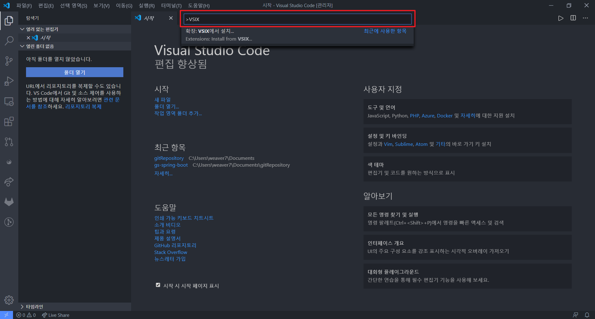
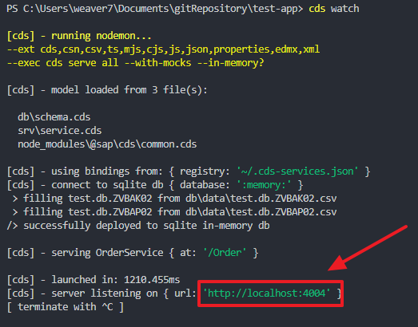
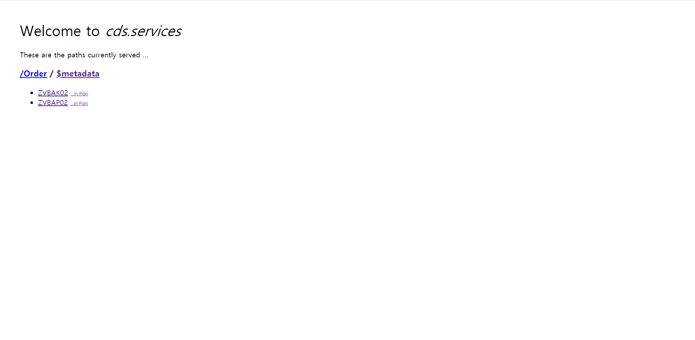
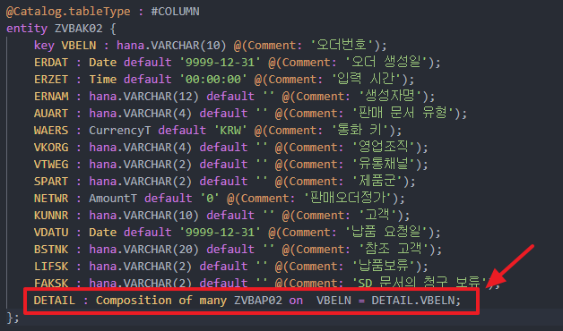
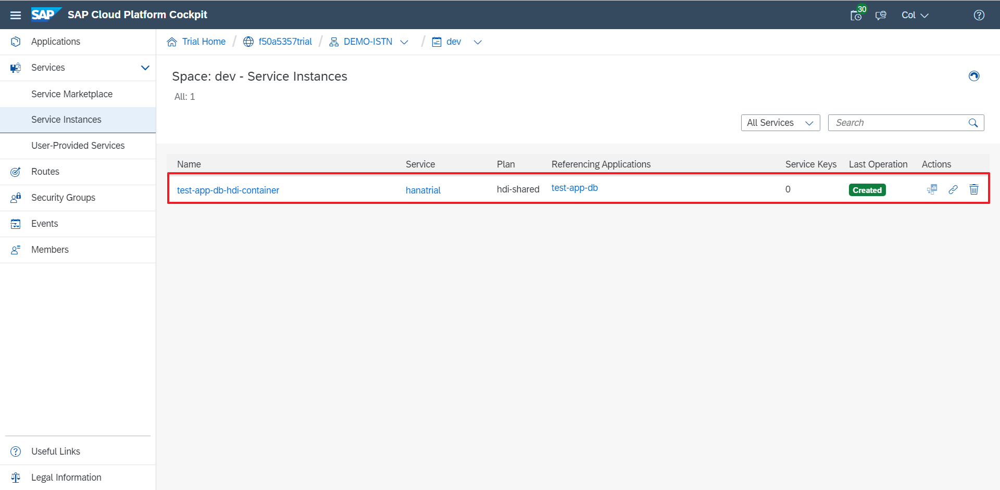
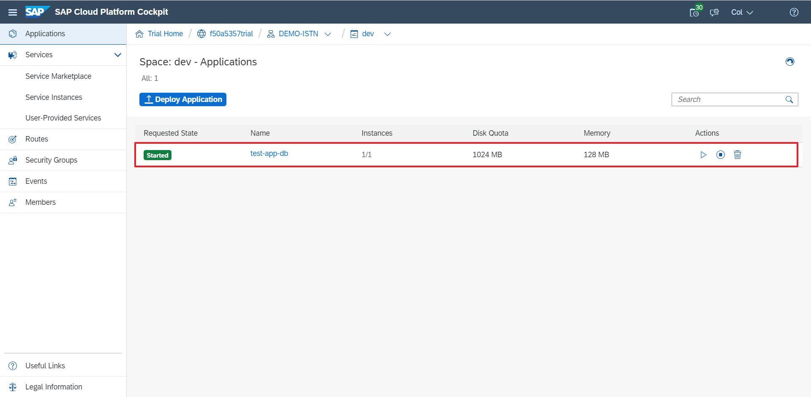
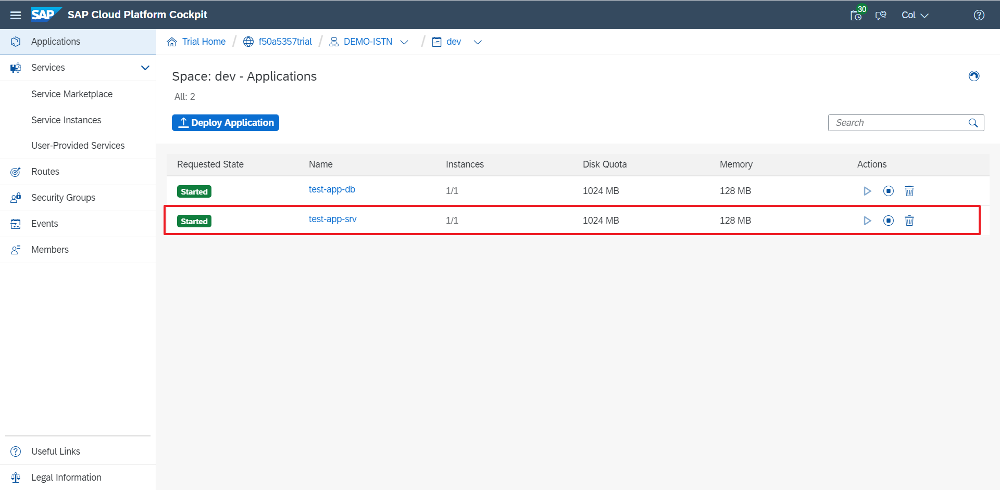
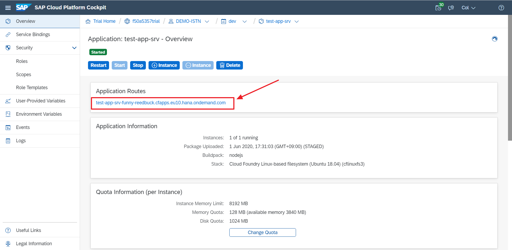
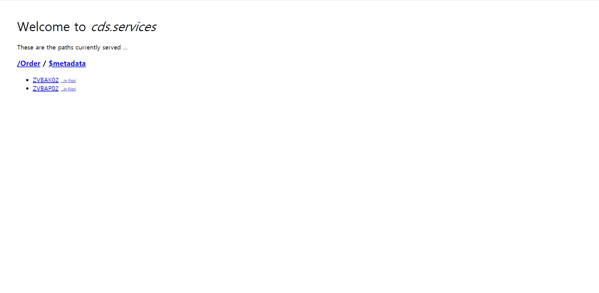

# **Tutorial SAP CAP - BAS**

# Change Log

## - 2020-05-27
  - INIT

## - 2020-06-08
  - 오타 수정
  - 내용 추가
---

## **Introduction**
이 내용에서는 SAP CAP 예제에 관한 내용을 안내합니다.


---
## **Prerequisite**
### 1) Visual Studio Code : [설치 가이드 링크](../Installation-Guide/01_Install-VSCODE.md)
### 2) NodeJS (Stable 버전 설치 - 12.x) [설치 가이드 링크](../Installation-Guide/02_Install-NodeJS.md) 
### 3) Cloud Foundry CLI [설치 가이드 링크](../Installation-Guide/03_Install-CF-CLI.md)
### 4) Git [설치 가이드 링크](../Installation-Guide/04_Install-Git.md)
---

## **1. Visual Studio Setting**


### 1) **`@sap`** 패키지에 대한 NPM registry 설정

    $ npm set @sap:registry=https://npm.sap.com
    

### 2) `cds` Development Kit 설치

이제 npm이 올바른 레지스트리에서 패키지를 요청한다는 것을 알고 다음 명령을 실행하여 `@sap/cds-dk`를 전역으로 설치할 수 있습니다. `cmd` 또는 `Vscode Terminal` 에서 다음 명령을 입력하세요.
   
   ```
   $ npm i -g @sap/cds-dk
   ```

> ✔ `@sap/cds` 와 `@sap/cds-dk`의 차이
>
> 원래 CAP의 NodeJS 패키지는 최상위 모듈 `@sap/cds`에 통합되어 있었습니다. 현재는 `@sap/cds-dk`가 별도로 분리되어 존재합니다. 여기서 `dk` 는 `'Development Kit'`를 의미합니다. 이 패키지는 포함된 모든 도구를 활용하여 CAP로 개발하기 위해 설치하려는 패키지입니다. `@sap/cds` 단순히 `Runtime` 패키지로 생각하시면 됩니다.

### 3) CDS Language Support for Visual Studio Code 설치

- `vscode-cds-2.2.0.vsix`  [다운로드 링크](https://tools.hana.ondemand.com/additional/vscode-cds-updateSite/vscode-cds-2.2.0.vsix)

- **`Ctrl + Shitp + P`** 를 입력 후 `VSIX` 입력


- 다운로드 받은 `vscode-cds-2.2.0.vsix` 파일을 찾아 설치

### 4) 설치 확인
- **명령어**

```
$ cds -v
```
- **결과**
```
PS C:\Users\weaver7\Documents\gitRepository> cds -v
@sap/cds: 3.34.1
@sap/cds-compiler: 1.26.2
@sap/cds-dk: 1.8.2
@sap/cds-foss: 1.2.0
@sap/cds-reflect: 2.11.0
@sap/cds-runtime: 1.1.0
Node.js: v10.15.3
home: C:\Users\weaver7\AppData\Roaming\npm\node_modules\@sap\cds-dk\node_modules\@sap\cds
```

## **2. Initialize new CAP porject**

설치한 `cds` 명령어를 사용하면 다양한 구성 요소가 미리 구성된 새 디렉토리 형태로 새 CAP Project를 만들 수 있습니다. 홈 디렉토리 또는 쓰기 액세스 권한이있는 다른 디렉토리에서 다음 명령어를 입력하세요.

- 명령어
```
cds init <사용자 프로젝트명>
```

- 예제
```
cds init tutorial-app
```


## **3. Add a schema and service definition**

프로젝트 생성시 아래와 같이 다수의 폴더/파일들이 생성됩니다.

```
📦test-app
 ┣ 📂.vscode
 ┣ 📂app
 ┣ 📂db
 ┣ 📂srv
 ┣ 📜.cdsrc.json
 ┣ 📜.eslintrc
 ┣ 📜.gitignore
 ┣ 📜package.json
 ┗ 📜README.md  
```

 ### - 📂app : Fiori UI를 그리기 위한 Artifacts
 ### - 📂db : 데이터베이스 스키마 모델을 정의하는 위치
 ### - 📂srv : 서비스를 정의하는 위치


### **1) 가장 먼저 데이터베이스 정의를 작성합니다.**

`📂db` 디렉토리에 `schema.cds` 파일을 작성하고 다음 내용을 파일에 저장합니다.

```javascript
using { Currency, managed, sap } from '@sap/cds/common';
namespace test.db;

type CurrencyT : String(5);
type AmountT : Decimal(15,3);
type QuantityT : Decimal(13, 3) @(title: 'Quantity', Measures.Unit: Units.Quantity );
type UnitT : String(3) @title: 'Unit';

@Catalog.tableType : #COLUMN
entity ZVBAK02 {
    key VBELN : hana.VARCHAR(10) @(Comment: '오더번호');
	ERDAT : Date default '9999-12-31' @(Comment: '오더 생성일');
	ERZET : Time default '00:00:00' @(Comment: '입력 시간');
	ERNAM : hana.VARCHAR(12) default '' @(Comment: '생성자명');
	AUART : hana.VARCHAR(4) default '' @(Comment: '판매 문서 유형');
	WAERS : CurrencyT default 'KRW' @(Comment: '통화 키');
	VKORG : hana.VARCHAR(4) default '' @(Comment: '영업조직');
	VTWEG : hana.VARCHAR(2) default '' @(Comment: '유통채널');
	SPART : hana.VARCHAR(2) default '' @(Comment: '제품군');
	NETWR : AmountT default '0' @(Comment: '판매오더정가');
	KUNNR : hana.VARCHAR(10) default '' @(Comment: '고객');
	VDATU : Date default '9999-12-31' @(Comment: '납품 요청일');
	BSTNK : hana.VARCHAR(20) default '' @(Comment: '참조 고객');
	LIFSK : hana.VARCHAR(2) default '' @(Comment: '납품보류');
	FAKSK : hana.VARCHAR(2) default '' @(Comment: 'SD 문서의 청구 보류');	
};


@Catalog.tableType : #COLUMN
entity ZVBAP02 {
    key VBELN : hana.VARCHAR(10) @(Comment: '오더번호');
	key POSNR : Integer @(Comment: '판매 문서 품목');
	MATNR : hana.VARCHAR(10) default '' @(Comment: '자재');
	KWMENG : QuantityT default '0' @(Comment: '누적 오더 수량(판매 단위)');
	MEINS : UnitT default '' @(Comment: '기본 단위');
	NETPR : AmountT default '0' @(Comment: '단가');
	WERKS : hana.VARCHAR(4) default '' @(Comment: '공장');
	NETWR : AmountT default '0' @(Comment: '전표 통화의 오더 품목 정가');
	LFIMG_SUM : QuantityT default '0' @(Comment: '실제수량납품 (판매단위)');
};
```

### **2) 해당 Entity를 노출시킬 서비스를 작성합니다.**

`📂srv` 디렉토리에 `service.cds` 파일을 작성하고 다음 내용을 파일에 저장합니다.

```javascript
using { test.db as db } from '../db/schema';

service OrderService @(path: '/Order') {
  entity ZVBAK02 as projection on db.ZVBAK02;
  entity ZVBAP02 as projection on db.ZVBAP02;
}
```


### **3) node module 설치**

여기까지 진행하면 한가지 문제가 발생합니다.

`db/schema.cds` 파일이 문제가 있다고 표시될겁니다.

```javascript
using { Currency, managed, sap } from '@sap/cds/common';
```

파일을 열어보면 `@sap/cds/common` 패키지를 찾을수 없다는 오류가 나타납니다.
참조 된 리소스를 사용할 수 없기 때문입니다. 
이것은 모든 CAP 설치와 함께 제공되는 Common Definition 파일이며 `@sap/cds` 및 `@sap/cds-dk` 패키지에 있습니다.

이 문제를 해결하기 위해서는 `package.json`에 설치된 `dependencies`를 설치해야 합니다.

VScode Terimal (`Ctrl` + `Shiht` + ` ) 열고 해당 CAP Project 디렉토리에서 명령어를 입력합니다.

```
$ C:\Users\weaver7\Documents\gitRepository\test-app> npm i
```

명령어를 입력하면 아래와 같이  `package.json` 등록된 모든 `dependencies`를 설치합니다.

```
PS C:\Users\weaver7\Documents\gitRepository\test-app> npm i

> @sap-cloud-sdk/core@1.18.1 postinstall C:\Users\weaver7\Documents\gitRepository\test-app\node_modules\@sap-cloud-sdk\core
> node usage-analytics.js

npm notice created a lockfile as package-lock.json. You should commit this file.
added 169 packages from 166 contributors and audited 169 packages in 12.417s

1 package is looking for funding
  run `npm fund` for details

found 0 vulnerabilities

PS C:\Users\weaver7\Documents\gitRepository\test-app>
```

설치가 완료되면 CAP Project Root 디렉토리에 `node_modules/`라는 새 디렉토리가 생성된것을 확인할 수 있습니다.


추가적으로 로컬 환경에서 CAP Project를 실행하기 위해서는 `SQLite` 모듈이 필요합니다. 아래와 같이 명령어를 입력해 `SQLite`를 설치합니다.

- **명령어**
```
$ cds watch
```

- **예제**
```
C:\Users\weaver7\Documents\gitRepository\test-app> npm install --save-dev sqlite3
```


### **4) 테스트 데이터 입력**

```
 ┣ 📂db
 ┃ ┣ 📂data
 ┃ ┃ ┗ 📜test.db.ZVBAK02.csv
 ┃ ┃ ┗ 📜test.db.ZVBAK02.csv
```

해당 경로에 위처럼 파일을 생성하고 아래와 같이 입력합니다.


- **test.db.ZVBAK02.csv**
```
VBELN;ERDAT;ERZET;ERNAM;AUART;WAERS;VKORG;VTWEG;SPART;NETWR;KUNNR;VDATU;BSTNK;LIFSK;FAKSK
1000000002;2020-02-04;17:44:20;JMWN50;TA;KRW;1000;10;D1;16000;1000000000;2020-02-04;;;
1000000003;2020-05-19;14:49:03;JWLEE;TA;KRW;1000;10;D1;1000;1000000000;2020-04-28;;;
1000000004;2020-05-19;14:50:43;JWLEE;TA;KRW;1000;10;D1;1000;1000000000;2020-04-28;;;
```

- **test.db.ZVBAP02.csv**
```
VBELN;POSNR;MATNR;KWMENG;MEINS;NETPR;WERKS;NETWR;LFIMG_SUM
1000000002;1;3000000000;6;EA;2500;;150.00;1
1000000002;2;1000000000;1;EA;1000;;10.00;1
1000000003;1;1000000001;1;EA;1000;;10.00;0
1000000004;1;1000000001;1;EA;1000;;10.00;0
```

### **5) CAP 실행**

VScode Terimal (`Ctrl` + `Shiht` + ` ) 열고 해당 CAP Project 디렉토리에서 명령어를 입력합니다.

- **명령어**
```
$ cds watch
```

- **예제**
```
C:\Users\weaver7\Documents\gitRepository\test-app> cds watch
```

명령어를 입력하면 아래와 같이 로컬 CAP가 4004포트에서 실행된것을 확인할수 있습니다.



해당 링크를 (`Ctrl + 클릭`) 들어가면 아래와 같은 화면이 나타납니다.




## **4. Add Deep Entity**

Deep Insert/Update/Delete 기능을 사용할수 있게 Entity를 작성하는 방법을 추가합니다.


기존에 작성한 `📂db` 디렉토리의 `schema.cds` 파일에 아래 코드를 `ZVBAK02` Entity에 추가합니다.


```
DETAIL : Composition of many ZVBAP02 on  VBELN = DETAIL.VBELN;
```





## **5. CRUD Example**
---

## **GET - Order Detail (Deep Read)**

>Method : **GET**
```url
http://localhost:4004/Order/ZVBAK02({VBELN})?$expand=DETAIL
```

- 예제
```
http://localhost:4004/Order/ZVBAK02('1000000002')?$expand=DETAIL
```

- ### **URL Parameter**

| Parameter | Description |
| :-------: | :---------: |
|   VBELN   |    전표번호     |

- ### **Request Header**


- ### **Request Body**
```
None
```


- ### **Response**
✅ 200 OK
```json
{
    "@odata.context": "$metadata#ZVBAK02(DETAIL())/$entity",
    "VBELN": "1000000111",
    "ERDAT": "2020-05-22",
    "ERZET": "17:45:26",
    "ERNAM": "Dummy",
    "AUART": "TA",
    "WAERS": "KRW",
    "VKORG": "1000",
    "VTWEG": "10",
    "SPART": "D1",
    "NETWR": 2500,
    "KUNNR": "1000000000",
    "VDATU": "2020-05-22",
    "BSTNK": "",
    "LIFSK": "",
    "FAKSK": "",
    "DETAIL": [
        {
            "VBELN": "1000000111",
            "POSNR": 1,
            "MATNR": "11123",
            "KWMENG": 50,
            "MEINS": "EA",
            "NETPR": 50,
            "WERKS": "",
            "NETWR": 2500,
            "LFIMG_SUM": 0
        }
    ]
}
```


---
## **POST - Create Order (Deep Insert)**

>Method : **POST**
```url
http://localhost:4004/Order/ZVBAK02
```

- ### **Request Header**
  
|     KEY      |                  VALUE                  |
| :----------: | :-------------------------------------: |
| Content-Type | application/json;IEEE754Compatible=true |

- ### **Request Body**
```json
{
    "VBELN": "",
    "ERDAT": "2020-02-04",
    "ERZET": "17:44:20",
    "ERNAM": "JMWN50",
    "AUART": "TA",
    "WAERS": "KRW",
    "VKORG": "1000",
    "VTWEG": "10",
    "SPART": "D1",
    "NETWR": "16000",
    "KUNNR": "1000000000",
    "VDATU": "2020-02-04",
    "BSTNK": "",
    "LIFSK": "",
    "FAKSK": "",
    "DETAIL": [
        {
            "POSNR": 1,
            "MATNR": "",
            "KWMENG": "0",
            "MEINS": "",
            "NETPR": "0",
            "WERKS": "",
            "NETWR": "0",
            "LFIMG_SUM": "0"
        },
        {
            "POSNR": 2,
            "MATNR": "",
            "KWMENG": "0",
            "MEINS": "",
            "NETPR": "0",
            "WERKS": "",
            "NETWR": "0",
            "LFIMG_SUM": "0"
        }
    ]
}
```


- ### **Response**
✅ 200 OK
```json
{
    "message": {
        "@odata.context": "$metadata#ZVBAK02(DETAIL())/$entity",
        "VBELN": "1000000123",
        "ERDAT": "2020-02-04",
        "ERZET": "17:44:20",
        "ERNAM": "JMWN50",
        "AUART": "TA",
        "WAERS": "KRW",
        "VKORG": "1000",
        "VTWEG": "10",
        "SPART": "D1",
        "NETWR": 16000,
        "KUNNR": "1000000000",
        "VDATU": "2020-02-04",
        "BSTNK": "",
        "LIFSK": "",
        "FAKSK": "",
        "DETAIL": [
            {
                "VBELN": "1000000123",
                "POSNR": 1,
                "MATNR": "",
                "KWMENG": 0,
                "MEINS": "",
                "NETPR": 0,
                "WERKS": "",
                "NETWR": 0,
                "LFIMG_SUM": 0
            },
            {
                "VBELN": "1000000123",
                "POSNR": 2,
                "MATNR": "",
                "KWMENG": 0,
                "MEINS": "",
                "NETPR": 0,
                "WERKS": "",
                "NETWR": 0,
                "LFIMG_SUM": 0
            }
        ]
    }
}
```


---
## **DELETE - DELETE Order (Deep Delete)**

>Method : **DELETE**
```url
http://localhost:4004/Order/ZVBAK02/{VBELN}
```

- 예제
```url
http://localhost:4004/Order/ZVBAK02/1000000123
```

- ### **Request Header**

- ### **Request Body**
```
None
```

- ### **Response**
✅ 204 No Content
```
None
```

---

## **PATCH - Update Order (Deep Update)**

- DB에 존재하지 않는 Child Entity 생성 가능
> ⚠ Deep Update시 기존 Child Entity의 Key를 입력하지 않으면 기존 Child Entity가 삭제되므로 주의

>Method : **PATCH**
```url
http://localhost:4004/Order/ZVBAK02/{VBELN}
```
- ### **URL Parameter**

| Parameter | Description |
| :-------: | :---------: |
|   VBELN   |    전표번호     |

- ### **Request Header**
  
|     KEY      |      VALUE       |
| :----------: | :--------------: |
| Content-Type | application/json |


- ### **Request Body**
```json
{
    "VBELN": "1000000001",
    "ERDAT": "2020-02-04",
    "ERZET": "17:44:20",
    "ERNAM": "JMWN50",
    "AUART": "TA",
    "WAERS": "KRW",
    "VKORG": "1000",
    "VTWEG": "10",
    "SPART": "D1",
    "NETWR": "16000",
    "KUNNR": "1000000000",
    "VDATU": "2020-02-04",
    "BSTNK": "",
    "LIFSK": "",
    "FAKSK": "",
    "DETAIL": [
        {
            "POSNR": 1,
            "MATNR": "",
            "KWMENG": "0",
            "MEINS": "",
            "NETPR": "0",
            "WERKS": "",
            "NETWR": "0",
            "LFIMG_SUM": "0"
        },
        {
            "POSNR": 2,
            "MATNR": "",
            "KWMENG": "0",
            "MEINS": "",
            "NETPR": "0",
            "WERKS": "",
            "NETWR": "0",
            "LFIMG_SUM": "0"
        }
    ]
}
```


- ### **Response**
✅ 200 OK
```json
{
    "@odata.context": "$metadata#ZVBAK02/$entity",
    "VBELN": "1000000001",
    "ERDAT": "2020-02-04",
    "ERZET": "17:44:20",
    "ERNAM": "JMWN50",
    "AUART": "TA",
    "WAERS": "KRW",
    "VKORG": "1000",
    "VTWEG": "10",
    "SPART": "D1",
    "NETWR": 16000,
    "KUNNR": "1000000000",
    "VDATU": "2020-02-04",
    "BSTNK": "",
    "LIFSK": "",
    "FAKSK": ""
}
```


---

## **POST - Create Order (Batch - multipart)**

>Method : **POST**
```url
http://localhost:4004/Order/$batch
```
- ### **URL Parameter**

| Parameter | Description |
| :-------: | :---------: |
|   VBELN   |    전표번호     |

- ### **Request Header**
  
|     KEY      |      VALUE       |
| :----------: | :--------------: |
| Content-Type | multipart/mixed; boundary=batch |


- ### **Request Body**

```batch
--batch
Content-Type: multipart/mixed; boundary=changeset

--changeset
Content-Type: application/http
Content-Transfer-Encoding: binary

POST ZVBAK02 HTTP/1.1
Content-Type: application/json;IEEE754Compatible=true
Accept: application/json

{
    "VBELN": "1000000010",
    "ERDAT": "2020-02-04",
    "ERZET": "17:44:20",
    "ERNAM": "JMWN50",
    "AUART": "TA",
    "WAERS": "KRW",
    "VKORG": "1000",
    "VTWEG": "10",
    "SPART": "D1",
    "NETWR": "16000",
    "KUNNR": "1000000000",
    "VDATU": "2020-02-04",
    "BSTNK": "",
    "LIFSK": "",
    "FAKSK": "",
    "DETAIL": [
        {
            "POSNR": 1,
            "MATNR": "",
            "KWMENG": "0",
            "MEINS": "",
            "NETPR": "0",
            "WERKS": "",
            "NETWR": "0",
            "LFIMG_SUM": "0"
        },
        {
            "POSNR": 2,
            "MATNR": "",
            "KWMENG": "0",
            "MEINS": "",
            "NETPR": "0",
            "WERKS": "",
            "NETWR": "0",
            "LFIMG_SUM": "0"
        }
    ]
}

--changeset--

--batch--
```


- ### **Response**
✅ 200 OK
```json
{
    "responses": [
        {
            "status": 201,
            "id": "~00",
            "atomicityGroup": "changeset",
            "headers": {
                "odata-version": "4.0",
                "content-type": "application/json;odata.metadata=minimal",
                "location": "ZVBAK02('1000000010')"
            },
            "body": {
                "@odata.context": "$metadata#ZVBAK02(DETAIL())/$entity",
                "VBELN": "1000000010",
                "ERDAT": "2020-02-04",
                "ERZET": "17:44:20",
                "ERNAM": "JMWN50",
                "AUART": "TA",
                "WAERS": "KRW",
                "VKORG": "1000",
                "VTWEG": "10",
                "SPART": "D1",
                "NETWR": 16000,
                "KUNNR": "1000000000",
                "VDATU": "2020-02-04",
                "BSTNK": "",
                "LIFSK": "",
                "FAKSK": "",
                "DETAIL": [
                    {
                        "VBELN": "1000000010",
                        "POSNR": 1,
                        "MATNR": "",
                        "KWMENG": 0,
                        "MEINS": "",
                        "NETPR": 0,
                        "WERKS": "",
                        "NETWR": 0,
                        "LFIMG_SUM": 0
                    },
                    {
                        "VBELN": "1000000010",
                        "POSNR": 2,
                        "MATNR": "",
                        "KWMENG": 0,
                        "MEINS": "",
                        "NETPR": 0,
                        "WERKS": "",
                        "NETWR": 0,
                        "LFIMG_SUM": 0
                    }
                ]
            }
        }
    ]
}
```

---

## **DELETE - Delete Order (Batch - Json)**

>Method : **POST**
```url
http://localhost:4004/Order/$batch
```
- ### **URL Parameter**

| Parameter | Description |
| :-------: | :---------: |
|   VBELN   |    전표번호     |

- ### **Request Header**
  
|     KEY      |      VALUE       |
| :----------: | :--------------: |
| Content-Type | application/json |


- ### **Request Body**
```json
{
	"requests": [
        {
            "atomicityGroup": "group1",
            "id": "group-002",
            "method": "DELETE",
            "url": "/ZVBAK02/1000000002"
        },
        {
            "atomicityGroup": "group1",
            "id": "group-003",
            "method": "DELETE",
            "url": "/ZVBAK02/1000000003"
        }
    ]
}
```


- ### **Response**
✅ 200 OK
```json
{
    "responses": [
        {
            "status": 204,
            "id": "group-002",
            "atomicityGroup": "group1",
            "headers": {
                "odata-version": "4.0"
            }
        },
        {
            "status": 204,
            "id": "group-003",
            "atomicityGroup": "group1",
            "headers": {
                "odata-version": "4.0"
            }
        }
    ]
}
```


## **6. Deploy CAP**

제작한 CAP Project를 Cloud Foundry에 배포하는 방법을 설명합니다.

### **1) CAP Project Build**

CAP Project를 배포하기 위해서는 우선 Build를 해야합니다.


```
$ $env:CDS_ENV = "production" ; cds build
```

Build후엔 아래와 같이 ROOT 디렉토리에 📂gen 디렉토리 생성된것을 확인할 수 있습니다.

```
📦gen
 ┣ 📂db
 ┗ 📂srv
```

> ⚠ Build 후엔 반드시 아래 명령어를 입력해 환경변수를 변경해야 합니다. 환경변수를 변경하지 않으면 `cds watch` 디버깅 모드가 동작하지 않습니다.

```
$ $env:CDS_ENV = "development"
```

### **2) Cloud Foundry 로그인**

```
$ cf l -a https://api.cf.eu10.hana.ondemand.com
```

명령어를 입력후 Email 과 Password를 입력해 로그인 합니다.


### **3) Cloud Foundry HANA HDI-Container 생성**

Database 역할을 담당할 hdi-container를 생성합니다.

- 명령어
```
cf create-service hana hdi-shared  {appname}-db-hdi-container
```

- Trial인 경우
```
$ cf create-service hanatrial hdi-shared  test-app-db-hdi-container
```

- GlobalAccount에 CF HANA DB가 존재할 경우
```
$ cf create-service hana hdi-shared test-app-db-hdi-container
```

hdi-container 생성이 완료된 상태



### **4) Cloud Foundry HANA DB 생성**

```
$ cf push -f gen\db
```

DB 생성이 완료된 상태



### **5) Cloud Foundry OData Service 생성**

```
$ cf push -f gen\srv --random-route
```

Service 생성이 완료된 상태



생성된 서비스 URL로 이동





로컬 CAP와 같은 화면이 나타난다면 정상적으로 CAP Project Deploy가 완료됐습니다.