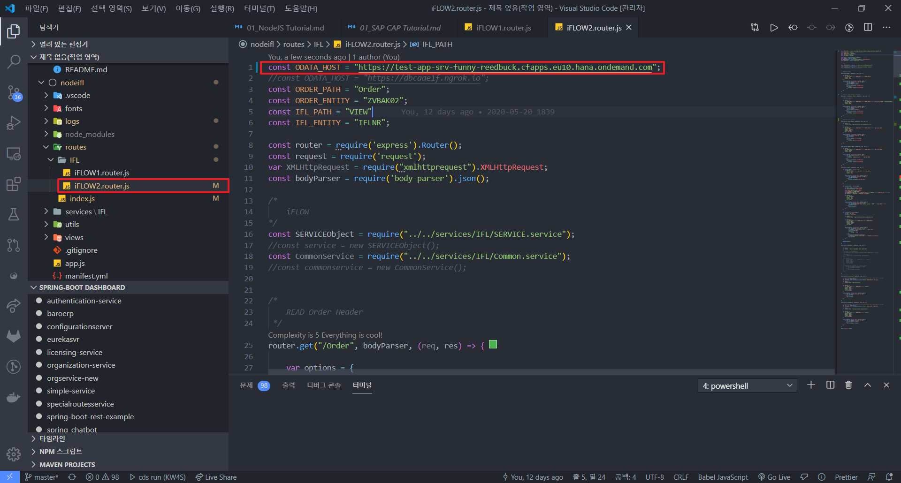
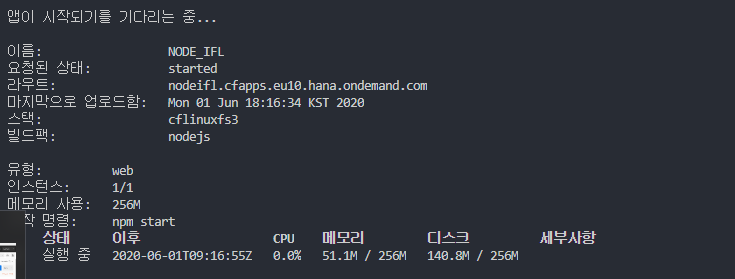
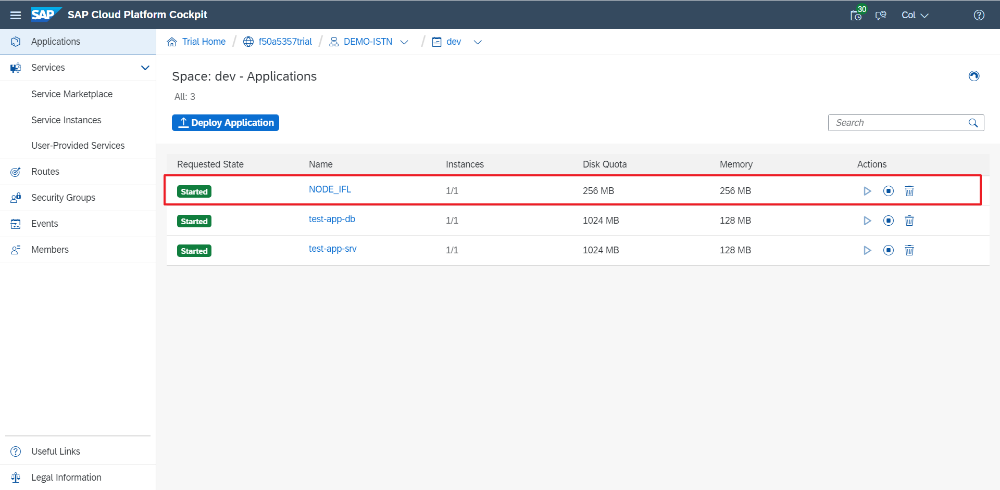
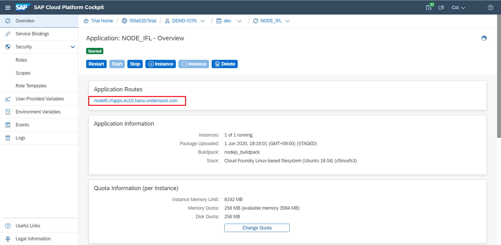

# **SAP NodeJS Tutorial**

## **Introduction**
이 내용에서는 NodeJS를 Cloud Foundry에 배포(Deploy)하기 위한 방법을 설명합니다.


---
## **Prerequisite**
### 1) Visual Studio Code : [설치 가이드 링크](./../../Software%20Installation%20Guide/01_Install%20Visual%20Studio%20Code.md)
### 2) NodeJS (Stable 버전 설치 - 12.x) [설치 가이드 링크](./../../Software%20Installation%20Guide/02_NodeJS.md) 
### 3) Cloud Foundry CLI [설치 가이드 링크](./../../Software%20Installation%20Guide/03_Cloud%20Foundry%20CLI%20copy.md)
### 4) Git [설치 가이드 링크](./../../Software%20Installation%20Guide/04_Git_.md)
---

## **NodeJS**


## **1. Initialize NodeJS porject**

첨부된 KW4S-NODEJS-master.zip를 사용합니다.


## **2. 로컬 실행 방법**

```
$ npm i
```
해당 명령어를 사용하면 package.json에 정의된 모든 dependency를 설치합니다.


## **2. OData Host설정**

아래 그림처럼 해당 경로로 이동해 상수 ODATA_HOST의 값을 배포한 CAP Service의 URL로 변경합니다.





## **3. Deploy NodeJS**

제작한 NodeJS Project를 Cloud Foundry에 배포하는 방법을 설명합니다.

### **1) Manifest 작성**
Cloud Foundfy에 배포하기 위해 ROOT 디렉토리에 `manifest.yml`을 작성합니다.

```yml
---
applications:
- name: NODE_IFL
  memory: 256MB
  disk_quota: 256MB
  buildpack: nodejs_buildpack
```


### **2) Cloud Foundry 로그인**

```
$ cf l -a https://api.cf.eu10.hana.ondemand.com
```

명령어를 입력후 `Email`과 `Password`를 입력해 로그인 합니다.


### **3) Deploy**

아래의 명령어를 입력해 Cloud Foundry에 배포합니다.

```
$ cf push
```










- 정상 배포(Deploy) 확인
```
<배포된 HOST URL>/IFL/Order
```

- 예제
```
https://nodeifl.cfapps.eu10.hana.ondemand.com/IFL/Order
```

```json
{
    "@odata.context": "$metadata#ZVBAK02",
    "value": []
}
```