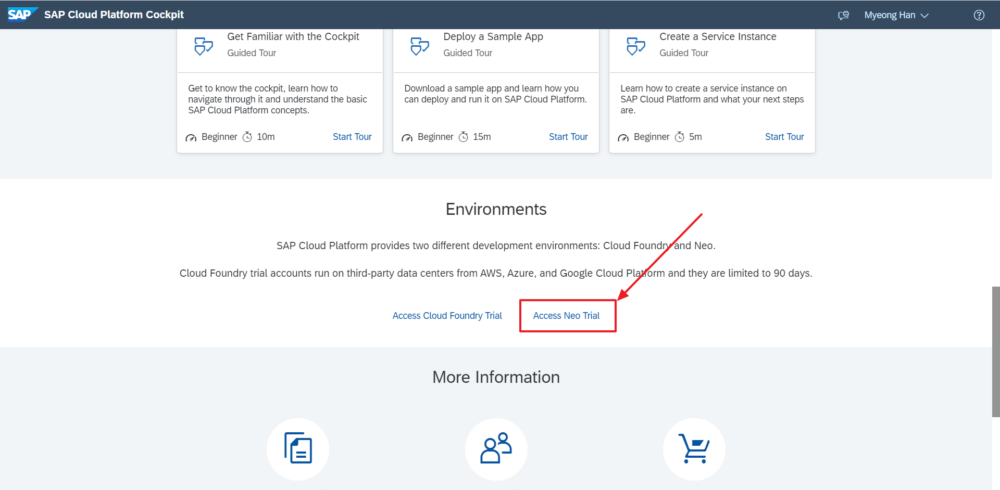
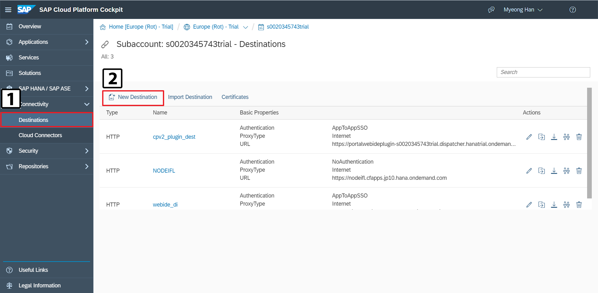
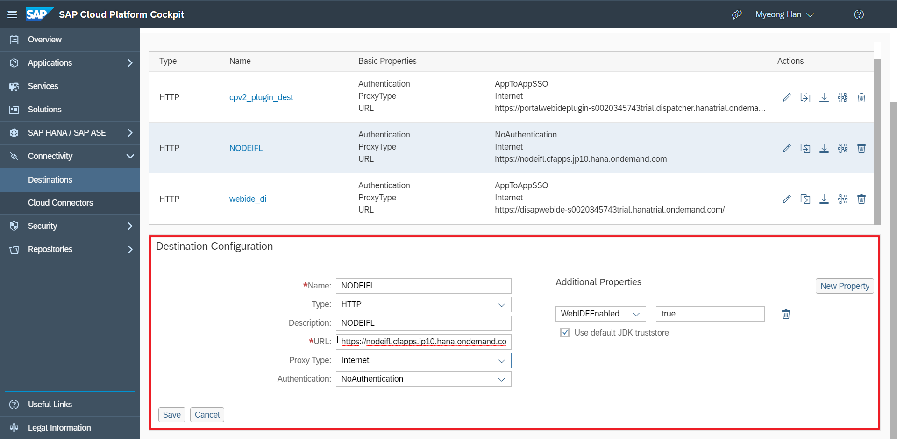
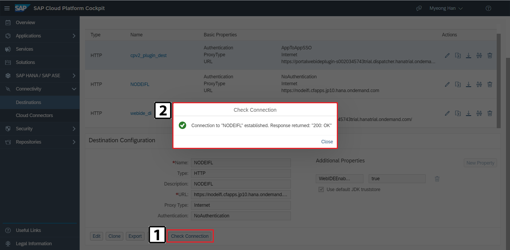
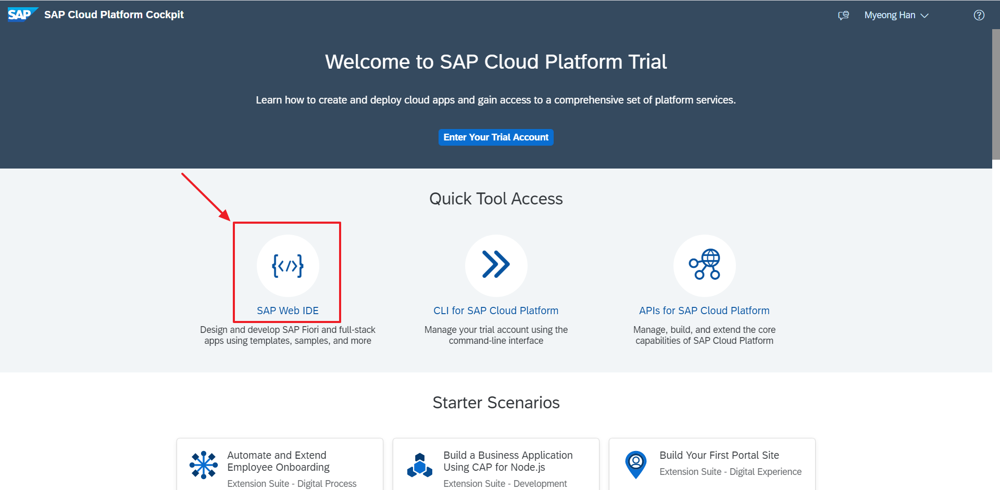
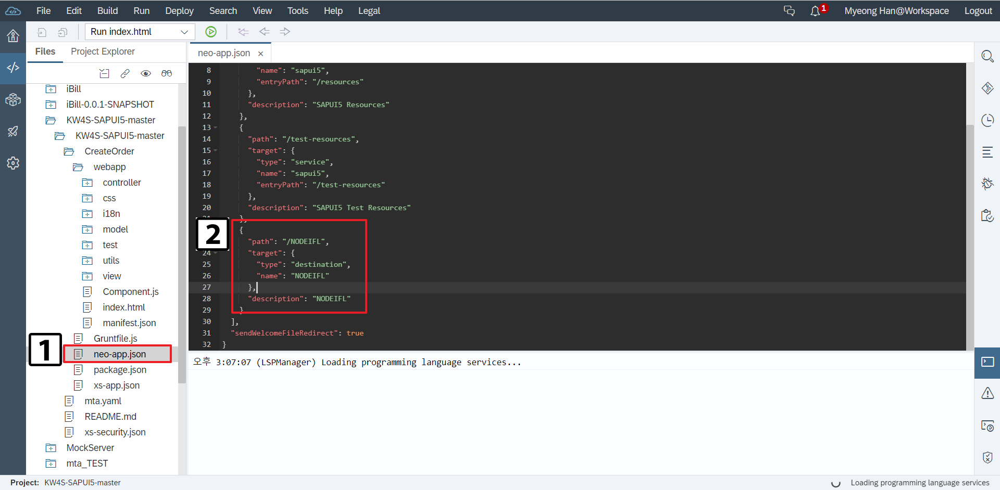

# SAP Cloud Platform Destination 설정

## **Introduction**
이 내용에서는 SAP Cloud Platform에서 Destination을 활성화하는 방법을 안내합니다.


CORS는 Cross Origin Resource Sharing의 약자로 도메인 또는 포트가 다른 서버의 자원을 요청하는 매커니즘을 말합니다.

이때 요청을 할때는 cross-origin HTTP 에 의해 요청됩니다.

하지만 동일 출처 정책(same-origin policy) 때문에 CORS 같은 상황이 발생 하면 외부서버에 요청한 데이터를 브라우저에서 보안목적으로 차단합니다. 그로 인해 정상적으로 데이터를 받을 수 없습니다.

>**동일 출처 정책(same-origin policy)**
>
>불러온문서나 스크립트가 다른 출처에서 가져온 리소스와 상호작용하는 것을 제한하는 중요한 보안 방식입니다. 이것은 잠재적 악성 문서를 격리하여, 공격 경로를 줄이는데 도움이 됩니다.

SAP Cloud Platform에서는 `Destination`을 설정해 이 문제를 해결할 수 있습니다.

### 1) Neo Trial로 이동



### 2) Destination 생성



### 3) Destination 생성

앞서 배포한 NodeJS APP의 HOST URL을 등록합니다.



- 기본 Properties

| Properties     | Description                        |
| :------------- | :--------------------------------- |
| Name           | Destination 이름                   |
| Type           | Destination 타입                   |
| URL            | 사용할 외부 URL                    |
| Proxy Type     | Proxy Type                         |
| Authentication | 인증방식 (없다면 NoAuthentication) |

- 추가 Properties

| Additional Properties | Value |
| :-------------------- | :---- |
| WebIDEEnabled         | true  |





### 4) WebIDE 접속




### 5) SAPUI5 프로젝트 생성 후 neo-app.json에 Destination 추가





```json
{
    "path": "/NODEIFL",
    "target": {
    "type": "destination",
    "name": "NODEIFL"
    },
    "description": "NODEIFL"
}
```


앞에서 설정한 외부 URL이 (https://nodeifl.cfapps.jp10.hana.ondemand.com)  `/NODEIFL` 로 대체됐습니다.

이제 `Ajax`호출을 통해 외부 URL에 HTTP 요청을 보낼수 있습니다.


```javascript
var uri = "/NODEIFL/IFL/Order";
var method = "POST";

$.ajax({
    url: uri,
    method: method,
    data: data,
    contentType: "application/json; charset=utf-8",
    async: false,
    success: function (data, textStatus, jqXHR) {
        console.log('Success');
    },
    error: function (xhr, status, thrownError) {
        console.log('Error');
    },
    complete: function (xhr, status) {
        console.log('Complete');
    }
});
```