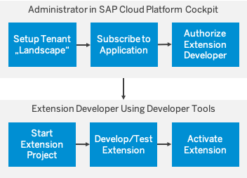

# **SAP CAP Extending SaaS Applications**

## **Introduction**
이 내용에서는 SAP Cloud Platform에서 Subscription으로 tenant level에서 SaaS Application Extension할 수 있는 방법에 대해 설명합니다.


## **1. The cds-mtx Library**

`cds-mtx` 라이브러리는 `@sap/cds-mtx`로 배포됐습니다.

- ### Feature
   - Multi-tenant Application 및 service를 위해 SAP Cloud Platform의 subscription infrastructure에서 사용할 수 있는  tenant provisioning API를 노출합니다.
   - model data를 가져오고 CDS extensions을 활성화하기 위해 REST API를 노출합니다.(tenant-specific).

- ### Configuration
   - `cds-mtx` 라이브러리는 CAP Node.js 스택에 대한 CDS configuration 방법을 따릅니다. 이는 configuration을 `package.json` 파일 또는 `.cdsrc.json`에 넣을 수 있음을 의미합니다. 아래 예는 `cds-mtx` 관련 configuration이있는 일반적인 `.cdsrc.json`를 보여줍니다.

    ```json
    {
        "mtx": {
            "element-prefix": ["Z_", "ZZ_"],
            "namespace-blacklist": ["com.sap.", "sap."],
            "entity-whitelist": ["my.bookshop.Books", "<another entity>", ...],
            "service-whitelist": ["AdminService", "<another service>", ...]
        },
        "odata": {"version": "v4"},
        "requires": {
            "db": {
                "kind": "hana",
                "model": ["db", "srv"],
                "multiTenant": true,
                "vcap": {"label": "managed-hana"}
            },
            "uaa": {
                "kind": "xsuaa"
            }
        }
    }
    ```

    `mtx` 영역에서  CDS element names (table/service field names)에 허용된 prefix 배열과 새 엔티티 및 서비스에 대한 CDS namespace blacklist를 구성할 수 있습니다. 필드 확장은 해당 접두사로만 수행 할 수 있습니다. 마찬가지로 blacklist에 포함된 CDS namespace 내에는 새로운 엔터티와 서비스를 만들 수 없습니다. Namespace restriction은 "inherited", 즉 "com.sap"을 보호합니다. "com.sap. *"도 보호합니다.

    ```json
    As an SAP developer, you should protect ["com.sap.", "sap."].
    ```

    `mtx` 영역에는 확장이 허용된 엔티티 및 서비스가 나열될 수도 있습니다. `entity-whitelist` 및 `service-whitelist`는 엔티티 또는 서비스의 완전한 이름을 나열합니다.

    참고 :이 목록을 제공하지 않으면 모든 엔티티 또는 서비스를 확장할 수 있습니다. 이 경우 `cds build`로 경고가 기록됩니다.

    목록의 항목을 확인할 수없는 경우, `cds build`가 오류와 함께 실패합니다.

    datasource `db` 영역은 `HDI Container`에 대한 바인딩 된 `Instance` 관리자 서비스를 구성하는 방법을 보여줍니다.

    `cds-mtx` 라이브러리는 `tenant provisioning API`, 확장을 수행하는 데 사용되는 `model API` 및 테넌트 별 모델 및 메타 데이터를 읽는 데 사용되는 `metadata API`를 제공합니다. 이러한 API 중 일부만 노출되는 사용 사례가 있습니다. 다음과 같이 구성할 수 있습니다.

    ```json
    "mtx": {
        "api": {
            "model":        true || false,   // default = true
            "provisioning": true || false,   // default = true
            "metadata":     true || false    // default = true
        }
    ```
- ## **REST APIs**

    모든 API는 JSON payload를 수신하고 응답합니다. Application-specific logic(예 : scope checks)는 `event handler`를 사용하여 추가할 수 있습니다.


- ### **Tenant Provisioning API**
  - **Onboard tenant**
    ```
    PUT /mtx/v1/provisioning/tenant/<tenantId>
    ```
    Minimal request body:
    ```json
    {
        "subscribedSubdomain": "<subdomain>",
        "eventType": "CREATE"
    }
    ```

    응용 프로그램은 응용 프로그램 특정 매개 변수를이 페이로드에 혼합(mix-in)하여 응용 프로그램 핸들러 내에서 해석 할 수 있습니다. `_application_` 객체를 사용하여 지정하십시오. `cds-mtx` 기본 핸들러에 의해 해석되는 하나의 사전 정의된 `sap` 오브젝트가 있습니다. 이를 통해 `HDI Container` 서비스 인스턴스를 생성 할 때 인스턴스 관리자 서비스에서 사용할 서비스 생성 매개 변수(service creation parameters)를 설정할 수 있습니다. 일반적인 사용 사례는 `database_id`를 제공하여 하나의 Cloud Foundry 공간에 매핑된 여러 SAP HANA DB를 구별하는 것입니다.

    ```json
    {
        "subscribedSubdomain": "<subdomain>",
        "eventType": "CREATE",
        "_application_": {
            "sap": {
            "managed-hana": {
                "provisioning_parameters": { "database_id" : "<HANA DB GUID>" },
                "binding_parameters": {"<key>" : "<value>"}
            }
        }  
    }
    ```
    > ###  **✔ Important**  
    >두 개의 SAP HANA Database가 하나의 `Space`에 매핑된 경우,  
    >기본 데이터베이스를 지정하지 않으면 `Onboarding`이 기본적으로 동작하지 않습니다.  
    >Database를 `Space`에 맵핑할 때 기본값을 지정하여 `Onboarding`을 동작할 수 있습니다.  
    >또는 `instance-manager service instance`를 작성할 때 기본값을 설정하여 다음을 수행하십시오.  
    > 
    >   1. Database를 공유할 때 기본값을 설정하십시오. 자세한 내용은 [Share an Instance with another Cloud Foundry Space](https://help.sap.com/viewer/cc53ad464a57404b8d453bbadbc81ceb/Cloud/en-US/5330bf0513e24aaabc4b88a55fdb063b.html#loio5330bf0513e24aaabc4b88a55fdb063b__section_b1t_nn1_t2b)를 참조하십시오. 
    >   2. `instance-manager service instance` 작성시 기본값 설정
 

    ```
    cf create-service managed-hana hdi-shared <service name> -c <config file>
    ```

    여기서 config file에는 기본 `database_id`가 포함됩니다.

    ```json
    {
        "database_id" : "<HANA DB GUID>"
    }
    ```

  - **Offboard tenant**
  
    ```
    DELETE /mtx/v1/provisioning/tenant/<tenantId>
    ```

  - **Offboard tenant**
  - **Subscription dependencies**
    ```
    GET /mtx/v1/provisioning/dependencies
    ```
    Response body: `Array of String`. default implementation은 빈 배열을 반환합니다.

  - **GET onboarded tenants**
    ```
    GET /mtx/v1/provisioning/tenant/
    ```

    onboarded tenants의 목록을 반환. 각 테넌트에 대해 테넌트 onboarding에 사용된 request body가 반환됩니다.


- ### **Model API**

  - **Get cds model content**
    ```
    GET mtx/v1/model/content/<tenantId>
    ```

    response body에서 두 개의 객체 `base`과 `extension`을 반환합니다.

    ```json
    {
        "base": "<base model cds files>",
        "extension": "<extension cds files>"
    }
    ```

  - **Activate extensions**
    ```
    POST mtx/v1/model/activate
    ```

    Request body (example):
    ```json
    {
        "tenant": "tenant1",
        "extension": "<cds extension files>",
        "undeployExtension": false
    }
    ```

    `extension` element는 JSON array of arrays이어야합니다.  
    각 first-level array element는 CDS extensions를 포함하는 CDS 파일에 해당합니다.  
    각 second-level array element는 two entry array어야합니다.  
    - first entry는 파일 이름을 지정합니다.  
    - second entry는 파일 내용을 지정합니다.   

    데이터 모델의 확장자 파일은 `db-` 폴더에 배치해야합니다.  
    서비스 확장은 `srv-`folder에 배치해야 합니다.  
    기본 모델 (비 확장 모델)의 엔티티는 `using ... from '_base/...'사용합니다.  


    Request body detailed sample:

    ```
    {
    "tenant": "6c07c584-f463-46e5-9340-51958c51dd0a",
    "extension": [
        [
        "db/ext-entities.cds",
        "using my.bookshop from '_base/db/data-model'; \n extend entity bookshop.Books with { \n ISBN: String; \n rating: Integer \n  }"
        ],
        [
        "db/new-entities.cds",
        "namespace com.acme.ext; \n entity Categories { \n key ID: String; \n description: String; \n }"
        ],
        [
        "srv/ext-service.cds",
        "using CatalogService from '_base/srv/cat-service'; \n using com.acme.ext from '../db/new-entities'; \n extend service CatalogService with { \n  @insertonly entity Categories as projection on ext.Categories; \n }"
        ]
        ],
        "undeployExtension": false
    }
    ```

  - **Upgrade base model from filesystem (asynchronous)**

    ```
    POST mtx/v1/model/asyncUpgrade
    ```

    Request body:
    ```
    { 
        "tenants": ["tenantId1", "tenantId2", ...], 
        "autoUndeploy": <boolean>
    }
    ```

    Request body `{ "tenant": [ "all"] }`는 all tenants를 업그레이드하는 구문입니다.

    `autoUndeploy`가 `true`로 설정되면 HDI deployer의 `auto-undeploy mode`가 사용됩니다. 자세한 내용은 [HDI Delta Deployment and Undeploy Whitelist](https://help.sap.com/viewer/4505d0bdaf4948449b7f7379d24d0f0d/2.0.04/en-US/ebb0a1d1d41e4ab0a06ea951717e7d3d.html)를 참조하십시오.

    Response (example):
    ```json
    { "jobID": "iy5u935lgaq" }
    ```
    
    `jobID`를 사용하여 업그레이드 프로세스 상태를 조회할 수 있습니다.
    ```
    GET /mtx/v1/model/status/<jobID>
    ```

    처리하는 동안 response은 다음과 같습니다.

    ```json
    {
        "error": null,
        "status": "RUNNING",
        "result": null
    }
    ```

    작업이 완료되면 collective status가 다음과 같이 보고됩니다.

    ```json
    {
        "error": null,
        "status": "FINISHED",
        "result": {
            "tenants": {
                "<tenantId1>": {
                    "status": "SUCCESS",
                    "message": "",
                    "buildLogs": "<build logs>"
                },
                "<tenantId2>": {
                    "status": "FAILURE",
                    "message": "<some error log output>",
                    "buildLogs": "<build logs>"
                }
            }
        }
    }
    ```

    >로그는 자동으로 삭제되기 전에 30 분 동안 지속됩니다. job 상태를 너무 늦게 요청하면 `404 Not Found` 응답이 표시됩니다.


  - ### **Metadata API**
    
    모든 메타 데이터 API는 eTag를 지원합니다. [setting the corresponding header](https://developer.mozilla.org/en-US/docs/Web/HTTP/Headers/ETag)를 참고하면 모델 업데이트를 확인할 수 있습니다.
  

    - **GET edmx**
        ```
        GET /mtx/v1/metadata/edmx/<tenantId>
        ```

        응용 프로그램 (extended) 모델의 edmx metadata를 반환합니다.

        선택적 URL 매개 변수

        ```
        name=<service-name>
        language=<language-code>
        ```

    - **GET csn**
        ```
        GET /mtx/v1/metadata/csn/<tenantId>
        ```

        응용 프로그램의 컴파일된 (extended) 모델을 반환합니다.

    - **GET languages**
        ```
        GET /mtx/v1/metadata/languages/<tenantId>
        ```
        응용 프로그램의 (extended) 모델에서 지원되는 언어를 반환합니다.

      - **GET services**
        ```
        GET /mtx/v1/metadata/services/<tenantId>
        ```
        응용 프로그램의 (extended) 모델 서비스를 반환합니다.

## **2. Exposing the Extension API**

CDS command line client를 사용하여 SaaS 애플리케이션 고객이 테넌트 별 확장을 수행할 수 있습니다 ([Extend SaaS Applications](https://cap.cloud.sap/docs/advanced/extensibility#extend-saas-applications) 참조). client는 `/mtx/v1/model/content` 및 `/mtx/v1/model/activate` endpoint를 사용합니다. 이러한 endpoint의 root URL을 결정하는 두 가지 옵션이 있습니다.

- `cds-mtx` 서버로 직접 Cloud Foundry route 사용
- approuter URL(있는 경우)을 사용하고 `cds-mtx` 서버에 대한 appropriate routes를 만듭니다.

후자의 경우 `xs-app.json`의 `approuter` 구성을 다음 예제와 같이 선택해야 합니다.

```json
...
"routes": [
  ...
  {
	"source": "^/extend/(.*)",
	"destination": "sidecar",
	"target": "$1",
	"authenticationType":"none"
  }
  ...
]
...
```

이 경우 고객은 다음 명령을 사용하여 확장 프로젝트를 만듭니다.

```
cds extend https://<tenant-specific-route-to-approuter>/extend ...
```

harmonization를 이루기 위해 `/extend/` path segment를 사용하는 것이 좋습니다. 접근자가 이 approuter의 인증을 처리하지 않도록 하려면 `"authenticationType": "none"`을 설정해야 합니다 (JWT를 가져 오는 프로세스가 다릅니다-[Extend SaaS Applications](https://cap.cloud.sap/docs/advanced/extensibility#extend-saas-applications) 참조).


## **3. Enable a Node.js Project**

  **NPM Dependencies**

  SAP HANA 및 SAP Cloud Platform security과 함께 `cds-mtx`를 사용하려면 `package.json`에 다음 `dependencies`을 포함하십시오.

  ```
  npm install --global --production windows-build-tools
  ```

  ```json
  "engines": {
    "node": ">=8.0.0 <11.0.0"
    },
    "dependencies": {
        "@sap/cds": "<latest release>",
        "@sap/cds-mtx": "<latest release>",
        "@sap/hdi-deploy": "^3.11.4",
        "@sap/instance-manager": "^2",
        "@sap/hana-client": "^2",
        "@sap/xssec": "^2.1.16",
        "express": "^4.16.4",
        "passport": "^0.4.0"
    }
  ```

  `<latest release>`를 사용 가능한 최신 `cds` 및 `cds-mtx` 릴리스로 바꾸십시오. hdi-deploy의 버전 제한으로 인해 `"node"`: 버전 제한을 설정해야 합니다.

  **Server Start Script**

  Node.js 서버가 `cds-mtx` API를 제공하고 SAP HANA에 대한 multi-tenant 설정에 연결하게 하려면 다음 시작 스크립트 (예 : `server.js`)를 사용하십시오.

  ```javascript
const app = require('express')();
const cds = require('@sap/cds');
// connect to datasource 'db' which must be the HANA instance manager
cds.connect.to('db');
// serve cds-mtx APIs
cds.mtx.in(app);
// serve application defined services: in combination with a CAP Java server, this won't appear here.
cds.serve('all');
const PORT = process.env.PORT || 4004;
app.listen(PORT);
  ```

  `4004` is the port used when starting the server locally.


  **Project Structure and `cds build`**

   [Getting Started](https://cap.cloud.sap/docs/get-started/in-a-nutshell)에 설명된 일반적인 권장 사항 및 규칙을 따르십시오. 설명된대로 `cds-mtx`를 사용하려면 `package.json`에서 적절한 설정을 수행하고 노드 서버 시작 스크립트 (예 : server.js)를 사용해야 합니다.

   프로젝트는 UI 부분없이 다음과 같아야합니다 :

   ```
   package.json         // node project definition
   .cdsrc.json          // cds configuration (if not in package.json)
   server.js
   db/
    csv/               // csv files
    dbmodel1.cds       // cds files for db activation
    dbmodel2.cds
    ...
   srv/
    i18n/              // language property files
    srvmodel1.cds      // service definition cds files
    srvmodel2.cds
    ...
   handlers/            // handler implementations
    impl1.js
    impl2.js
    ...
   ```
   `cds-mtx`는 런타임에 모든 cd 관련 파일이 `gen/sd/` 폴더에있을 것으로 예상합니다.  
   이 폴더는 `cds build/all`을 실행할 때 생성됩니다. 전제 조건으로 [cds configuration](https://cap.cloud.sap/docs/advanced/extensibility#configuration) 파일에는 다음이 포함되어야 합니다.

   ```json
   "build": {
        "tasks": [ {"for": "mtx", "src": "." } ]
   }
   ```

   > 버전 관리를 위해 `gen/` 폴더를 체크인하지 마십시오.


   
## **4. Enable a Java Project**

## **5. Event Handlers for cds-mtx APIs**

> ### **✔ Note**  
> CAP Java 서버를 사용하는 경우 SAP Cloud Platform의 SaaS Manager (Provisioning API)에 필요한 API가 다시 노출됩니다.   
> 해당 Java 기반 메커니즘을 활용하여 이러한 API에 핸들러를 추가하는 것이 좋습니다.  
> `cds-mtx`의 Model-API 핸들러는 Java 스택에 의해 다시 노출되지 않으므로 Node.js 서버에서 항상 구현되어야 합니다.

`cds-mtx`는 cds 기술을 사용하여 API를 제공합니다. 따라서 추가 응용 프로그램 로직은 [cds event handlers](https://cap.cloud.sap/docs/node.js/api#cds-event-handlers)로 구현할 수 있습니다. Event handlers는 JavaScript 파일로 구현될 수 있으며 압축된 서비스 이름에 따라 이름이 지정됩니다. 이러한 파일은 cds 서비스 정의 파일 (예 : `srv/` 폴더)이 들어있는 폴더에 배치해야하지만 모델이 로드된 위치에 배치할 수 있습니다. `cds-mtx` API의 경우 `provisioning.js`, `model.js` 및 `metadata.js` 파일을 사용하십시오. 예제는 아래 사용 사례를 참조하십시오.

**Use Case: Return Application URL After Onboarding**

tenant provisioning API를 SAP Cloud Platform의 SaaS Manager에 연결하는 경우 `ProvisioningService` 핸들러를 구현해야 합니다.이 핸들러는 SAP Cloud Platform Cockpit에 표시하기 위해 구독자가 사용할 애플리케이션 URL을 리턴합니다. 아래 예제는 애플리케이션이 환경 변수 `APP_URLPART`를 설정한다고 가정합니다. 처리기의 임무는 온 보딩 요청에 포함 된 테넌트 하위 도메인으로 `APP_URLPART`의 내용을 접두어로 붙여 전체 tenant-specific 응용 프로그램 URL을 반환하는 것입니다.

`provisioning.js`

```javascript
module.exports = (service) => {
  // event handler for returning the tenant specific application URL as a response to an onboarding request
  service.on('UPDATE', 'tenant', async (req, next) => {
    const res = await next();          // IMPORTANT: call default implementation which is doing the HDI container creation
    let c = cds.env.for('app');        // use cds config framework to read app specific config node
    let appuri = typeof c.urlpart === "undefined" ? ' ' : c.urlpart;
    if (appuri === ' ') {
      console.log('[INFO ][ON_UPDATE_TENANT] Application URI for subscriptions is not configured.');
      return '';
    } else {
      let url = 'https://' + req.data.subscribedSubdomain + appuri;
      console.log('[INFO ][ON_UPDATE_TENANT] ' + 'Application URL is ' + url);
      return url;
    }
  });
}
```

provisioning service의 기본 핸들러를 대체하는 핸들러가 등록되었습니다. SAP Cloud Platform은 onboarding에 대한 `PUT` 요청을 전송하기 때문에 `UPDATE`는 여기에 관련됩니다. 환경 변수는 직접 읽지 않습니다(read-in directly). 대신 [cds configuration framework](https://cap.cloud.sap/docs/advanced/config)가 사용되므로 다양한 방법으로 구성 할 수 있습니다.


**Use Case: Application-Specific Scope Checks**

또 다른 일반적인 작업은 subscription requests에 대한 application-specific scope check를 구현하는 것입니다. provisioning.js 내에 `before-UPDATE -tenant` 이벤트 핸들러를 구현하여 수행할 수 있습니다.


```javascript
module.exports = (service) => {
  // event handler for doing some application specific scope checks
  service.before ('UPDATE', 'tenant', async (req) => {
    console.log('[INFO ][BEFORE_UPDATE_TENANT] ' + req.data.subscribedTenantId);
    if (!req.user.is('Callback')) {     // check for the scope "Callback"
      console.log('[ERROR][BEFORE_UPDATE_TENANT]: JWT does not contain required scope.');
      // Reject request
      const e = new Error('Forbidden');
      e.statusCode = 403;
      return req.reject(e);
    } else {
      console.log('[INFO ][BEFORE_UPDATE_TENANT]: JWT contains relevant scope');
    }
  });
...
}
```

**Use Case: Conditional Offboarding**

특정 조건이 충족되는 경우 응용 프로그램에서 tenant database container 삭제를 방지하려고 할 수 있습니다 (예 : 여전히 이 데이터베이스르 사용하는 가입자가 있음). 기본 `DELETE tenant` 구현을 대체하여 구현할 수 있습니다.

```javascript
module.exports = (service) => {
  ...
  // Event handler checking a condition before deleting the tenant DB container as a response to an offboarding request.
  // This handler overwrites the default handler!
  service.on ('DELETE', 'tenant', async (req, next) => {
    console.log('[INFO ][ON_DELETE_TENANT] ' + req.data.subscribedTenantId);
    if (1 === 2) {    // put your condition here
      console.log('[INFO ][ON_DELETE_TENANT]: Offboarding will not be executed');
    } else {
       await next();  // call default implementation which is doing regular offboarding
    }
  });
  ...
}
```

**Use Case: Return Subscription Dependencies**

SAP Cloud Platform의 SaaS Manager는 다양한 subscription dependencies을 요청할 수 있습니다 (`GET DEPENDENCIES callback`). 이는 `GET mtx/v1/provisioning/dependencies` endpoint 에 ON-handler를 등록하여 구현할 수 있습니다.

```javascript
module.exports = (service) => {
...
  // event handler returning an array of dependencies as a response to the GET DEPENDENCIES request
    service.on('dependencies', async (req) => {
    const deps = ['first_dependency', 'second_dependency'];
    console.log('[INFO ][ON_GET_DEPENDENCIES] Dependent applications/services: ' + JSON.stringify(deps) );
    return deps;
  });
...
}
```

## **5. Extension Templates**

SaaS application provider는 고객에게 템플릿 cds 파일을 제공할 수 있으며, 이는 일반적이고 유용한 확장 사용 사례를 보여줄 수 있습니다. cds command line 인터페이스를 사용하는 경우 고객은 `cds extend --templates` 명령을 사용하여 이러한 템플리트 파일을 확인할 수 있습니다 ([Fetching extension templates from the SaaS application](https://cap.cloud.sap/docs/advanced/extensibility#fetching-extension-templates-from-the-saas-application) 참조).

application provider는 이러한 템플릿 cds 파일을 개발 프로젝트 root의 `tpl/` 폴더에 넣을 수 있습니다. 확장 파일 도메인 모델 확장 또는 서비스 확장)의 사용 사례를 표시하려면 `db/` 및 `srv/` 하위 폴더를 사용하십시오.


## **6. Extend SaaS Applications**

SaaS application의 Subscriber(customers)는 가입 컨텍스트 (= tenant context = subaccount context)에서 데이터 및 서비스 모델을 확장할 수 있습니다. SAP 제공 데이터베이스 테이블에 새 필드를 추가 할 수 있습니다. 이러한 필드는 SAP의 Fiori Elements 기술로 구축된 경우 UI에도 추가 할 수 있습니다.

전체 프로세스는 다음 그림에 나와 있습니다.



**Setup Tenant Landscape**

account administrator는 SAP Cloud Platform Cockpit을 ​​사용하여 단계별 확장 개발 시나리오 (예 : development and productive tenants)를 활성화하기 위해 "landscape of tenants"(= multiple subaccounts)을 설정합니다. extended data-, service-, and UI models 을 테스트하기 위해 최소한 development tenant를 설정하여 productive tenant에서 활성화하는 것이 좋습니다.

**Subscribe to SaaS Application**

subaccount administrator는 SAP Cloud Platform Cockpit을 ​​사용하여 SaaS 애플리케이션에 가입하고 있습니다. 이 subscription을 진행하는 동안 SaaS application은 tenant onboarding 단계를 자동으로 수행하며 (SAP HANA를 사용하는 경우)이 테넌트에 대한 SAP HANA persistence을 할당하고 (= subaccount) database objects를 배포합니다.

>cds service 및 database entities은 SaaS application이 SAP HANA Database Service를 사용하는 경우에만 가능합니다. 또한 SaaS 제공자가 SaaS application을 확장할 수 있도록 설정해야 합니다.

**Authorize Extension Developer**

extension은 extension developer (a customer role)가 수행합니다. tenant의 기본 모델을 확장할 수 있는 권한은 SaaS application의 scope에 연결됩니다. 따라서 하위 계정의 보안 관리자는 SAP Cloud Platform Cockpit을 ​​사용하여 개발자에게 이 scope를 부여해야 합니다. 전제 조건으로 개발자는 하위 계정에 연결된 Identity Provider내에 등록되어 있어야 합니다.

확장 개발자에게 할당 할 수있는 두 가지 관련 범위가 있습니다.

| Scope           | -                                                                                                      |
| :-------------- | :----------------------------------------------------------------------------------------------------- |
| ExtendCDS       | 확장 프로젝트를 만들고 확장 파일을 적용하십시오. 이전 확장으로 작성된 테이블을 삭제할 권한이 없습니다. |
| ExtendCDSdelete | 추가적으로, 이전 확장으로 생성된 테이블을 삭제하여 데이터가 손실될 수 있습니다!                      |

SaaS application은 이러한 scope를 포함한 role templates을 제공합니다. 이를 확인하려면 SaaS application 설명서를 참조하십시오.


**Start Extension Project**

Extension developers는 컴퓨터의 파일 시스템에서 확장 프로젝트를 초기화합니다. 

- 전제 조건 
  - cds command line tools가 설치되어 있어야 합니다 ([Local Setup](https://cap.cloud.sap/docs/get-started/#local-setup) 참조).
  - tenant’s subaccount에 연결된 Identity Provider는 SAML 표준을 지원해야 합니다.
  - Extension CDS 파일을 작성하기 위해 사용 가능한 [CDS editors](https://cap.cloud.sap/docs/get-started/) 중 하나와 함께 Integrated Development Environment (IDE)를 사용하는 것이 좋습니다.
  - CDS 언어에 대한 기본 지식.


>명령 옵션에 대한 자세한 내용을 보려면 일반 `cds help` 기능을 사용하십시오.  
>예를 들어, `cds extend` 명령에 대한 설명을 보려면 `cds help extend`를 사용하십시오.

cds client는 SaaS application과 통신하고 거기서 "기본 모델"(아직 확장되지 않은 모델)을 가져옵니다. 확장 프로젝트 폴더는 로컬 파일 시스템에 생성됩니다. 이전에 확장이 이미 발생한 경우 마지막으로 활성화된 확장도 가져옵니다.

extension developer로서 다음 명령을 사용하여 확장 프로젝트를 초기화하십시오.

```
cds extend <app-url> -d <project-directory> -p <passcode>
```

`<app-url>`은 확장하려는 SaaS application에 따라 다릅니다. 이 URL은 해당 SaaS application의 설명서에서 찾을 수 있습니다. 일반적으로 `<app-url>`은 SAP Cloud Platform Cockpit의 구독 탭에 표시되는 것과 동일한 URL이며, 추가 URL path segment (예 : `/extend`)로 향상되어 application을 시작하는데 사용됩니다. 그러나 SaaS application은 확장 작업에 다른 URL을 제공하기로 결정할 수 있습니다.

`<project-directory>`는 확장 프로젝트 파일이 들어있는 로컬 디스크의 폴더입니다.

`<passcode>`는 SaaS application에 연결하는 데 사용되는 임시 인증 코드(temporary authentication code)입니다. 이 passcode는 브라우저 로그온 페이지를 열어 검색할 수 있습니다. 이 브라우저 페이지의 URL은 SaaS application이 실행중인 SAP Cloud Platform 환경과 테넌트에 따라 다릅니다.

```
<url> = https://<tenant-subdomain>.authentication.<landscape>.hana.ondemand.com/passcode
```

passcode는 제한된 기간 내에 한 번만 사용할 수 있습니다. 연결이 성공적으로 설정되면 SAP Cloud Platform의 하위 계정에 연결된 Identity Provider의 구성에 따라 일정 기간 동안 후속 명령을 실행할 수 있습니다. 만료되면 새로운 passcode를 생성하고 다시 보내야 합니다.

연결은 테넌트마다 다르므로 `<tenant-subdomain>`은 `<app-url>`에 포함된 하위 도메인 (the string preceding the first dot ‘.’)이어야합니다. 그렇지 않은 경우 `-s <tenant-subdomain>` 옵션을 사용할 수 있습니다.

`cds extend`의 ​​결과로 지정된 폴더에 확장 프로젝트가 생성됩니다. 예를 들어, 다음 파일 /folder 구조가 로컬 디스크에서 생성됩니다.

```
myextproject/
  package.json    # extension project descriptor
  srv/
            # will contain service and ui-related extension cds files
  db/
            # will contain db-related extension cds files
  node_modules/
    _base/
       ...   # contains the base model provided by the SaaS application
```

`node_modules` 폴더는 변경할 수 없는 아티팩트 (SaaS application의 기본 cds model)를 포함하므로 IDE를 사용할 때 숨겨져야 합니다. SaaS application은 기본 entity 및 service의 의미있는 확장을 수행하는 방법을 문서화하는 템플릿을 제공할 수 있습니다.

이 프로젝트 구조는 전체 CD 응용 프로그램을 개발하기 위해 도입된 것과 동일한 규칙을 따릅니다.  
데이터베이스 배치와 관련된 모델 확장자 파일은 `db/` 폴더에 있어야합니다.  
서비스 확장 파일은 srv / 폴더에 있어야합니다.   
기본 모델은 재사용 모델처럼 취급됩니다. `using ... from '_base/...'`를 사용하여 확장 파일에서 간단히 참조 할 수 있습니다.

>Extension developer는 다른 개발 프로젝트와 유사한 확장 프로젝트를 추진해야합니다.  
>확장 프로젝트 소스를 호스팅하려면 버전 관리 시스템 (예 : Git)을 사용하는 것이 좋습니다.

**Develop & Activate Extensions**

cds model 파일 개발은 cds 편집기 및 cds build 도구에서 지원됩니다. 이 파일 내에서 using ... from '_base/...'문을 사용하여 기본 모델 파일을 참조할 수 있습니다. `cds extend` 기술을 사용하여 entity 및 service를 확장할 수 있습니다. 다음 예제는 가상의 Bookshop 애플리케이션의 Books 데이터베이스 테이블에 두 개의 필드를 추가하는 방법을 보여줍니다. db- 폴더 내에 파일 확장자 .cds가 생성됩니다 (파일 이름은 중요하지 않음).

```javascript
using sap.bookshop from '_base/db/datamodel';

extend entity bookshop.Books with {
  GTIN: String(14);
  rating: Integer;
}
```

다음 명령을 사용하여 test tenant에서 확장을 활성화 할 수 있습니다.

```
cds activate <extension-project-directory>
```

활성화를 위해 현재 연결을 사용합니다. 이 연결이 존재하지 않거나 만료 된 경우 `'-p <passcode>'`, `'-s <tenant-subdomain>'`및 `'--to <app-url>'`옵션을 사용하여 (재) 잇다. 기존 프로젝트를 다른 테넌트로 활성화하려면 `<passcode>` 및 `<app-url>`을 적절하게 설정해야 합니다.

>`cds activate`를 사용하면 확장 테넌트에 csv 파일을 업로드 할 수 없습니다.

- Executing cds extend on an Existing Extension Project


`cds extend`는 확장 프로젝트를 생성하고 초기화하는 데 사용됩니다. 기존 파일 기본 모델 파일 및 확장 파일)을 덮어 쓰려면 `--force` 옵션을 사용하여 후속 cds 실행을 수행해야 합니다. 파일이 삭제되지 않습니다. 버전 관리 시스템의 기능을 사용하여 변경 사항을 감지하고 병합해야 합니다.

- Fetching Extension Templates from the SaaS Application

SaaS application이 SaaS application의 entity 및 service를 확장하는 방법을 보여주는 템플릿 파일을 제공할 수 있습니다. `cds extend` 명령의 `--templates` 옵션을 사용하여 서버에서 이러한 템플리트를 가져올 수 있습니다. 결과적으로 확장 템플릿 파일이 포함된 폴더 `tpl`이 생성됩니다.


## **6. Deploy Extensions to Production**

productive tenant (SAP Cloud Platform의 productive subaccount)는 기술적으로 development tenant와 동일한 방식으로 처리됩니다. 역할 기반 권한 부여(Role-based authorization)는 productive tenant에 대한 액세스를 전용 확장 개발자로 제한할 수 있습니다. 개발 테넌트를 참조하여 생성된 확장 프로젝트는 적절한 옵션과 함께 `cds activate`를 사용하여 생산 테넌트로 활성화 할 수 있습니다.