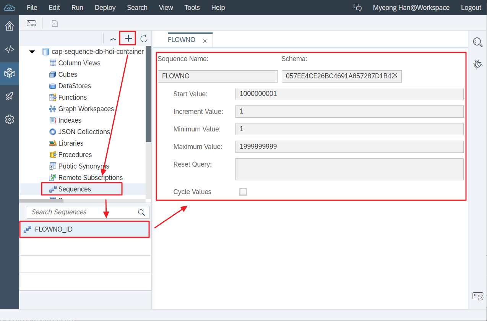
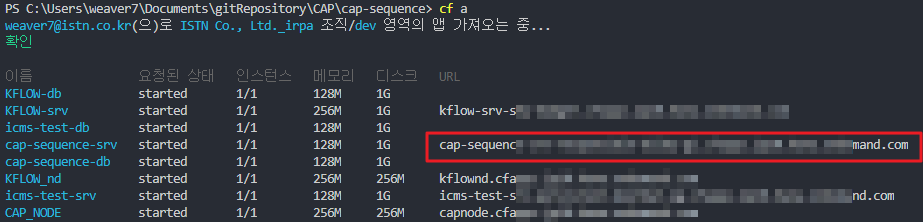
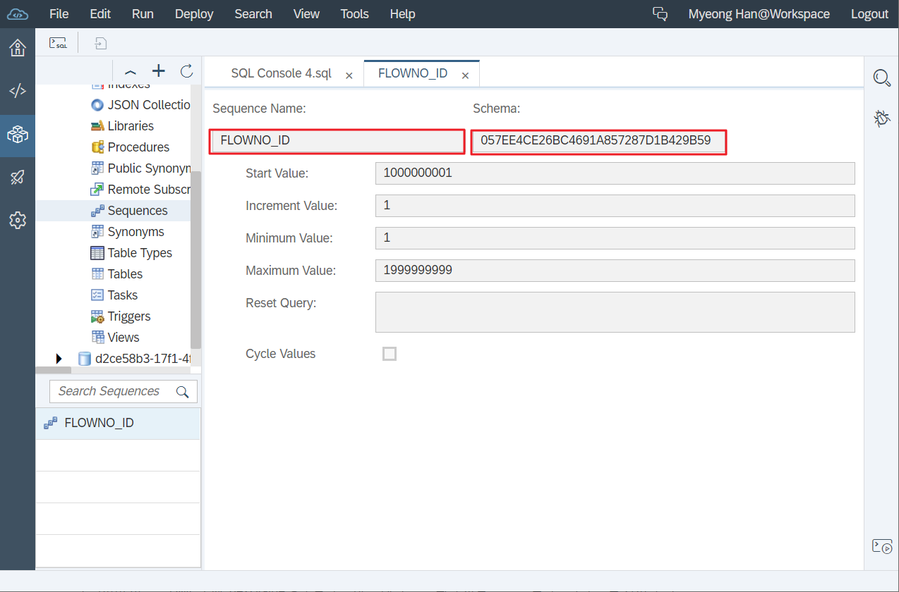
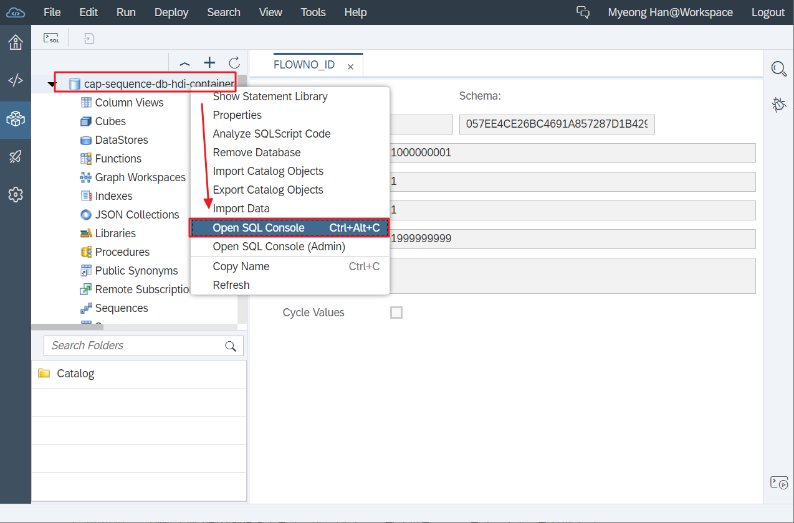
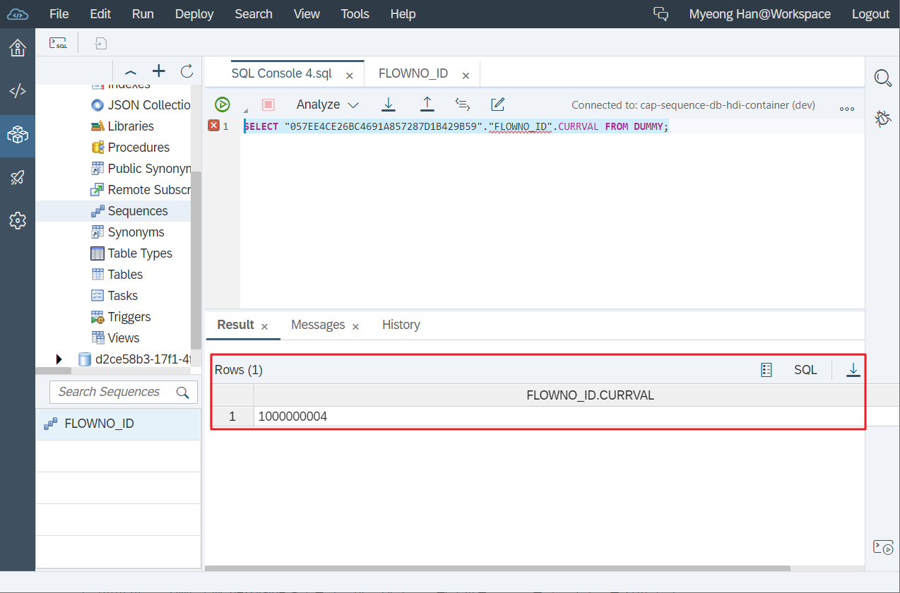

# **Tutorial CAP HANA Sequence**

# Change Log

## - 2020-07-23
  - INIT
  

## **Introduction**
이 내용에서는 SAP CAP에서 HANA DB 시퀀스를 사용하여 ID를 제공하는 방법을 보여줍니다.


## **Prerequisite**
### 1) DB Browser for SQLite  [공식링크](https://sqlitebrowser.org/dl/)  
[DB Browser for SQLite 설치파일 다운로드 링크](https://download.sqlitebrowser.org/DB.Browser.for.SQLite-3.12.0-win64.msi)  


> ## 경고 
>만약 CDS Framework에서 제공하는 UUID (GUID aspect) 개념을 사용하지 않기 위해 HANA DB Sequence를 사용하는 것이라면 권장하지 않습니다.   
>DB Sequence 또는 running number와 비교하여 UUID를 사용하면 많은 장점이 있습니다. 가급적 UUID 사용을 권장합니다.


## **1. CAP Template**
실습을 위한 CAP Template을 제공합니다.
[**HANA Sequence CAP Template Git**](https://github.com/MHKIM0829/rendez-cap-seq-before.git)


## **2. Create a HANA DB Sequence**

- 아래 명령을 실행하여 HANA Config파일을 추가합니다.

```bash
cds add hana
```

- `db/src` 폴더에 `.hdiconfig` 파일이 생성됩니다. 이제 HDB Sequnce에 대한 파일 정의를 작성합니다. `db/src` 폴더 내에 `FLOWNO_ID.hdbsequence` 파일을 작성합니다.


### **FLOWNO_ID.hdbsequence**
```sql
SEQUENCE "FLOWNO_ID" START WITH 1000000001 MAXVALUE 1999999999
```


- Service Handler에 대한 Custom Handler 파일을 작성하십시오. `srv` 폴더 안에 `seq-service.js`라는 파일을 만듭니다.

### **seq-service.js**
```javascript
const cds = require("@sap/cds");
const SequenceHelper = require("./lib/SequenceHelper");

module.exports = cds.service.impl(async (service) => {
	const db = await cds.connect.to("db");
	const { IFLT0001 } = service.entities;

	service.before("CREATE", IFLT0001, async (context) => {
		const flownoId = new SequenceHelper({
			db: db,
			sequence: "FLOWNO_ID",
			table: context.query._target.query._target["@cds.persistence.name"],
			field: "FLOWNO"
		});

        context.data.FLOWNO = await flownoId.getNextNumber();
	});
});
```

이 Custom Handler는 IFLT0001 Entity의 CREATE event 용이며 실제 Entity 작성 전에 실행됩니다.  
DB Sequence에서 다음 번호를 얻기 위해 로직을 추가해야 하기 때문입니다.   
다음 숫자는 `SequenceHelper` Class에서 제공됩니다.

> ### **참고**  
> **SequenceHelper** 객체를 인스턴스화하려면 인스턴스화 중에 아래 매개 변수를 전달해야합니다.
> - db connetion  
> - sequence name  
> - table name  
> - field name (Value이 없을 경우 FLOWNO를 기본값으로 설정)


`SequenceHelper` Class를 작성합니다. `srv/lib` 폴더 내에 `SequenceHelper.js`라는 파일을 작성합니다.

```javascript
module.exports = class SequenceHelper {
	constructor (options) {
		this.db = options.db;
		this.sequence = options.sequence;
		this.table = options.table;
		this.field = options.field || "FLOWNO";
	}

	getNextNumber() {
		return new Promise((resolve, reject) => {
			let nextNumber = 0;
			switch (this.db.kind) {
				case "hana":
					this.db.run(`SELECT "${this.sequence}".NEXTVAL FROM DUMMY`)
						.then(result => {
							nextNumber = result[0][`${this.sequence}.NEXTVAL`];
							resolve(nextNumber);
						})
						.catch(error => {
							reject(error);
						});

					break;
				case "sql":
				case "sqlite":
					this.db.run(`SELECT MAX("${this.field}") FROM ${this.table}`)
						.then(result => {
							nextNumber = parseInt(result[0][`MAX("${this.field}")`]) + 1;
							resolve(nextNumber);
						})
						.catch(error => {
							reject(error);
						});
					break;
				default:
					reject(new Error(`Unsupported DB kind --> ${this.db.kind}`));
			}
		});
	}
};
```


>**hana, sql, sqlite 유형에 대한 방법을 제공합니다.**  
>  
>hana : HANA Squence를 이용한 방법  
>sql, sqlite : SELECT MAX를 이용한 방법
>
>HANA Sequence을 사용하면 Node.js Runtime에서 "NEXTVAL"를 조회하여 성능이 약간 저하됩니다. 
>가장 좋은 방법은 DML 호출을 통해 이 값을 직접 얻는 것입니다. 향후 버전의 CAP Framework가 DB Sequence 처리를 지원한다면 좋을 것입니다.
>
>SQLite의 SELECT MAX를 사용한 방법으로 조회시 유일(Unique) 값을 보장하지 않습니다.  
>INSERT전에 조회를 시도하면 중복된 값을 얻을 수 있으므로 다중 사용자 시나리오에 적합하지 않습니다.  
>어디까지나 로컬테스트 전용으로만 사용하십시오.


## **3. Test using SQLite**

배포전에 테스트를 먼저 해봅니다.

테스트시 반드시 Dependency에 등록된 모듈들을 설치해야 합니다.
```
npm i
```

시작전 sqlite db를 먼저 만들어줍니다.
```
cds deploy --to sqlite:my.db
```

이제 실행합니다.
```
cds watch
```

http cliet를 이용해 테스트 합니다.
```json
###
POST http://localhost:4004/seq/IFLT0001
Content-Type: application/json;IEEE754Compatible=true

{
    "FLOWCODE" : "MH001",
    "FLOWCNT" : "001",
    "TITLE" : "결재 테스트 1000"
}
```

>### **Note**
> OData V4 서비스를 테스트하려면 추가 매개 변수 `IEEE754Compatible = true`가 필요합니다. 이를 사용하지 않으면 서비스는이 매개 변수를 사용하도록 요청하는 오류를 리턴합니다.


아래와 같이 결과값이 리턴된다면 성공입니다.
```json
HTTP/1.1 201 Created
X-Powered-By: Express
OData-Version: 4.0
content-type: application/json;odata.metadata=minimal
Location: IFLT0001('6153cb36-c17b-4bc0-be88-4050949af2bb')
Date: Thu, 23 Jul 2020 08:17:05 GMT
Connection: close
Content-Length: 186

{
  "@odata.context": "$metadata#IFLT0001/$entity",
  "FLOWUUID": "6153cb36-c17b-4bc0-be88-4050949af2bb",
  "FLOWCODE": "MH001",
  "FLOWNO": "1000000015",
  "FLOWCNT": "001",
  "TITLE": "결재 테스트 1000"
}
```


SequenceHelper.js class와 함께 사용하면 DB가 HANA, SQLite 또는 인 메모리 SQL DB인지에 관계없이 서비스를 테스트 할 수 있습니다. 

이 내용에서 CAP Model 프로젝트에서 DB Sequence를 사용하는 방법을 보여주었지만 이 옵션은 최종 사용자에게이 ID를 보여줄만한 정당성이 있는 경우에만 사용해야합니다. ID가 최종 사용자가 보거나 사용하는 것과 관련이 없는 경우, 항상 CAP 모델 프로젝트를 빌드하기 위한 사실상의 표준인 UUID를 사용하십시오.


## **4. Test using HANA DB**

빌드전 package.json의 내용을 아래와 같이 수정해 주세요.

**package.json**
```
...
"cds": {
        "requires": {
            "db": {
                "kind": "hana",
                "credentials": {}
            }
        }
    }
...
```

**powerShell 기준 빌드 명령어**
```bash
$env:CDS_ENV="production"; cds build
```

**cf login**
```
cf l -a <<Endpoint>>
```

**hdi container 생성**  
사용하는 DB에 따라 명령어 입력
```
cf cs hanatrial hdi-shared cap-sequence-db-hdi-container
```
```
cf cs hana hdi-shared cap-sequence-db-hdi-container
```


**Deploy DB**  
DB 프로그램을 배포합니다.
```
cf push -f gen\db
```

**Deploy Service**  
Service 프로그램을 배포합니다.
```
cf push -f gen\srv --random-route
```


**SEQUENCE 확인**  

SAP Cloud Platform `WebIDE`를 통해 HANA HDI-Container를 조회합니다.

`HDI Container 목록 추가 -> Sequence -> FLOWNO -> Sequence 상세정보`




**Test HAND Seqence**

아래 명령어를 통해 실행중인 서비스 URL을 조회하여 복사합니다.
```
cf a
```

;

복사한 URL을 이용하여 테스트 합니다.
```json
###
POST <<service URL>>/seq/IFLT0001
Content-Type: application/json;IEEE754Compatible=true

{
    "FLOWCODE" : "MH001",
    "FLOWCNT" : "001",
    "TITLE" : "결재 테스트 1000"
}
```


**처리결과**
```json
HTTP/1.1 201 Created
Content-Length: 186
Content-Type: application/json;odata.metadata=minimal
Date: Thu, 23 Jul 2020 10:14:33 GMT
Location: IFLT0001('311bc94e-25f2-4be5-a5ab-f85e53c43d46')
Odata-Version: 4.0
X-Powered-By: Express
X-Vcap-Request-Id: c01af63b-2ec5-4fd3-541a-5499922f3573
Connection: close
Strict-Transport-Security: max-age=31536000; includeSubDomains; preload;

{
  "@odata.context": "$metadata#IFLT0001/$entity",
  "FLOWUUID": "311bc94e-25f2-4be5-a5ab-f85e53c43d46",
  "FLOWCODE": "MH001",
  "FLOWNO": "1000000005",
  "FLOWCNT": "001",
  "TITLE": "결재 테스트 1000"
}
```


Schema와 Sequence를 복사해둡니다.



SQL Console을 엽니다.



**Query Statement**
```sql
SELECT "<Schema>"."<Sequence Name>".CURRVAL FROM DUMMY;	// 현재 값
SELECT "<Schema>"."<Sequence Name>".NEXTVAL FROM DUMMY;	// 다음 값
```

```sql
SELECT "<Schema>"."<Sequence Name>".CURRVAL FROM DUMMY;
```

조회시 아래와 같이 현재 Sequence 값을 확인할수 있습니다.


